# 浏览器工作原理

## 前言

“参透了浏览器的工作原理，你就能解决80%的前端难题”。

## 目录

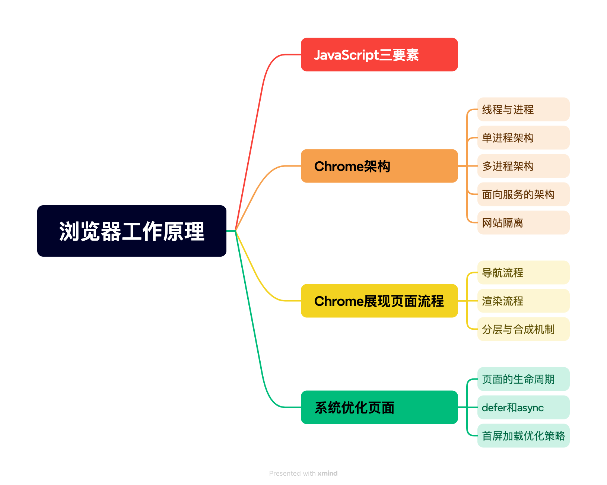

## JavScript三要素

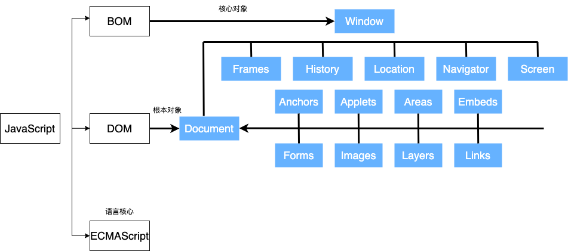

JavaScript由ECMAScript，DOM和BOM三部分组成。其中，ECMAScript是语言的核心，描述了JS的语法和基本对象。文档对象模型(Document Object Mode, DOM) ，提供处理页面和方法的接口。为了方便以编程的方式操作HTML内容，DOM定义了HTMLDocument和HTMLElement，从将整个页面的HTML内容抽象为树形结构即DOM树。浏览器对象模型（Browser Object Model, BOM），浏览器提供的一些原生属性和方法可以用于操作浏览器。

由此我们可以将浏览器页面分为两个区域，DOM区域和BOM区域。其中DOM区域为主视区，为浏览器加载页面部分。浏览器可以通过在地址栏中的URL去加载页面的document至本地。BOM区为浏览器功能区，包括标签页、地址栏、搜索栏、右键菜单等。

## Chrome架构

#### 线程与进程

**进程**是一个程序的运行实例，**线程**是操作系统能够进行**运算调度**的最小单位，其是进程中的一个执行任务（控制单元），负责当前进程中程序的执行。详细来说，每当启动一个程序的时候，操作系统会为该程序开辟一个空间用来用来存放代码、运行中的数据和一个执行任务的主线程，这个运行空间就是进程，进程中执行调度的是线程，通常进程使用多线程并行处理计算提升效率。其中，**值得注意的是**，进程中的任意一线程执行出错，都会导致整个进程的崩溃；线程之间共享进程中的数据；当一个进程关闭之后，操作系统会回收进程所占用的内存；进程之间的内容相互隔离。

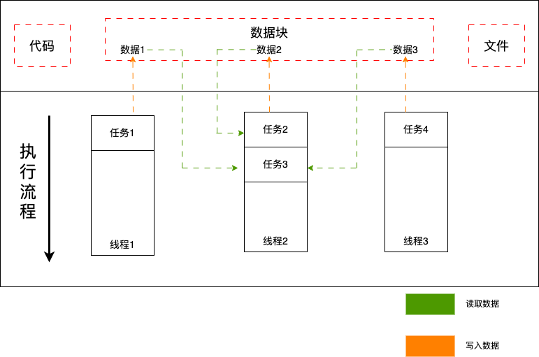

#### 早期单进程架构

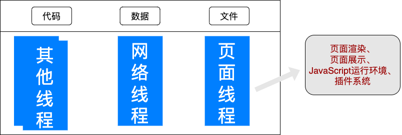

缺点：进程中线程的崩溃会导致整个浏览器崩溃，整个系统十分不稳定；单进程易造成内存泄漏、执行延后导致不流程；无法隔离插件环境，易被代码侵入易导致安全问题。

#### 多进程架构

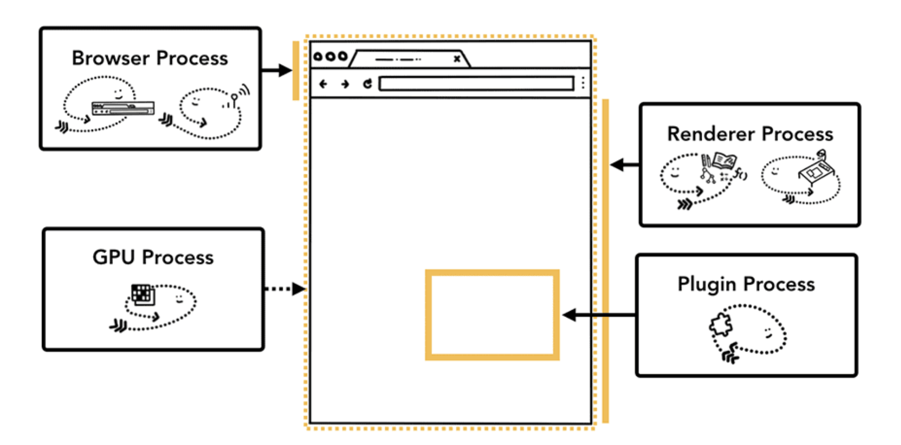

| 流程及控制对象 |                                            |   |
| ------- | ------------------------------------------ | - |
| 浏览器进程   | 主要负责界面显示、用户交互、子进程管理，同时提供存储等功能              |   |
| 网络进程    | 主要负责页面的网络资源加载                              |   |
| 渲染进程    | 将代码转换为用户可以与之交互的网页，每个Tap都有独立的渲染进程，运行在沙箱环境中。 |   |
| 插件进程    | 负责插件运行、环境隔离，避免插件崩溃对浏览器带来影响                 |   |
| GPU进程   | 处理GPU任务，提高页面绘制效率                           |   |

多进程架构图和功能介绍如上所示。由此可见，在多进程架构中将各功能通过进程分隔开，页面或进程的崩溃并不会如单进程架构一般影响整个浏览器工作，解决了稳定性问题。同理，渲染进程的阻塞也被很好的隔离在可控区域内并不会影响其余工作环境，并且哪怕出现内存泄漏等问题只需要关闭相应Tap，回收进程所占内存即可，解决了不流畅的问题。采用多进程的额外好处是可以对进程采用安全沙箱隔离恶意程序，解决了不安全的问题。

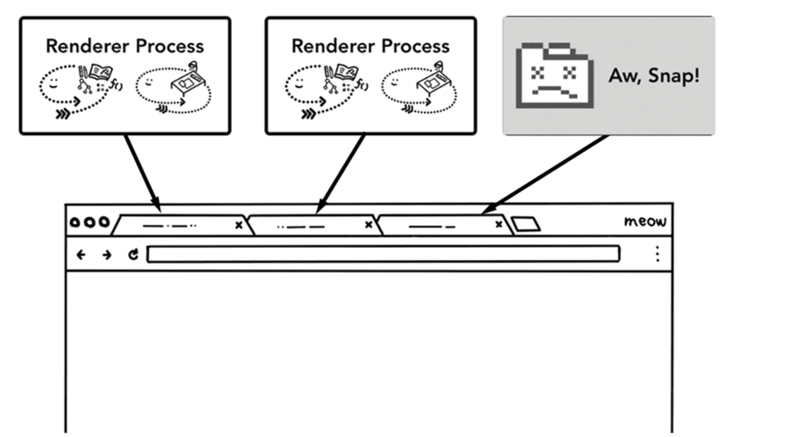

#### 面向服务的架构

进程的隔离在解决问题的同时也带来了新的问题，多进程的架构体系过于复杂，耦合性高，难以适应新需求。与此同时，多进程的创建也意味着更高的资源占用情况，为此Chrome会根据设备的内存和CPU来设置进程上线，当达到上线时会在一个进程中运行来自同一网站的多个标签页，但这类限制并不够灵活。Chrome开发者团队开始谋求面向服务的架构发展以提供灵活性并节省内存消耗。

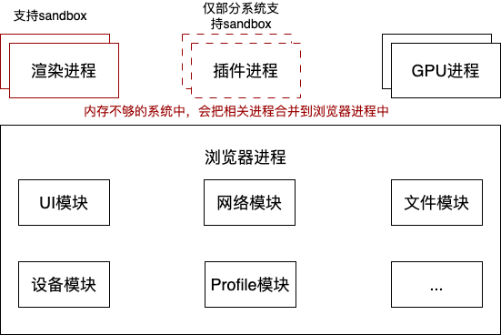

如上图所示，面向服务的架构就是将原本的每个模块重构成独立的服务，将各种功能服务归类于主进程中，仅固定拆分出渲染、插件和GPU进程。浏览器可以通过设备的性能来选择拆分或者聚合主进程中的各类服务。

#### 网站隔离

网站隔离从根本上改变 iframe 之间的通信方式，为每个跨网站 iframe 运行单独的渲染程序进程，允许跨网站 iframe 在单个渲染程序进程中运行，并在不同网站之间共享内存空间。这是一个里程碑式的功能，有效减少了安全攻击的攻击面、降低了攻击横向扩散的风险。

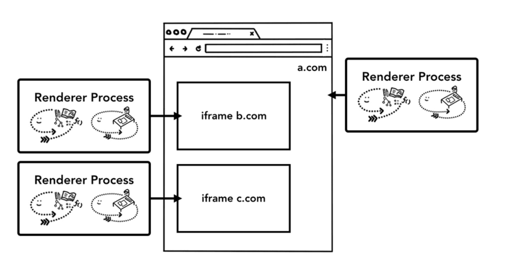

## 页面展现流程

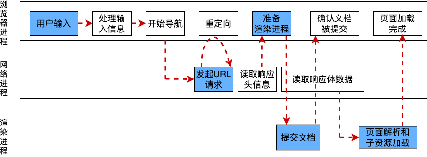

Chorme浏览器展现网页的整个工作流程如上图所示，主要可分为导航流程、渲染流程和合成优化三部分

## 导航流程

当用户在导航栏输入完后，浏览器首先会处理用户信息，界面线程会根据解析结果决定是跳转到搜索引擎还是跳转到请求的网站。：

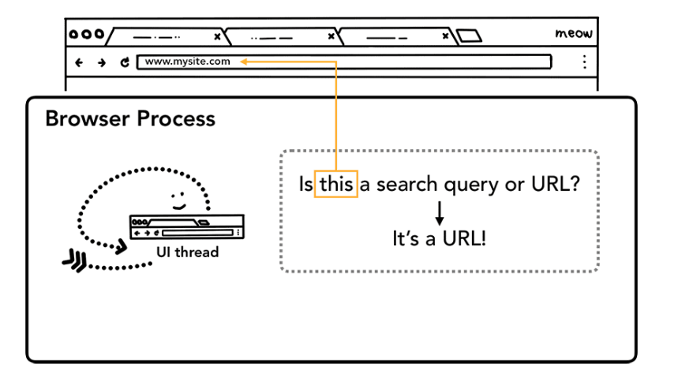

其次，网络线程会进行DNS解析并建立TCP三次握手建立TLS连接。如果接收到类似于301重定向的状态码，网络线程会重新请求重定向的界面。(DNS解析流程：本地DNS缓存—>路由器DNS缓存—>运营商DNS缓存—>递归查找全球13台DNS服务器)

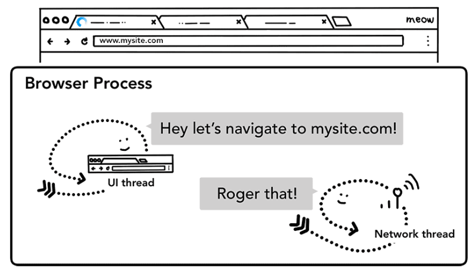

最后，读取响应数据信息，如果响应数据是压缩文件或其他文件，代表访问的是下载请求，浏览器会将数据传递给下载管理器。如果是HTML文件，数据会提供给渲染进程，进行页面的渲染。到了这一步，浏览器进程已经将准备好的数据发送给渲染进程，渲染进程接收到数据之后，又会发送IPC消息给浏览器进程，同步信息：导航已经提交了，页面开始加载。此时，导航流程就告一段落，导航栏、安全指示符和访问列表都已经更新，可以进行前进后退操作。**值得注意的是，** 进入渲染进程前会进行safeBrowsing检查响应网络是否与已知恶意网站相符，以此作为第一层安全保障。除此以外，为了加快页面响应流程，避免网络请求耗时带来的影响。界面线程会在发送请求时就让渲染进程进行准备。

## 渲染流程

渲染程序进程的核心任务是将 HTML、CSS 和 JavaScript 转换为用户可与之互动的网页，具体流程如下图所示：

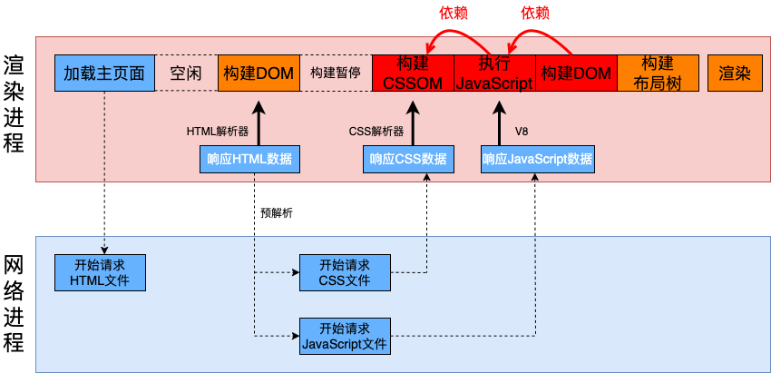

渲染流程主体来说分为三步：构建DOM树，构建CSS树、构建布局树。**值得注意的是**，渲染引擎会尝试以最快速度展示内容，如果内容样式未及时加载，这就会出现flash of unstyled content（渲染浏览器默认样式）或白屏问题。

#### 构建DOM树

网络进程会根据响应头中的content-type字段来判断文件的类型，值为“text/html”时，网络进程与渲染进程建立连接并且准备递交导航信息接收HTML数据。网络进程与渲染进程间建立数据共享通道，网络进程传输的数据会被渲染进程的HTML解析器进行解析并转换成一个对象模态-DOM树。构建DOM树总体流程如下图所示：

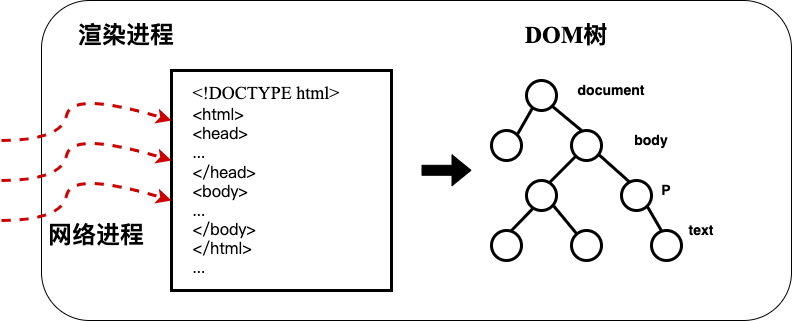

HTML解析器解析主要分为三个阶段，首先分词器会将字节流转换为Token，随后Token会被解析为DOM节点，在解析成DOM节点的同时会将DOM节点添加到DOM树中去。其中，Token主要分为StartTag Token、EndTag Token和文本Token分别对应起始标签、终止标签和文本。HTML解析器具体流程图下图所示：

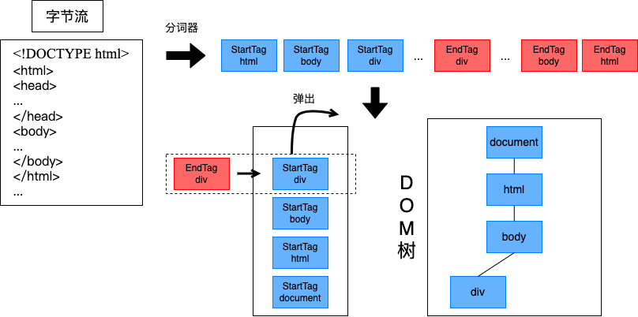

#### 构建CSS树

拥有 DOM 并不足以了解网页是什么样子，我们还需要通过CSS文件来设置页面元素的样式。和HTML文件 一样，渲染引擎也是无法直接理解 CSS 文件内容。需要通过主线程解析 CSS 并确定为每个 DOM 节点计算出的样式生成CSSOM。CSSOM具有两个作用，第一个是提供给 JavaScript 操作样式表的能力，第二个是为布局树的合成提供基础的样式信息。

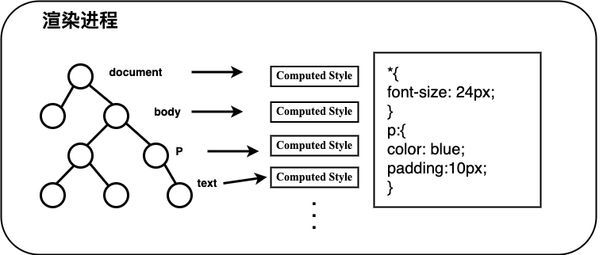

#### 构建布局树

目前，渲染进程已经知晓了DOM的结构以及节点样式，但这仍不足以渲染页面。因为渲染进程并不知道DOM元素的几何位置信息。如何计算DOM树中可见元素的几何位置的过程叫做生成布局树。主线程会遍历 DOM 和计算出的样式，并创建包含 x y 坐标和边界框大小等信息的布局树。布局树的结构可能与 DOM 树类似，但它仅包含与页面上可见内容相关的信息。如果应用 **display: none**，则该元素不属于布局树的一部分（但是，具有 **visibility: hidden** 的元素位于布局树中）。同样，如果应用了内容类似于 **p::before{content:"Hi!"}** 的伪类，则它会包含在布局树中（即使它不在 DOM 中）。

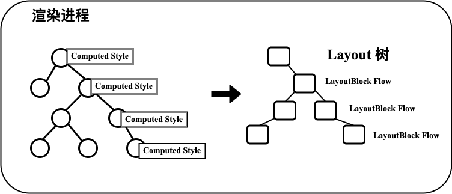

## 合成优化

#### 重排与重绘

DOM元素受JavaScript代码控制，当改变了某个元素的颜色属性时不会重新触发布局，但还是会触发样式计算和绘制这就是**重绘**。当一个DOM元素的尺寸或位置属性有所变化时，会重新进行样式计算、布局绘制以及后面的所有流程，这种行为称为**重排**。重排必定会触发重绘。由于JavaScript是单线程的，重排和重绘都会占用主线程从而出现抢占执行时间的问题。

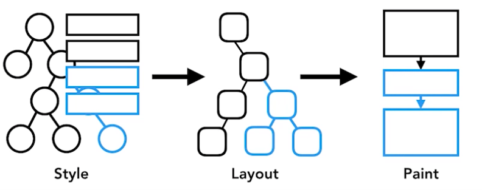

#### 分层与合成机制

通常页面的组成是非常复杂的，有的页面里要实现一些复杂的动画效果，为了降低触发重排或者重绘带来的高昂代价，Chrome采用分层和合成的机制将素材先分成多个图层进行渲染，最后在合成一张整图，提高了每帧的渲染效率。因此，拥有 DOM、样式和布局仍然不足以渲染网页。因为即使知道元素的大小、形状和位置，仍需要判断绘制元素的顺序，绘画顺序的错误也可能会导致呈现的错误。而在知晓元素大小、形状、位置及绘制顺序后，将这些信息转换为屏幕上的像素的动作就称为光栅化。为了更好的对页面进行光栅处理，Chrome推广了合成技术。合成技术会创建独立的合成器线程与光栅线程，合成器线程会将图层分块传输至光栅线程，光栅线程会光栅化每个图块并将其存储在 GPU 内存中。

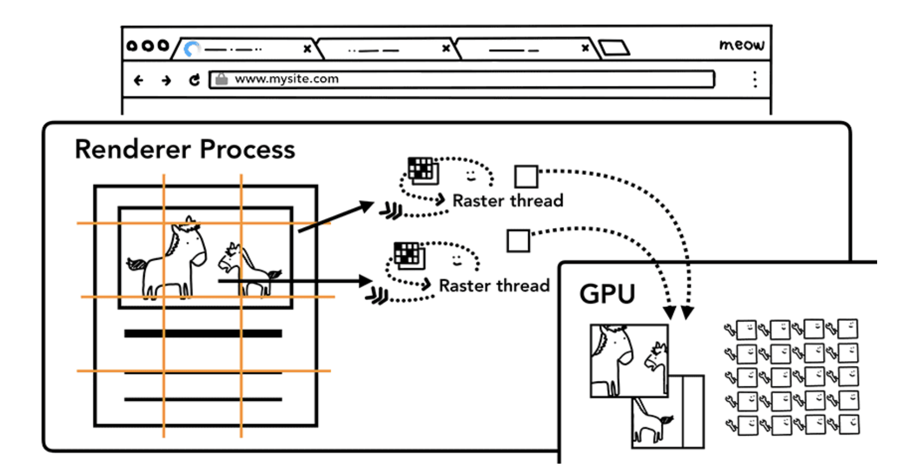

将图块进行光栅化后，合成器线程会收集称为“绘制四边形”的图块信息，以创建合成器帧。然后通过 IPC 将合成器帧提交到浏览器进程。此时，对于浏览器界面更改，可以从界面线程添加另一个合成器帧，对于扩展程序，可以从其他渲染程序进程添加。这些合成器帧会发送到 GPU 以在屏幕上显示。如果滚动事件传入，合成器线程会创建另一个要发送到 GPU 的合成器帧。

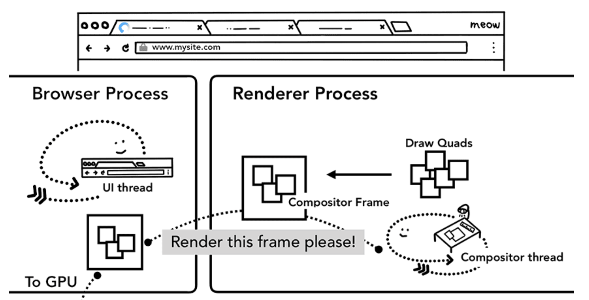

合成的优势在于，它在完成时不涉及主线程。合成器线程不需要等待样式计算或 JavaScript 执行。因此，仅合成动画被认为是实现流畅性能的最佳方式。如果需要再次计算布局或绘制，则必须涉及主线程。

## 系统优化页面

#### 页面的生命周期

- **DOMContentLoaded**：DOMContentLoaded触发时，浏览器已完全加载 HTML，并构建了 DOM 树，但样式表之类的外部资源可能尚未加载完成。
- **window\.load：** 当浏览器不仅加载完了 HTML文件，还加载完了包括样式、图片和其他资源时，会触发 window 对象上的 load 事件。
- **window\.beforeunload：** 用户离开页面时触发，常用于检测保存是否更改、询问是否需要离开等操作。
- **window\.unload：** 用户已经离开页面时触发，进行一些关闭操作。

其中，需要注意的是**DOMContentLoaded**事件。该事件发生在document对象上，必须使用addEventListener进行捕捉，DOMContentLoaded 可以查看所有元素但不能查看外部资源。DOMContentLoaded事件的触发时机比较复杂，总结如下：

- 该事件需要等JavaScript代码脚本运行结束后才会触发，这样可以预防代码脚本对DOM树进行修改。
  - 具有async标志的脚本不会阻塞DOMContentLoaded事件的触发。
  - 使用 document.createElement('script') 动态生成并添加到网页的脚本也不会阻塞 DOMContentLoaded。
- 外部样式表不影响DOM，一般情况下DOMContentLoaded不会等待外部样式表的下载完成。
  - 如果在样式表后面跟着JavaScript代码脚本，那么该脚本必须等待样式表加载完成后才执行。**因为代码可能想要获取元素的坐标和其他与样式相关的属性。**因此当DOMContentLoaded 等待脚本执行的的时候，脚本可能也在等待前面样式生成。这**一点正对应着渲染流程图中的两个依赖关系。**

#### defer和async

- 默认引用script
  - 当浏览器遇到 script 标签时，DOM文档的解析将停止，立即下载并执行脚本，脚本执行完毕后将继续解析DOM文档。
- async
  - 下载脚本不阻塞文档解析，下载后先执行脚本再文档解析。JavaScript代码脚本的**加载和执行**与加载生成DOM树的过程并行处理。 对 async 而言，脚本的加载和执行是紧挨着的，不管声明顺序如何，只要加载完就会立即执行。
- defer
  - JavaScript代码脚本的**加载**与加载生成DOM树的过程并行处理。但是脚本的执行要在所有元素解析完成之后，DOMContentLoaded 事件触发之前完成。 推迟的脚本原则上按照它们被列出的顺序执行。
- async和defer的相同点
  - defer 和 async 在网络读取（下载）这一阶段是一样的，相对于 html 解析来说都是异步的。
- async和defer的差别
  - 使用async属性时，脚本下载完后会立即执行；使用defer属性时，脚本的执行时机按照原定顺序。
- 推荐使用场景
  - 使用async属性：脚本并不关心页面中的 DOM 元素（文档是否解析完毕），并且也不会产生其他脚本需要的数据。如：百度统计，Google 统计等。
  - &#x20;使用 defer  属性：如果你的脚本代码依赖于页面中的 DOM 元素（文档是否解析完毕），或者被其他脚本文件依赖。

#### 首屏加载优化策略

从发起URL请求到首次展示页面的内容主要分为三个阶段：导航流程、渲染流程、分层与合成优化。其中，第一阶段的影响因素主要在服务器和网络处理模块，本文就暂不讲述优化方法。第三阶段通常用于复杂结构与交互场景，普通页面常为一个图层，不会触发相关机制。因此，本小节主要讲述渲染流程易出现的白屏问题的解决方案，该流程性能问题主要表现在下载CSS文件、下载JavaScript文件及执行JavaScript文件这三步上。优化策略可以分为以下几点：

- 资源预加载：在解析构建DOM时，系统会并发运行“预加载扫描程序”。如果HTML文档中包含\<image>或 \<link> 等内容，程序会提前将这些请求发送到网络进程中去请求。
- 脚本并行下载：灵活使用async和defer让脚本的加载与DOM的构建并行处理。
- 缓存：Service Worker 是一种在应用代码中编写网络代理的方法，可让 Web 开发者更好地控制本地缓存的内容以及何时从网络获取新数据。如果 Service Worker 设置为从缓存加载页面，则无需从网络请求数据。值得注意的是，Service Worker 是在渲染程序进程中运行的 JavaScript 代码。
- Navigation预加载：如果 Service Worker 最终决定从网络请求数据，浏览器进程和渲染器进程之间的这种往返可能会导致延迟。Navigation 预加载是一种通过在 Service Worker 启动过程中并行加载资源来加快此过程的机制。它使用标头来标记这些请求，以便服务器决定为这些请求发送不同的内容；例如，只更新数据而不是完整文档。
- 压缩加载文档：通过Webpack等打包工具缩小JavaScript文件，拆分CSS文件，进行按需加载。

## 总结

谷歌开发者文档里写的是真的好，生动简洁，面面俱到。

## 参考文献

> [https://developer.chrome.com/blog/inside-browser-part1?hl=zh-cn](https://developer.chrome.com/blog/inside-browser-part1?hl=zh-cn "https://developer.chrome.com/blog/inside-browser-part1?hl=zh-cn")深入了解现代网络浏览器系列，部分图片截图于此

> 李兵老师的浏览器工作原理与实战

> winter老师的重学前端

> JavaScript引擎基础知识[https://mathiasbynens.be/notes/shapes-ics](https://mathiasbynens.be/notes/shapes-ics "https://mathiasbynens.be/notes/shapes-ics")
