# 浏览器的安全

## 前言

浏览器的安全主要可分为页面安全、系统安全和网络安全。页面安全主要涉及我们熟知的同源策略、跨域，主要为了保护用户使用界面信息不外泄。系统安全和网络安全主要了解了chrome的安全沙箱策略以及Https是如何进行数据传输保护的。

## 目录

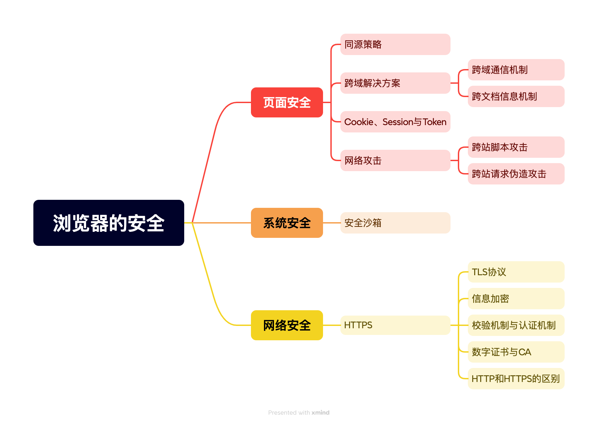

## 页面安全

## 同源策略

浏览器为了保证用户信息的安全，防止恶意的网站窃取数据，禁止不同域之间的JS进行交互。对于浏览器而言只要域名、协议、端口其中一个不同就被认为这两个URL不是相同的源。两个不同源之间若想要相互访问资源或者操作DOM就会受安全策略的制约，这套安全策略就是同源策略。

同源策略的限制主要表现在DOM、数据和网络层面，不同源之间不能使用javaScript脚本操作当前DOM对象、读取Cookie、IndexDB和 LocalStorage等数据、不能请求跨域资源。

## 跨域解决方案

安全性与便利性总是相互对立的，让不同源之间绝对隔离无疑是安全的，但这违背了WEB世界的开发性的初衷。因此，为了在保证安全的情况下提升便利性，web引入了多种跨域解决方案来解决上述的三种特性。

### 跨域通信机制

同源政策规定，AJAX请求只能发给同源的网址以确保信息安全。

#### 什么是域名？

一个完整的域名由二个或二个以上部分组成，各部分之间用英文的句号"."来分隔，最后一个"."的右边部分称为顶级域名（TLD，也称为一级域名），最后一个"."的左边部分称为二级域名（SLD），二级域名的左边部分称为三级域名，以此类推，每一级的域名控制它下一级域名的分配。

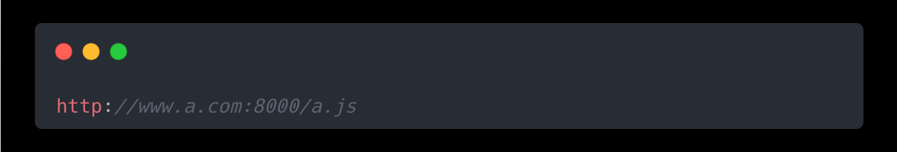

例如上述代码，http是协议，www是三级域，a是二级域名，com是三级域名，/a.js是子目录，8000是端口号。

**值得注意的是，** 前端只能解决域名不同导致的同源策略问题，无法解决协议和端口导致的问题。在跨域问题上，域名仅通过URL来识别而不会去判断对应ip地址。换句话说，尽管多个网站可以共享同一台物理服务器和同一IP地址，但由于域名和Host header的存在，这些网站仍然被视为不同的源，因此必须遵守同源策略的规则。

#### JSONP

JSONP的基本思想是利用script标签进行资源加载和回调使用。

`<script>` 标签被设计可用于跨域加载JavaScript文件，以方便开发者加载外部脚本库。因此，通过在网页中动态插入`<script>` 标签的方式来请求资源，并在请求的查询字符串后添加一个callback参数来指定回调函数，就可以利用这个回调函数来承接服务器返回的数据。

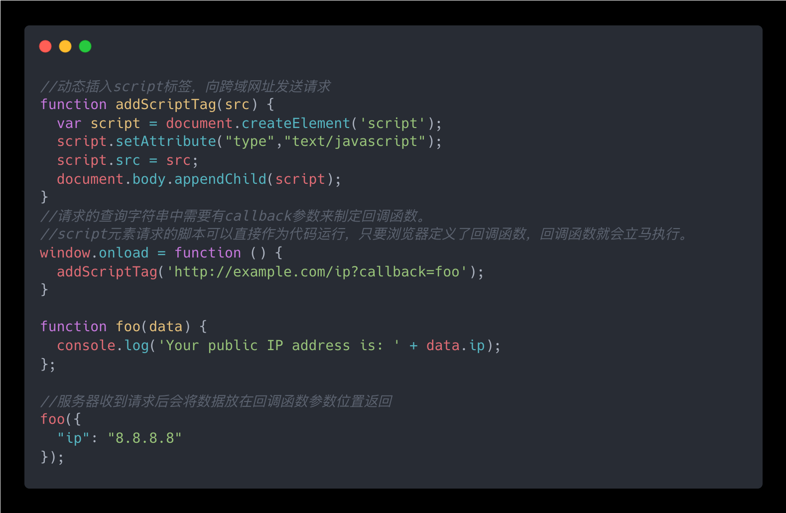

#### WebSocket

WebSocket使用`ws://`（非加密）和`wss://`（加密）作为协议前缀。该协议的请求头中有`ORigin` 字段来判断请求源，因此不需要同源协议也可以通过白名单来进行判断通信安全性。

#### 跨域资源共享-CORS

服务器端对于CORS的支持，主要就是通过设置Access-Control-Allow-Origin来来告诉浏览器 让运行在一个 origin (domain) 上的Web应用被准许访问来自不同源服务器上的指定的资源。如果浏览器检测到相应的设置，就可以允许Ajax进行跨域的访问。

#### 简单请求和复杂请求

简单请求需要满足以下两种条件：

1. 请求方式：GET、HEAD或POST
2. 请求头：只能包含简单的头部信息，`Accept`、`Accept-Language` 、`Content-Language`、`DPR` 、`Downlink` 、`Save-Data` 、

`Viewport-Width` 、`Width` 、`Content-Type`（取值只能为`application/x-www-form-urlencoded`、`multipart/form-data` 、`text/plain`）

不满足上述条件的则为复杂请求。复杂请求在跨域请求中会先发一次请求作为预检验请求，预检请求以`OPTIONS`方法发送，包含`Access-Control-Request-Method` 和`Access-Control-Request-Headers` 两项内容，`Access-Control-Request-Method` 声明了实际请求的种类，`Access-Control-Request-Headers` 声明了复杂请求中所使用的头部。

显而易见，这个"预检"请求实际上就是在为之后的实际请求发送一个权限请求，在预回应返回的内容当中，服务端应当对这两项进行回复，以让浏览器确定请求是否能够成功完成。一旦预回应如期而至，所请求的权限也都已满足，才会发出真实请求，携带真实数据。因此对于处理复杂请求的在自定义中间件，遇到预检请求，需要直接放行，否则会出现非预期的结果。

为防止预检请求带来的通信压力，可以在服务端设置Access-Control-Max-Age来控制浏览器在多长时间内(单位s)无需在请求时发送预检请求，从而减少不必要的预检请求。

### 跨文档信息机制

#### iframe

`iframe`（Inline Frame）是 HTML 中的一个标签，用于在网页中嵌入另一个 HTML 文档。它可以被视为一个网页中的网页，允许在一个文档内加载和显示其他文档的内容。

`iframe` 常被用于内容嵌入、内容分割、内容隔离、多域内容隔离以及加载优化。

`iframe` 本质上是一个HTML标签，通过向指定的src发送HTTP请求，将返回的内容在`iframe`区域内渲染。`iframe` 遵循同源策略且可以通过`sandbox`属性增强安全性

#### Cookie

`Cookie` 以key-value的形式存储，本质上就是一个字符串，里面包含着浏览器和服务器沟通的信息（交互时产生的信息）。HTTP是无状态的，服务器不会保留任何上下文。但在实际应用中，常需要浏览器记录用户的状态信息以追踪用户行为。解决HTTP的无状态行为，便是`Cookie` 的设计初衷之一。

只有同源网页才能共享数据，但如果两个网页一级域名相同，仅二级域名不同，浏览器允许`document.domain`共享Cookie。例如A网址为'[http://A.example.com/a.html](http://w1.example.com/a.html "http://A.example.com/a.html")'、B网址为'[http://B.example.com/b.html](http://w1.example.com/a.html "http://B.example.com/b.html")'

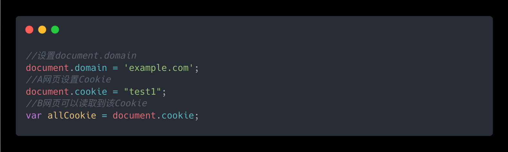

此外，服务器也可以指定Cookie的所属域名为一级域名。

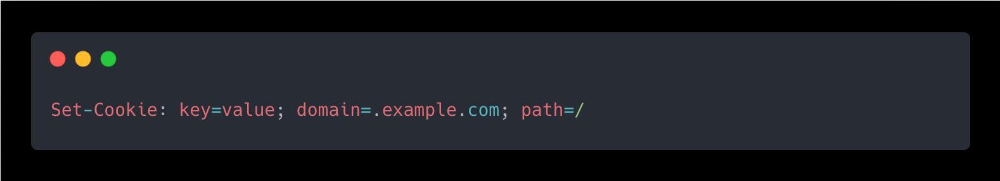

这样，二三级域名不做任何设置也能读取该Cookie。

值得注意的是，`document.domain` 进行跨域的方法仅适用于iframe和Cookie，对于LocalStorage与IndexDB无法使用该方法规避同源策略，需要使用PostMessage Api。

#### 跨域窗口通信方案

同源策略限制不同源的两个网页不能获取对方的DOM。典型的例子就是`iframe`窗口和`window.open`方法打开的窗口，它们与父窗口之间无法进行通信。如果两个窗口一级域名相同但二级域名不同可以通过document.domain属性来规避同源策略。但对于完全不同源的网站便需要下述方法解决跨域窗口通信问题。

#### 片段识别符

片段标识符值URL中#号后面的部分，如'[http://example.com/xxxxxx.html#fragment](http://example.com/x.html#fragment "http://example.com/xxxxxx.html#fragment")'中的`#fragment` ，父子窗口间可以共享这段信息，并且改变fragment不会导致页面的重新刷新。

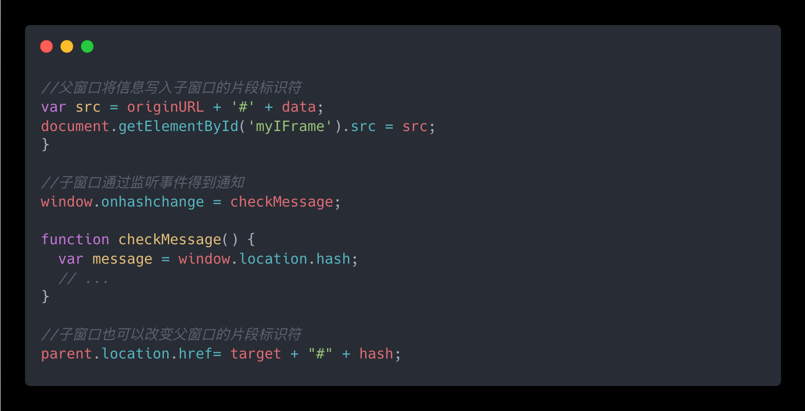

#### window\.name

`window.name`属性最大特点是无论是否同源，只要在同一个窗口中前一个网页设置了该属性，后一个网页就可以读取它。

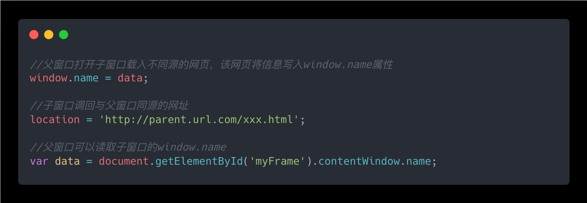

`window.name`属性的容量很大，但必须要监听该属性变化才能获取相关值。

#### window\.postMessage

同源策略为了保护数据的安全限制了不同源之间的读写操作，但没有阻止通信。现代Web引入了跨文档消息机制允许不同源（origin）的文档或脚本进行安全的消息传递，这在单页应用、多窗口或标签页通信、以及与嵌入式`<iframe>`元素的交互中非常有用。这一机制在HTML5中通过`window.postMessage()`方法和相应的`message`事件得以实现。

- `window.postMessage()`：这是一个可以用来从一个窗口向另一个窗口发送消息的方法。消息可以是任何类型的数据，如字符串或JSON对象，但复杂对象需要序列化。
- `message`事件：这是接收方窗口监听的事件，当接收到一个`postMessage`调用发送过来的消息时，就会触发这个事件。在事件处理器中，可以通过`event.data`属性访问到发送过来的消息。
- `targetOrigin`参数：在调用`postMessage`时，可以指定`targetOrigin`参数，它定义了消息可以发送到的目标窗口的源。如果目标窗口的源与`targetOrigin`参数不匹配，则消息不会被送达，以此增强安全性。

下面是一个简单的示例，展示了如何从一个窗口向另一个窗口发送消息：

**发送方：**

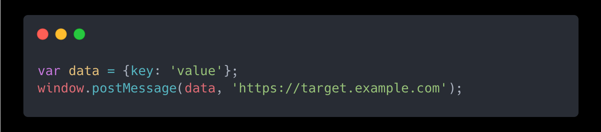

**接收方：**

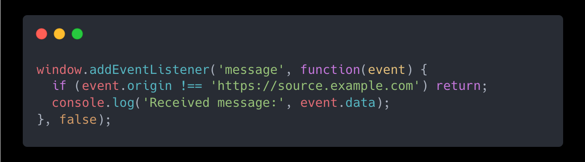

在这个例子中，发送方将消息发送到了特定的`targetOrigin`，而接收方只处理来自特定源的消息，这有助于防止中间人攻击。

## Cookie、Session与Token

#### Cookie

为了提高可伸缩性、增强系统的性能，Http协议被设计成无状态协议。无状态可以确保每个请求都相互独立，但通过频繁的通信来维持用户会话状态的话会增加网络压力。因此，Cookie被设计出来解决这一问题。Cookie 的基本思想是，当服务器向客户端发送数据时，它可以在 HTTP 响应头部中添加一个 `Set-Cookie` 字段，该字段包含一个键值对，客户端会保存这个键值对，并在后续请求中自动将其发送回服务器。Cookie分为会话Cookie和持久化Cookie，会话 Cookie 的行为取决于浏览器的实现。一般来说，当浏览器窗口或标签页关闭时，会话 Cookie 会被删除。但是，有些浏览器可能会保留会话 Cookie，直到浏览器完全退出（即关闭所有窗口）。持久性 Cookie 有一个明确的过期时间，通常是通过 `Max-Age` 或 `Expires` 属性来设置的。

#### Cookie-Session

然而，将重要信息存放在Cookie中，容易遭受XSS攻击而造成数据安全问题。因此，研究人员在服务器中开辟一块空间供Session使用，使用Session在服务器中存放敏感数据，通过Cookie交互Session\_id来达到维护状态的目的。Cookie-Session模式的生命周期主要看Cookie的生命周期。对于会话Cookie，服务端通过检测请求头中 Cookie 是否缺失来确定 Session 是否应该被释放。对于持久化Cookie，Session会在Cookie失效后失效。除此以外，许多应用还实现了 **Session 的超时机制**，这意味着即使 Cookie 没有过期，如果用户在一定时间内没有活动（如 15 分钟或 30 分钟），Session 也会被标记为过期并从服务器端释放。这种机制是为了安全考虑，防止用户在长时间不活动的情况下保持登录状态。值得注意的是，Cookie一般会配合Session一起使用，并且服务端会做Session持久化，防止服务器重启导致Session丢失。Session也可以通过覆写URL、隐藏于表单或者添加到请求头中的自定义字段中来使用。虽然可以应付不支持Cookie的环境，但是Cookie自带的安全策略与Session\_id配合依然是最好的配合。

#### Token

Cookie-Session模式依赖于浏览器对Cookie的自动处理，对于禁用Cookie机制的情况以及原生应用中就相对繁琐。在原生应用中，Cookie 的存储和发送需要手动管理。这与浏览器不同，浏览器会自动处理这些过程，开发者不需要关心 Cookie 的细节。

Token（令牌）是一种用于身份验证和授权的方法，它通常用于无状态的应用程序中。Token 通常由服务器生成，并在用户成功登录后发送给客户端。并且这些信息通常会被加密或签名以确保数据的安全性。`Session-Cookie` 和 `Token` 有很多类似的地方，但是 `Token` 更像是 `Session-Cookie` 的升级改良版。Token的时间戳机制可以有效防御DOS 攻击；签名机制可以确保数据不会被篡改；IP限制防止 token 被截取后在别的网络环境发出请求，在服务器通过请求 ip 与这个 ip 必须对上才能解密Session 和 Token 并不矛盾，作为身份认证 Token 安全性比 Session 好，因为每一个请求都有签名还能防止监听以及重放攻击；

#### Token有效期过短、易过期

在使用Token作为权限认证的过程中，常会遇到Token已过期需频繁登录的情况。通常使用Refresh Token来解决这个问题。将获取Token的接口分为Access Token和Refresh Token：

- **Access Token：** 用来访问业务接口，由于有效期足够短，盗用风险小，也可以使请求方式更宽松灵活；
- **Refresh Token：** 用来获取 Access Token，有效期可以长一些，通过独立服务和严格的请求方式增加安全性；由于不常验证，也可以如前面的 Session 一样处理；

Refresh Token 认证步骤解析如下图所示：

#### JWT

Token 作为身份验证和授权的一种手段，在现代 Web 开发中非常常见。Token的生成方式不受限制，开发者可以选择创建自己的 Token 格式，但这涉及不同的加密方式和结构设计并且这可能会带来维护上的问题，而JWT (JSON Web Token) 是一种流行的Token实现方式。

相较而言，JWT的结构简单明了，易于理解，并且可以通过添加自定义声明来扩展其功能。其无状态、自包含的特点可以轻松地通过不同域之间的请求进行传递，这对于单点登录 (SSO) 场景特别有用。

## 网络攻击

#### 跨站脚本攻击

跨站脚本攻击(Cross Site Scripting, XSS)，是一种通过代码注入方式，在用户浏览页面时利用恶意脚本进行攻击的一种手段。时至今日，往HTML文件中注入恶意脚本的方法越来越多，而浏览器也无法区分正常内容和恶意脚本，因此恶意脚本可以获取所有的脚本权限。这些权限可以被用来进行获取Cookie、监听用户行为及修改DOM伪造页面等操作。

**恶意脚本的注入**主要分为存储型、反射型和DOM型三种。存储型XSS攻击流程如下所示：

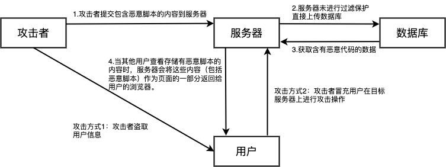

如果网站对信息过滤不严格，攻击者就可以利用站点漏洞将恶意代码递交到目标服务器。当用户访问带有恶意代码的网页时，恶意脚本会获取用户信息。攻击者获取用户信息后可以利用用户信息达到自己的目的，也可以冒充用户对目标服务器进行攻击操作。

反射型XSS攻击流程如下：

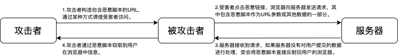

在现实中，攻击者通常诱导用户去点开恶意链接，以此来植入恶意脚本。值得注意的是，Web 服务器不会存储反射型 XSS 攻击的恶意脚本，这是和存储型XSS 攻击不同的地方。

DOM型XSS攻击流程与反射型XSS型流程相似，只是恶意脚本以HTML内容的形式修改用户界面以窃取用户信息。在这三种XSS攻击方式中，DOM型XSS攻击的恶意代码执行由浏览器完成，属于前端自身安全漏洞，其他两种则属于服务端安全漏洞。存储型XSS攻击持续有效，而其他两种为非持续型。

#### 如何防御CSRF攻击

**防御攻击的关键在于构成攻击的原因**，XSS攻击构成的两大要素：攻击者递交恶意代码、浏览器执行恶意代码。针对这两点，常见防御手段：输入过滤、CSP安全策略、代码与数据分离、HTML充分转译、避免innerHTML与outerHTML、使用HttpOnly属性。其中，输入过滤、CSP安全策略、避免innerHTML与outerHTML属于避免攻击者递交恶意代码。但是前端过滤易被绕过，后端过滤易引发不确定性和乱码问题。其余方法属于避免浏览器执行恶意代码，恶意代码被递交但不被执行也不会有风险。HTML充分转译主要针对于DOM型XSS攻击，将特殊字符转为普通文本，防止作为HTML标签或脚本的一部分来执行。HttpOnly属性是最常使用的方法，因为XSS攻击主要用来窃取Cookie，而Js脚本`document.cookie` 无法读取设置了 HttpOnly 的 Cookie 数据。

#### 跨站请求伪造攻击

跨站请求伪造攻击(Cross-Site Request Forgery, CSRF)，是一种诱导用户在三方网站中向被攻击网站发送跨站请求的攻击。利用用户在被攻击网站已经获取的注册凭证，**绕开后台验证**，达到冒充用户对被攻击的网站执行某项操作的目的。

CSRF攻击主要分为GET类型、POST类型、链接类型三种。其中，最容易实施的攻击方式是自动发起 Get 请求。

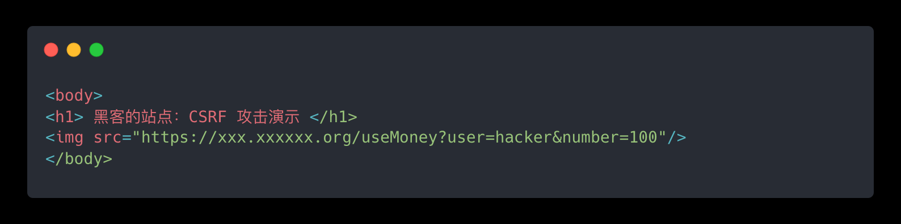

攻击者在三方网站中将转账链接隐藏于图片标签中，在获取到用户信息后，利用信息进行转账请求。

除了GET类型请求外，攻击者常使用表单来伪造POST请求。在三方页面中构建一个隐藏表单，当用户打开三方网站时进行表单的自动递交实现跨站点的POST请求。

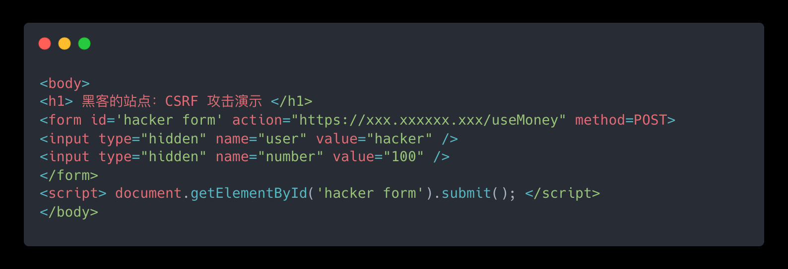

链接类型通常出现在论坛或者恶意邮件上。黑客会采用很多方式去诱惑用户点击链接

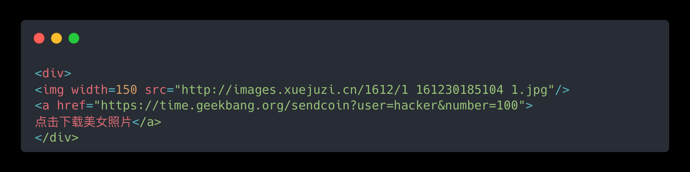

和 XSS 不同的是，CSRF 攻击不需要将恶意代码注入用户的页面，仅仅是利用服务器的漏洞和用户的登录状态来实施攻击。

#### 如何预防CSRF攻击

造成CSRF攻击需要具备三个条件：网站存在CSRF漏洞、用户在目标站点保持登录状态、用户点击诱饵网页。CSRF攻击侧重于盗用用户的Cookie，因此防御手段主要在防止盗用以及验证上。

1. 利用Cookie的SameSite 属性
   - 当设置为 `Strict` 时，浏览器将不会发送跨站点请求中的 Cookie。这意味着只有当用户直接访问站点时（即，通过直接在地址栏中输入 URL 或通过书签访问），才会发送这些 Cookie。
   - 当设置为 `Lax` 时，浏览器在大多数情况下会发送跨站点请求中的 Cookie，但当请求是由 ``、`<iframe>`、`<script>`、`<link>` 等元素触发或者是由 POST 形式的表单提交触发时，不会发送。
2. 同源检测
   - 禁止外域对我们发起请求。使用`Origin Header` 和`Referer Header` 来确定来源域名；
   - `Origin` 指示了请求来自于哪个站点，只有服务器名，不包含路径信息；
   - `Referer `指示了请求来自于哪个具体页面，包含服务器名和路径的详细URL；
3. CSRF Token
   - 在浏览器向服务器发起请求时，服务器生成一个 CSRF Token的字符串。CSRF Token可以通过设置set-cookie返回，也可以作为HTML元素一部分进行返回
   - 浏览器发送请求时需要带上CSRF Token，作为Cookie发送的，浏览器会自动处理并在后续请求中携带，作为HTML发送的通常是在递交表单时将Token附加到请求中。
   - 服务器收到请求后会校验CSRF Token，以确保安全。

## 系统安全

## 安全沙箱

在前文[浏览器工作原理](https://juejin.cn/post/7363209007827714063 "浏览器工作原理")中，我们讲述了为什么现代浏览器架构演变成了多进程架构以及分析了多进程架构的稳定性。下面我们针对浏览器架构的安全性问题，谈一谈如何避免被攻击者抓到浏览器漏洞导致操作系统安全。

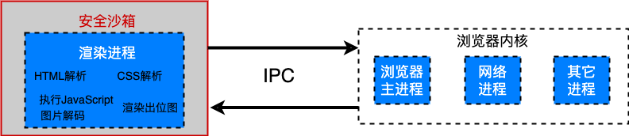

浏览器的工作流程如上图所示，首先需要由浏览器内核来下载网络资源并通过IPC传输给渲染进程。其次，会根据网络资源进行解析、绘制等操作生成对应页面。最后，渲染进程会将页面传回浏览器内核，由浏览器内核将页面展示在页面上。这么做的重点在于需要将渲染进程隔离在安全沙箱内，确保在执行过程中无法访问或者修改操作系统中的数据，在渲染进程需要访问系统资源的时候，需要通过浏览器内核来实现。因为网络资源往往是不可控的，攻击者很容易通过网络内容对用户进行攻击。因此，我们对于执行环境进行把控，将网络资源的使用限制在安全沙箱中。这样恶意程序哪怕被下载了，不被执行也是不会生效的。

安全沙箱最小的保护单位是进程。因为单进程浏览器需要频繁访问或者修改操作系统的数据，所以单进程浏览器是无法被安全沙箱保护的，而现代浏览器采用的多进程架构使得安全沙箱可以发挥作用。

## 网络安全

## HTTPS

由于HTTP具有“明文”的特点，整个传输过程完全透明，这给通信带来了很大的不稳定性。

通常认为，如果通信过程具备了四个特性，就可以认为是“安全”的，这四个特性是：机密性、完整性，身份认证和不可否认。而**HTTPS**在传统的HTTP和TCP之间加了一层用于加密解密的SSL/TLS层，以避免窃听风险、篡改风险与冒充风险。

#### TLS协议

传输层安全协议(Transport Layer Security, TLS)主要通过信息加密、校验机制及认证机制来避免窃听风险、篡改风险与冒充风险。

#### 信息加密

TLS 支持多种加密算法和密钥交换机制，这些机制可以组合使用来提供不同的安全级别。

**加密算法主要分为对称加密、非对称加密。**

对称加密以AES 和ChaCha20为代表，加密和解密都是同一个密钥。优点是速度快、效率高。然而，密钥交换机制影响着对称密钥的机密性。因为在对称加密算法中只要持有密钥就可以解密。如果约定的密钥在交换途中被攻击者窃取，通信过程也就没有机密性可言了。因此，研究人员设计出了以RSA和ECDHE非对称密钥算法。在非对称加密中密钥成对出现，分为公钥和私钥，公钥和私钥之间不能互相推导，公钥加密需要私钥解密，私钥加密需要公钥解密。公钥和私钥有个特别的“单向”性，虽然都可以用来加密解密，但公钥加密后只能用私钥解密，反过来，私钥加密后也只能用公钥解密。

非对称加密算法解决了密钥交换机制，但复杂数学大大影响了加密性能，速度缓慢让其难以落地。因此，TLS为了构建完备的加密传输过程，结合了对称加密与非对称加密。整体流程如下图所示：

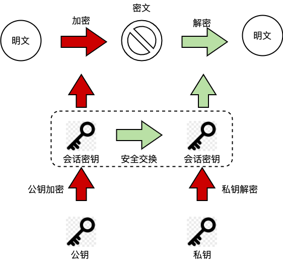

简单来说，就是利用非对称密钥作为密钥交换机制来确保对称密钥的私密性。使用对称密钥作为信息的加密工具，确保效率。由于密钥通常较短，使用对称密钥也不会造成多大延迟。整体流程中需要注意的是**密钥交换机制**在密钥的安全分发中起着至关重要的作用。密钥交换机制既要保证密钥的安全性，又要提供前行安全性，哪怕未来服务器密钥泄露也要确保以前的会话扔受保护。

#### 校验机制与认证机制

使用混合加密的方式实现机密性还不足以实现“安全”通信。如果服务器不验证完整性，对于响应照单全收，攻击者可能通过大量试错的方式找到破解方法。如果不进行身份认证，攻击者也能伪造公钥来进行攻击。

实现完整性的主要手段是摘要算法，例如SHA-2系列。摘要算法本质上是一种压缩算法，具有“单向性”和“雪崩效应”，可以将任意长度的数据“压缩”成固定长度、独一无二的“摘要”字符串，且无法逆推，输入的微小不同会导致输出的剧烈变化。摘要算法保证了“数字摘要”和原文是完全等价的。所以，只要在原文后附上它的摘要，就能够保证数据的完整性。

实现身份认证的主要手段非对称加密加上“数字摘要”构成数字签名。与保证私密性不同的是，数字签名采用私钥加密，公钥解密的方式进行。因为与确保私密性不同，数字签名主要为了进行身份认证操作。“数字摘要”确保了信息的完整性，私钥加密代表签名是由私钥持有方进行加密的，认证了身份信息，这样做同时实现了“身份认证”和“不可否认”。

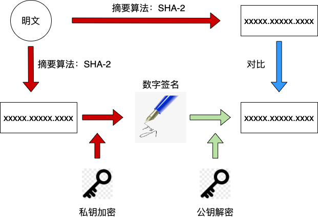

#### 数字证书与CA

最后存在的问题是“公钥的信任”问题，缺少防御攻击者伪造公钥的手段。“信任的起点，递归的终点”，证书认证机构(Certificate Authority，CA)由此而生，它就像公正中心，具有极高可信度，具有数字证书的公钥就被作为可信任的公钥而使用。到此，整个安全通信链路彻底闭环。

#### **HTTP和HTTPS区别**

最后，HTTP和HTTPS的区别总结如下：

1. HTTP 是超文本传输协议，信息是明文传输，存在安全风险的问题。HTTPS 则解决 HTTP 不安全的缺陷，在 TCP 和 HTTP 网络层之间加入了 SSL/TLS 安全协议，使得报文能够加密传输。
2. HTTP连接简单，建立连接和关闭连接涉及TCP的三次握手与四次挥手。HTTPS还涉及到了TSL
3. 连接端口号不一样，HTTP是80，HTTPS是443；
4. HTTPS协议需要使用CA申请证书，用于验证服务器身份信息。

## 总结

逻辑无法闭环的需要通过规则来进行约束，那规则之上又存在什么呢？

## 补充资料

[ Cookie 机制完全解析 浏览器: cookie机制完全解析 https://mp.weixin.qq.com/s/Fsu0JGxNFUFK-T7ovfl5Dw](https://mp.weixin.qq.com/s/Fsu0JGxNFUFK-T7ovfl5Dw " Cookie 机制完全解析 浏览器: cookie机制完全解析 https://mp.weixin.qq.com/s/Fsu0JGxNFUFK-T7ovfl5Dw")

[ 京东一面：浏览器跨标签页通信的方式都有什么？ 大厂面试场景题 https://mp.weixin.qq.com/s/VgYuw9hzmUDPSeI3AgTgPQ](https://mp.weixin.qq.com/s/VgYuw9hzmUDPSeI3AgTgPQ " 京东一面：浏览器跨标签页通信的方式都有什么？ 大厂面试场景题 https://mp.weixin.qq.com/s/VgYuw9hzmUDPSeI3AgTgPQ")

[ LocalStorage 还能这么用？ 优雅的 Storage 工具类如何封装(支持前缀key、加密存储、过期时间，ts封装等)localStorage 真实存储大小/存储统计localStorage 如何监听localStorage 同源问题与同源窗口通信 https://mp.weixin.qq.com/s/Ofzmok4bStGdsqmLv-lThg](https://mp.weixin.qq.com/s/Ofzmok4bStGdsqmLv-lThg " LocalStorage 还能这么用？ 优雅的 Storage 工具类如何封装(支持前缀key、加密存储、过期时间，ts封装等)localStorage 真实存储大小/存储统计localStorage 如何监听localStorage 同源问题与同源窗口通信 https://mp.weixin.qq.com/s/Ofzmok4bStGdsqmLv-lThg")

[ 跨域也会造成一些性能问题？  https://mp.weixin.qq.com/s/bs30YrYwOX0XMM\_mHFbGNg](https://mp.weixin.qq.com/s/bs30YrYwOX0XMM_mHFbGNg " 跨域也会造成一些性能问题？  https://mp.weixin.qq.com/s/bs30YrYwOX0XMM_mHFbGNg")

[ 【第3127期】浏览器跨 Tab 窗口通信原理及应用实践 介绍了跨窗口通信的必要能力，包括数据传输能力、实时性和安全性。 https://mp.weixin.qq.com/s/0FjTxS7guYxW4wEXeCjMeg](https://mp.weixin.qq.com/s/0FjTxS7guYxW4wEXeCjMeg " 【第3127期】浏览器跨 Tab 窗口通信原理及应用实践 介绍了跨窗口通信的必要能力，包括数据传输能力、实时性和安全性。 https://mp.weixin.qq.com/s/0FjTxS7guYxW4wEXeCjMeg")

[ 对不起 localStorage，现在我爱上 localForage了！ localForage 是一个可以完美替代 LocalStorage 以及 IndexDB 的前端本地化存储库\~\~ https://mp.weixin.qq.com/s/R3v5NXiuWzbVqM1AhPoUZg](https://mp.weixin.qq.com/s/R3v5NXiuWzbVqM1AhPoUZg " 对不起 localStorage，现在我爱上 localForage了！ localForage 是一个可以完美替代 LocalStorage 以及 IndexDB 的前端本地化存储库~~ https://mp.weixin.qq.com/s/R3v5NXiuWzbVqM1AhPoUZg")

[ 常见网站攻击技术，一篇打包全部带走！ 今天给大家介绍一下，Web安全领域常见的一些安全问题。 https://mp.weixin.qq.com/s/8icBQurPVBZhMStJlyPOOA](https://mp.weixin.qq.com/s/8icBQurPVBZhMStJlyPOOA " 常见网站攻击技术，一篇打包全部带走！ 今天给大家介绍一下，Web安全领域常见的一些安全问题。 https://mp.weixin.qq.com/s/8icBQurPVBZhMStJlyPOOA")

## 参考资料

> 透视HTTP协议

> 浏览器同源政策及其规避方法[https://www.ruanyifeng.com/blog/2016/04/same-origin-policy.html](https://www.ruanyifeng.com/blog/2016/04/same-origin-policy.html "https://www.ruanyifeng.com/blog/2016/04/same-origin-policy.html")

> 浏览器原理与实践

> Hardening Your HTTP Security Headers[https://www.keycdn.com/blog/http-security-headers](https://www.keycdn.com/blog/http-security-headers "https://www.keycdn.com/blog/http-security-headers")
