# 前端编程中的异常处理机制

## 前言

在代码世界并不总是一帆风顺的，错误总是伴随着一个程序从诞生到毁灭。在前端世界中错误是什么，可以怎么处理。是一个容易被人忽略但又十分重要的问题。

## 什么是错误？

在JavaScript中错误是一个对象，可以使用构造函数创建，用以暂停程序。

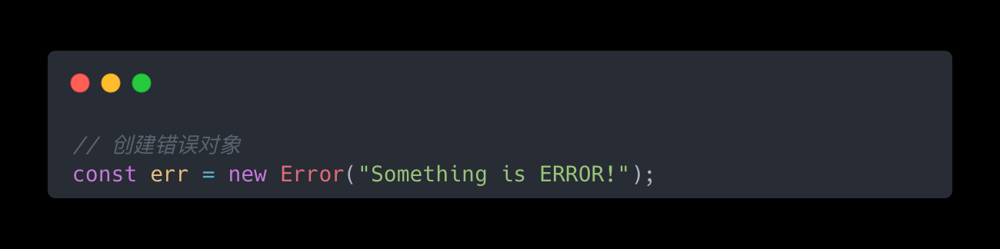

错误对象上存在三个属性：

- message：包含错误消息的字符串。
- name：错误的类型。
- stack：函数执行的堆栈跟踪。

其中，错误类型主要分为原始错误类Error、评估错误EvalError、内部错误InternalError、范围错误RangeError、引用错误ReferenceError、语法错误SyntaxError、类型错误TypeError、URI错误URIError。由于安全问题，强烈建议不使用eval()函数，并且当前ECMAScript规范不再抛出EvalError。

一般大多数错误来自JavaScript引擎，除了这些内置错误外在浏览器中还存在一系列与WebAPI相关的错误如DOMException。DOMException是一个**可序列化对象**用于描述Web API中错误条件。

堆栈追踪是发生异常或警告事件时程序所在的方法调用列表。此方法列表以堆叠方式排列，显示异常首次引发的位置及如何调用传播。

## 什么是异常？

错误抛出便会成为异常。通常在JavaScript中使用`throw`抛出错误对象。

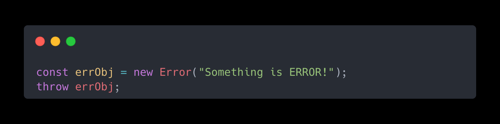

JavaScript并不会限制你抛出的是错误对象还是原始类型，但为保证错误处理的一致性、保证团队成员能够在错误对象上访问message和stack，应总是抛出正确的错误对象。

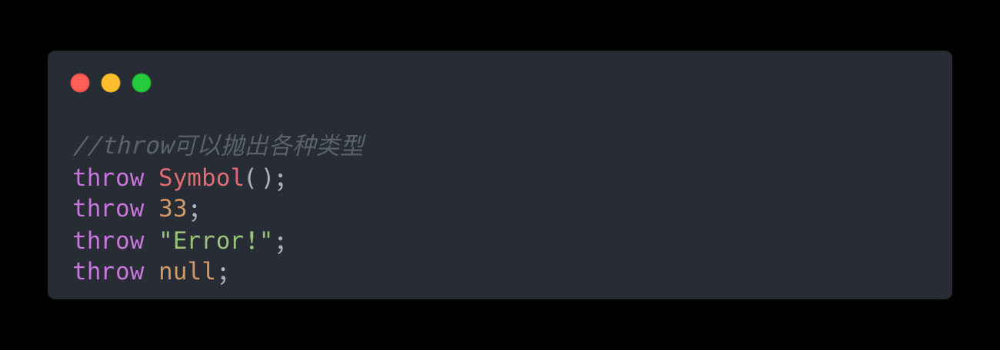

异常抛出后会在执行栈中冒泡，如果不进行异常捕捉，会在栈中传播至程序崩溃。通常程序员需要提供更好的容错机制，在更安全的地方捕捉并处理以防程序崩溃。

## 同步异常处理

同步任务按执行栈顺序执行，通常采用**try-catch-finally机制**就可以捕获同步函数产生的异常。

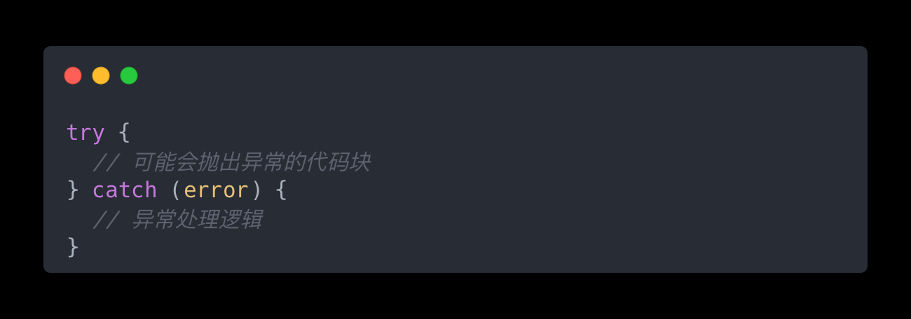

#### **常规函数的异常处理**

通常try块中放置可能抛出异常的代码块，catch块则会捕获实际抛出的异常，其中error参数是一个表示异常对象的变量，可以用来获取异常的详细信息。值得注意的是，catch块必须始终随try块才能有效地处理错误，两者分开是不被允许的。并且在JavaScript中try块后有且只能存在一个catch块或finally块，将多个catch块附加到try块上或者不跟随catch或finally块，解释器都将引发SyntaxError另外无论函数的执行结果如何，不管是成功还是失败，finally块中的所有代码都会被执行。这意味着即使catch块不能完全处理错误或者catch块中抛出错误，解释器也会在程序崩溃之前执行finally块中的代码。

#### 生成器函数的异常处理

JavaScript 中的生成器函数是一种特殊的函数。除了在其内部作用域和使用者之间提供**双向通信通道**之外，它还可以**随意暂停和恢复**。在迭代器对象上调用 **next()**及使用**for ... of** 的迭代均可以从生成器中取值。除了取值操作，调用者还可以通过注入异常的方式暂停生成器函数。

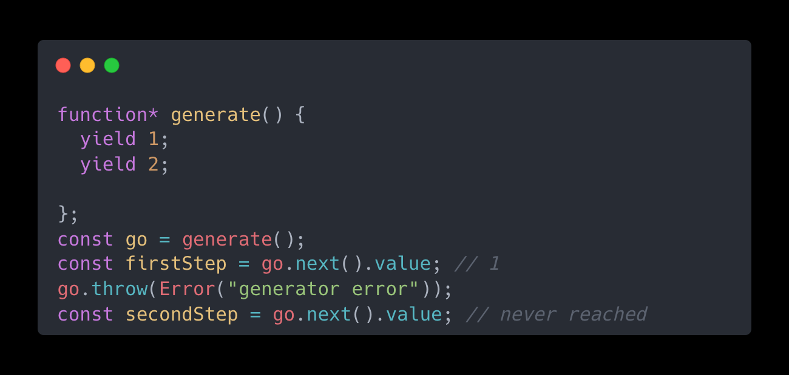

可以通过在内部使用try-catch函数块来捕获异常。

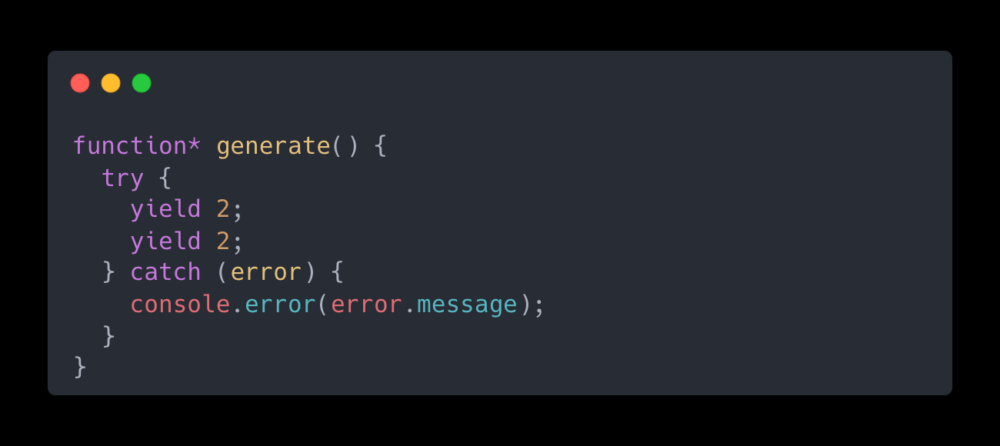

也可以从内部向外抛出异常。

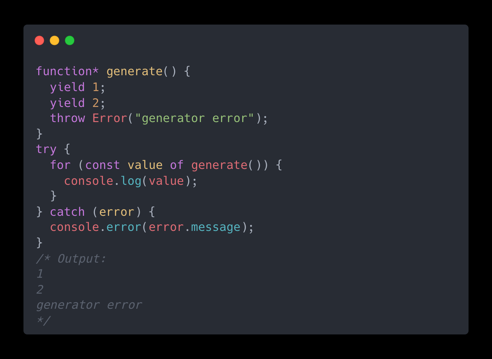

## 异步异常处理

JavaScript是一门单线程语言，通过任务队列和事件循环机制来处理异步任务逻辑。try-catch-finally可以捕获执行栈中的同步异常，对于定时器任务、DOM事件等异步任务需要使用不同的方式。

**DOM 事件错误的异常处理事例：**

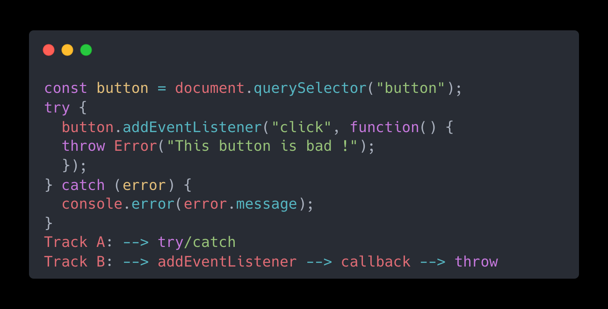

#### onerror()方法全局处理异常

**onerror()** 方法适用于所有HTML元素包括window，用于处理它们可能发生的任何错误。

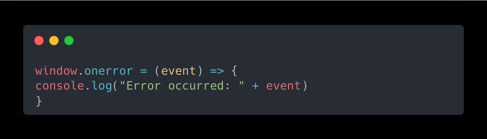

使用此事件处理程序，集中的应用程序的错误事件处理。

**定时器任务错误的异常处理事例：**

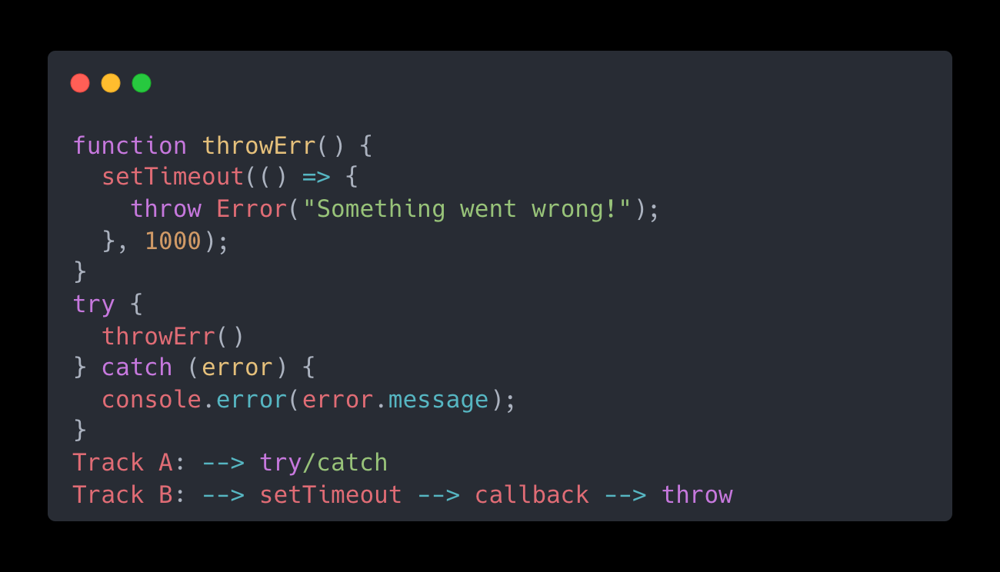

#### 使用回调处理定时器错误

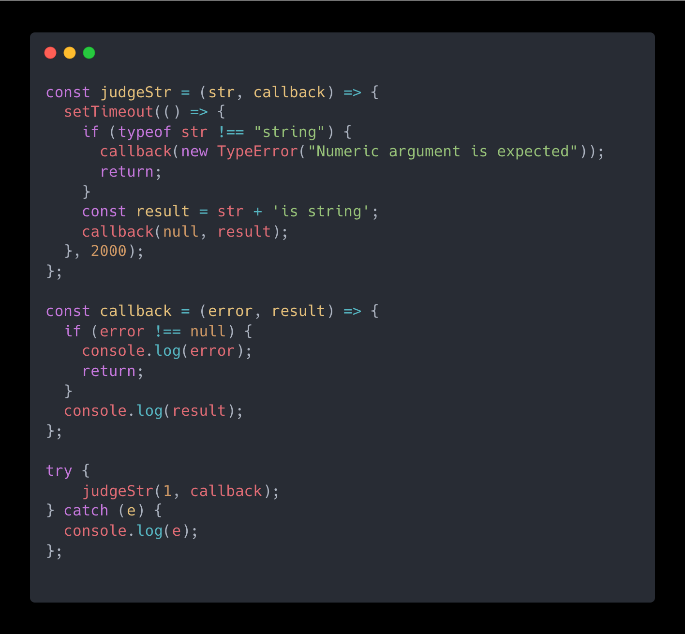

#### 使用promise处理异常错误

**使用promise处理同步错误：**

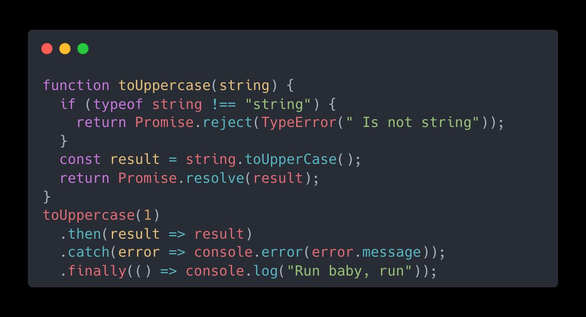

在promise中同样存在**then/catch/finally**代码块， \*\*.then()**既可以捕获成功的信息又可以捕获失败的信息，**.catch()**仅用于处理错误的信息，**.finally()\*\*无论promise处理成功与否最后都会执行。值得注意的是，**then/catch/finally**的回调都由微任务队列异步处理，且微任务的处理时机优先于宏任务。

**使用promise处理定时器异步错误：**

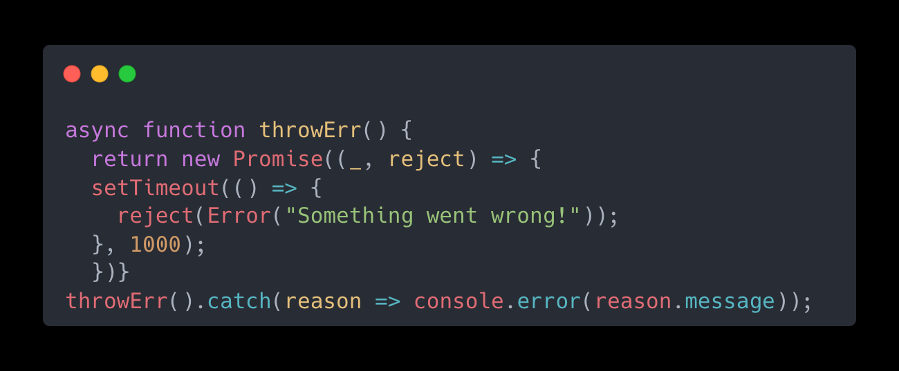

#### 使用async/await处理异常错误

async/await作为promise的语法糖可以简化promise写法，所有async函数返回值都为promise对象。

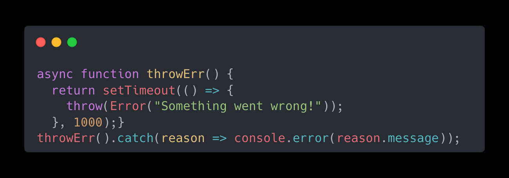

此外，通过async/await可以化异步为同步，使用try-catch-finally进行异常捕获。

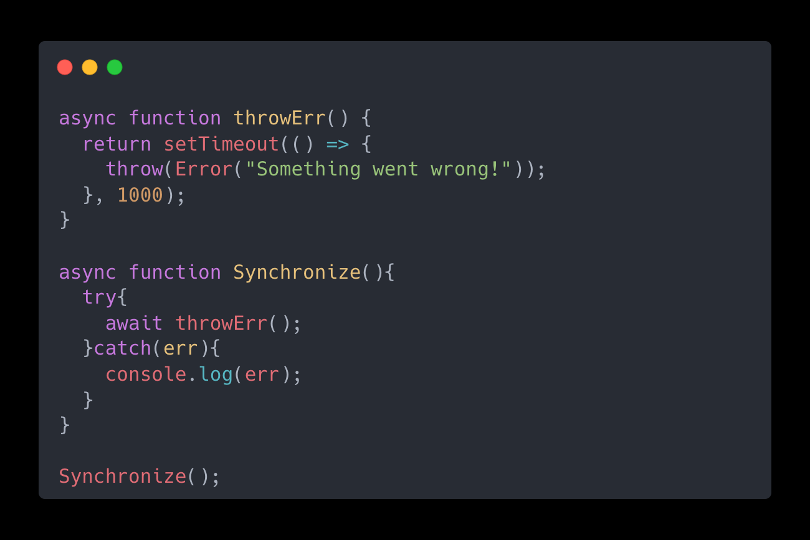

## 参考资料

> 错误处理大全[https://cloud.tencent.com/developer/article/1690099](https://cloud.tencent.com/developer/article/1690099 "https://cloud.tencent.com/developer/article/1690099")

> 处理JavaScript错误的权威指南 [https://www.wbolt.com/errors-in-javascript.html](https://www.wbolt.com/errors-in-javascript.html "https://www.wbolt.com/errors-in-javascript.html")
