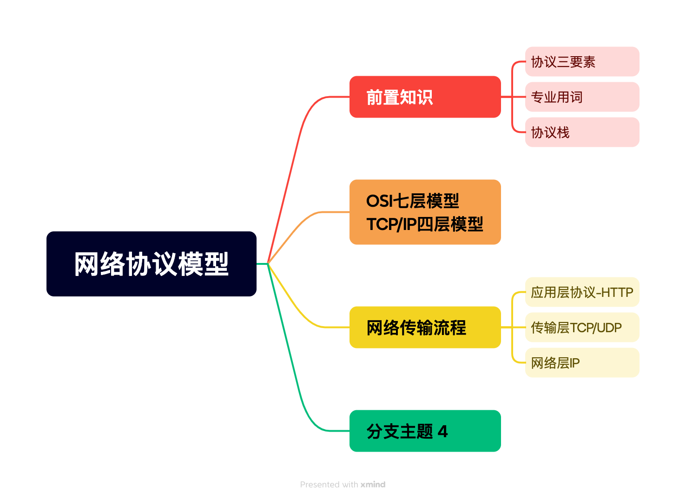
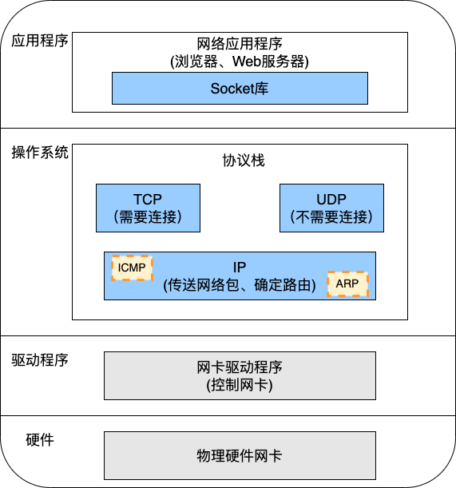
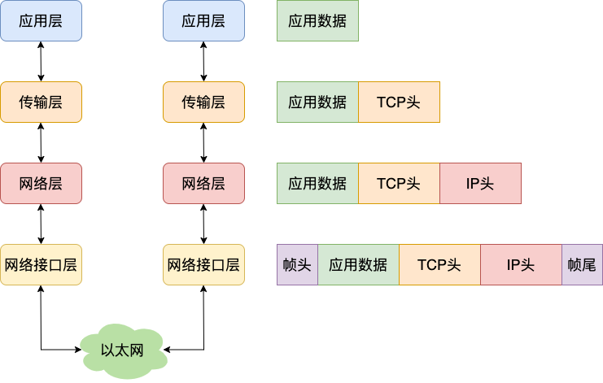
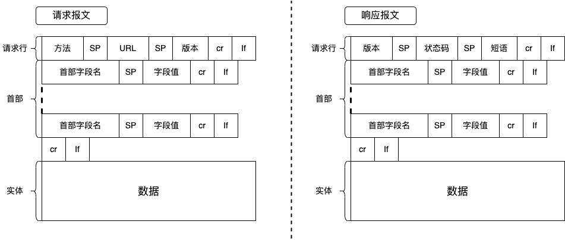
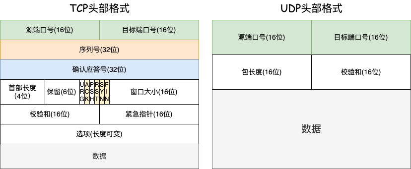
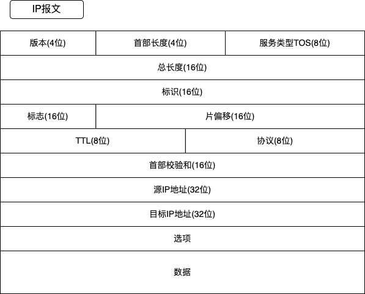
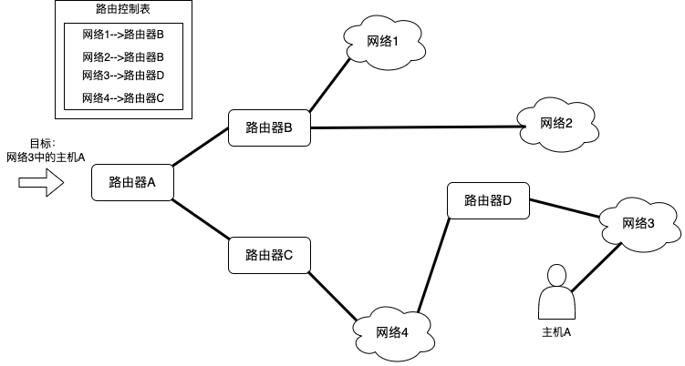

# 网络协议模型

## 前言

“看似最枯燥、最基础的东西往往具有最长久的生命力。”—趣谈网络协议

## 目录

## 前置知识

#### 协议三要素-语法、语义及顺序

协议首先需要满足语法、语义及顺序这三要素。其中，语法表示内容需要符合一定的规律及格式，如括号要成对，以分号结尾等，只有符合语法，浏览器才认识。语义表示内容需要代表某种意义，如数字进行运算是有意义的，文本进行运算是没意义的，根据约定的语义可以表达更清晰的结果，例如，状态码200表示返回成功。顺序表示内容需要一定先后顺序，不能乱序，比如，需要先发送一个请求才能获得一个返回体。

#### 专业用词

IP地址(Internet Protocol Address, IP)：网络上每台通信设备的编号，以逻辑地址来屏蔽物理地址的差异。

子网掩码：将IP地址划分成网络地址和主机地址两个部分。

无类型域间选路(Classless Inter-Domain Routing, CIDR)：打破原有分类地址做法，将IP地址10.100.122.2/24一分为二，前者为网络号后者为主机号。以斜杠后的数字为划分，即32位中前24位为网络号后8位为主机号。

MAC地址：全球唯一的硬件地址，由设备制造商确定烧录在网卡中。更像是身份证，但找人光靠身份证不够，需要有地址来进行定位，而IP地址就是定位。

网关(Gateway)：又称网间连接器、协议转换器。网关在传输层上以实现网络互连，是最复杂的网络互连设备，仅用于两个高层协议不同的网络互连，是一个网络连接到另个网络的关口。网关实质上是一个网络通向其他网络的**IP地址**，网关在网段内的可用ip中选一个，不过，一般用的是第1个和最后一个。

路由器：使得不同网络可以相互交换信息和资源的设备。

端口、端口号：端口是进程的数据传输通道，光凭ip地址只能将数据传输到设备层面，无法确定把数据给哪个进程，需要用端口号来分辨。

#### 协议栈

操作系统中的协议栈是实现网络互连和通信的基础，不仅定义了数据在网络中传输的格式和规则，还提供了必要的控制和服务，确保数据能够跨越不同的网络环境和设备，安全、高效地到达目的地。协议栈的主要作用包括：**数据封装与解封、错误检测与纠正、寻址与路由、流量控制与拥塞控制、接口抽象**、**多路复用与解复用**等。

## OSI七层模型和TCP/IP四层模型&#x20;

| OSI七层网络模型 | TCP/IP四层概念模型 | 对应网络协议                             |
| --------- | ------------ | ---------------------------------- |
| 应用层       | 应用层          | HTTP、FTP、NFS                       |
| 表示层       |              | Telnet、SNMP                        |
| 会话层       |              | SMTP、DNS                           |
| 传输层       | 传输层          | TCP、UDP                            |
| 网络层       | 网络层          | IP、ICMP、ARP                        |
| 数据链路层     | 网络接口层        | FDDI、Arpanet、PDN                   |
| 物理层       |              | IEEE 802.1A、IEEE 802.2到IEEE 802.11 |

如上表所示，开放式系统互联通信参考模型(Open System Interconnection Reference Model，OSI)由下至上分别为物理层，数据链路层，网络层，运输层，会话层，表示层， 应用层。网络通讯协议四层模型(Transmission Control Protocol/Internet Protocol,TCP/IP)由下至上分别为网络接口层，网络层，传输层，应用层。

数据封装格式如上图所示，网络接口层的传输单位是帧（frame），IP 层的传输单位是包（packet），TCP 层的传输单位是段（segment），HTTP 的传输单位则是消息或报文（message）。但这些名词并没有什么本质的区分，可以统称为数据包。

## 网络传输流程

从输入网址到页面内容显示的整个网络传输流程如上图所示，主要分为两部分：发送端寻址传输、接收端信息校验。其中寻址传输的主要流程如下：

- URL解析：浏览器接收到URL后会进行相关解析，生成需要发送给服务器的请求信息
- 应用层HTTP协议：生成的请求数据通过HTTP协议使用面向连接的方式发送请求
- DNS解析：查询服务器域名对应的 IP 地址作为通信对象的IP地址，以便委托操作系统发送信息
- 传输层TCP协议：HTTP 协议是基于 TCP 协议的，TCP会使用TCP保障机制确保数据的传输稳定性，确保请求数据完整、连接稳定。
- 网络层IP协议：TCP报文中的IP字段会记录源地址和目标地址，方便IP协议在网络层中定位目标地址。
  - 如果目标地址与源地址在同一个局域网内，直接发送ARP协议请求目标地址对应的MAC地址，将源MAC地址和目标MAC地址放入MAC头发送，利用MAC地址定位目标机器。
  - 如果目标地址与源地址不在同一个局域网内，会根据路由协议与目标IP地址进行目标局域网跳转，到达目标局域网后再发送ARP协议获取目标MAC地址。

当数据传输到目标机器后，目标机器会对数据包层层校验审核：校验MAC地址是否正确、校验IP地址是否正确、校验TCP序列号确保数据完整性、读取目标端口确定数据的去向。

#### 应用层协议-HTTP

超文本传输协议(HyperText Transfer Protocol, HTTP)， 是一个在计算机世界里专门在两点之间传输文字、图片、音频、视频等超文本数据的约定和规范。其请求报文与响应报文如上图所示，两者皆分为请求行、首部和数据三部分。其中请求报文中：方法字段决定访问资源的请求方法如GET、POST等；首部字段通过key:value的形式分割开，保存重要的字段如Content-Type、Cache-control、If-Modified-Since等;数据代表请求数据字段。响应报文中：版本表示服务器HTTP协议版本 **；** 状态码代表响应状态码；短语表示状态码的文本描述；首部字段通过key:value的形式分割开，保存重要的字段如Date、Age、Content-Tyep等;

#### 传输层-TCP/UDP

TCP是**有状态的、面向连接的、可靠的、基于字节流**的传输层通信协议，常用于对网络通信质量有很高要求的地方，如文件传输，邮件发送，远程登录等场景。

UDP是**无状态的**、面向**无连接的、不可靠的、基于数据包**的传输层通信协议，常用于即时通信，如语音、视频、直播等场景。TCP与UDP协议头格式如下图所示：

两者相比，UDP头部格式明显简单，主要差距是UDP并不依赖于各种机制来**维护状态**和**可靠连接**，其头部格式进需要提供源端口号、目标端口号、包长度及校验和这四种信息。与之相比，TCP想要做到**有状态、可靠连接及数据完整有序**，需要如下属性进行校验：

- 序列号：用于维护数据包顺序，初始值由建立连接时的计算机生成，SYN包成功传送一次，序列号**累加**一次该**数据字节数**大小。
- 确认应答号：用来解决丢包问题，发送端接收到的确认应答号便认为该序号之前的数据已成功接收。
- 控制位：
  - ACK：该位为 1 时，**确认应答**的字段变为有效，TCP 规定除了最初建立连接时的 SYN 包之外该位必须设置为 1 。
  - RST：该位为 1 时，表示 TCP 连接中出现异常必须强制断开连接。
  - SYN：该位为 1 时，表示希望建立连接，并在其**序列号**的字段进行序列号初始值的设定。
  - FIN：该位为 1 时，表示今后不会再有数据发送，希望断开连接。当通信结束希望断开连接时，通信双方的主机之间就可以相互交换 FIN 位为 1 的 TCP 段。
- 窗口大小：根据接收方当前的处理能力动态调整，防止发送方发送速度过快而导致接收方无法处理。

值得注意的是，TCP没有包长度字段，转而使用序列号和确认应答号字段来实现数据的可靠传输，通过这些字段的值以及头部长度字段来确定数据的边界。

#### 网络层-IP

在 IP 协议里面需要有**源地址 IP** 和 **目标地址 IP**：

- 源地址IP，即是客户端输出的 IP 地址；
- 目标地址，即通过 DNS 域名解析得到的 Web 服务器 IP。

网络层主要通过IP地址、路由协议表与ARP请求来定位目标局域网和目标机器的MAC地址，只有有了MAC地址才能准确将数据包传送给目标机器。IP地址和路由协议表可以定位到目标局域网，完后通过ARP进行广播，得到IP地址对应的MAC地址，通过MAC地址将数据包准确的传输到目标机器。目标机器通过层层校验数据包的准确性将数据包精准传输到所需目标端口。

## 参考资料

> 小林coding的图解网络

> 趣谈网络协议

> 透视HTTP协议
