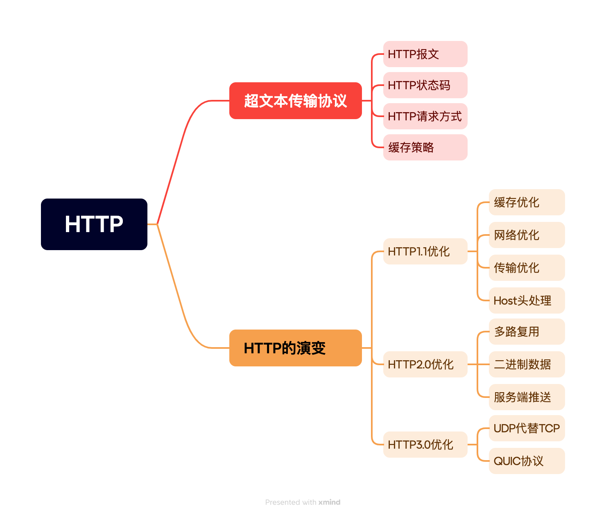
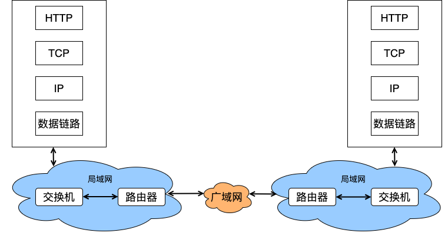
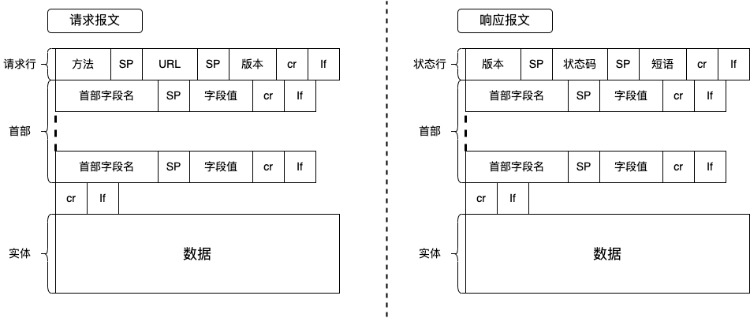
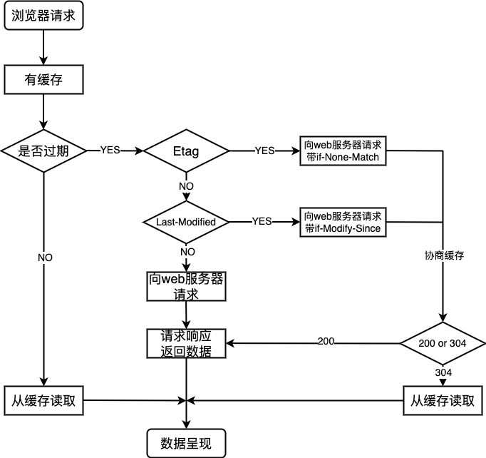

# 网络协议HTTP

## 前言

“想要不被滚滚而来的新技术淘汰，就要掌握这些可以长久使用的知识，而网络协议就是值得你学习，而且是到 40 岁之后依然有价值的知识。”—趣谈网络协议

## 目录

## 超文本传输协议-HTTP

超文本传输协议(HyperText Transfer Protocol, HTTP)，是一个在计算机世界里专门在两点之间传输文字、图片、音频、视频等超文本数据的约定和规范。HTTP不是孤立存在的，在互联网世界里，HTTP 通常跑在 TCP/IP 协议栈之上，依靠 IP 协议实现寻址和路由、TCP协议实现可靠数据传输、DNS 协议实现域名查找、SSL/TLS 协议实现安全通信。计算机通信是一张错综复杂的关系网，而HTTP是活跃在应用层的，与web用户打交道最多的协议。想要了解整体网络的运作，详见文章：[网络协议模型](https://juejin.cn/post/7373238579839778853 "网络协议模型")。

#### HTTP报文

HTTP 协议在实际传输中会在数据前添加一些头部信息以供功能使用，其是一个“纯文本”协议，头部数据都是ASCII码文本，无需借助程序解析也能看懂。HTTP 协议的报文主要分为请求报文和响应报文，两者结构基本相同，由三大部分组成：

1. 起始行（start line）：描述请求或响应的基本信息；
2. 头部字段集合（header）：使用 key-value 形式更详细地说明报文；
3. 消息正文（entity）：实际传输的数据，它不一定是纯文本，可以是图片、视频等二进制数据。

**起始行**

起始行在请求报文中叫请求行，请求行由三部分组成：

1. 请求方法：对资源的操作动作；
2. 操作目标：通常为URL，标记请求方法要操作的资源；
3. 版本号：报文使用的HTTP协议版本；

三部分用空格分隔开并用CRLF换行表示结束。

起始行在响应报文中叫状态行，表示服务器的响应状态。同样，状态行也由三部分组成：

1. 版本号：报文使用的 HTTP 协议版本；
2. 状态码：一个三位数，用代码的形式表示处理的结果，比如 200 是成功，500 是服务器错误；
3. 原因：以更详细的文字作为数字状态码补充，帮助人理解原因。

**头部字段**

头部字段以 key、value的形式进行存储，通过冒号分隔。通常，首部字段中会存储功能性字段来说明协议功能。HTTP协议中规定了非常多的字段，基本可以分为四大类：通用字段、请求字段、响应字段和实体字段。其中，**通用字段提供关于报文整体的信息，不特定于请求或响应。** 例如：

- **Cache-Control**: 控制请求和响应的缓存机制，如`no-cache`, `max-age`等指令，指导缓存如何存储及使用请求或响应。
- **Connection**: 指示是否保持TCP连接持久性，如`keep-alive`表示希望维持连接，以便后续请求复用。
- **Date**: 表示消息生成的时间。

**请求字段提供了关于客户端的信息、请求的细节以及客户端对响应的偏好。** 例如：

- **Host**: 指定请求资源的主机名和端口号。它是必须的，用于标识请求的服务器。
- **Accept**: 客户端可接受的响应内容类型。
- **Accept-Language**: 客户端偏好的语言，服务器可根据此字段提供多语言版本的网页。
- **Authorization**:用于HTTP身份验证，携带了客户端的认证信息，如基本认证、Bearer令牌等。
- **User-Agent**: 发起请求的客户端软件信息，如名称、版本号等，有助于服务器了解客户端的功能。
- **Cookie**: 发送之前与服务器交互时设置的Cookie，用于会话管理或个性化设置。
- **Referer**: 表示当前请求的URL是从哪个地址跳转过来的，用于追踪用户来源。
- **If-Modified-Since** 和 **If-None-Match**: 用于条件请求，前者检查资源自从指定时间后是否修改过，后者检查资源的ETag是否匹配，以决定是否需要重新传输资源。

**响应字段提供了关于响应的附加信息，以及可能对客户端进一步操作的指示。** 例如：

- **Server**: 指示服务器软件的信息，如名称和版本，但出于安全考虑，许多服务器默认不发送或伪造此信息。
- **Last-Modified**: 标记资源最后修改的时间，客户端可以使用此时间进行条件请求，判断资源是否需要更新。
- **Location**: 用于重定向，告诉客户端应当访问的新URL。
- **Refresh**: 指示浏览器在多少秒后刷新页面或重定向到另一个URL，常用于页面自动刷新或定时跳转。
- **Pragma**: 与缓存控制相关，`Pragma: no-cache `是HTTP/1.0中用于禁用缓存的方式，但在HTTP/1.1中推荐使用Cache-Control。
- **Set-Cookie**: 用于设置或更新Cookie，发送至客户端，用于会话管理和个性化设置。
- **Expires**: 指定响应过期时间，超过此时间，内容应被视为过时，但现代Web开发更倾向于使用Cache-Control。
- **Vary**: 指出哪些请求头域决定了响应的可变性，使得代理服务器可以更精准地缓存响应。

**实体字段涉及报文的实体部分（即请求或响应的主体内容），提供了有关实体内容的元数据。** 例如：

- **Content-Type**: 实体内容的类型和字符集。
- **Content-Length**: 实体主体的大小（字节）。
- **Content-Encoding**: 实体主体使用的编码方式，如压缩格式。
- **ETag**: 实体的一个唯一标识符，用于缓存验证。

**值得一提的是，字段命名有相应规范：** 1.不区分大小写；2.不允许出现空格；3.不允许使用下划线“ \_”；4.可以使用连字符“-”；5.key后紧跟“:”，不能有空格；6.“:”后的value前可以有多个空格；7.字段顺序无意义；8.原则上不能重复。

消息正文代表实际传输的数据，**HTTP报文中用空行来区分header和body，哪怕body为空，空行也必须存在。**

#### HTTP状态码

- **1xx 信息响应**。 请求已接收并理解。 等待后续进一步请求。
- **2xx 成功**。 已成功接收、理解和接受该操作。
- **3xx 重定向**。 信息不完整需要进一步补充才能完成请求。
  - 301(永久移动）：请求的网页已被永久移动到新位置。服务器返回此响应（作为对GET或HEAD请求的响应）时，会自动将请求者转到新位置。
  - 302(临时移动)：服务器目前正从不同位置的网页响应请求，但请求者应继续使用原有位置来进行以后的请求。此代码与响应GET和HEAD请求的301代码类似，会自动将请求者转到不同的位置。
  - 304：当客户端有缓冲的文件并发出了一个条件性的请求时，服务器返回客户端，原来缓冲的文档还可以继续使用。
  - HTTP状态码301与302的区别：
    - 它们之间关键区别在，资源是否存在有效性；
    - 301表示旧地址A的资源已经被永久地移除了（这个资源不可访问了），搜索引擎在抓取新内容的同时也将旧的网址交换为重定向之后的网址；
    - 302表示旧地址A的资源还在（仍然可以访问），这个重定向只是临时地从旧地址A跳转到地址B，搜索引擎会抓取新的内容而保存旧的网址。
    - 302会出现 **“网址劫持”现象**，从A网址302重定向到B网址，由于部分搜索引擎无法总是抓取到目标网址，或者B网址对用户展示不够友好，因此浏览器会仍旧显示A网址，但是所用的网页内容却是B网址上的内容
    - 注意：如果永久失效建议使用404。
- **4xx 客户端错误**。 可能是客户端导致的错误。 请求包含错误的语法或无法实现。
  - 400：服务器由于客户端错误而**无法理解和处理请求**。
  - 401：**身份验证失败或未提供身份验证**时，将发生此状态代码请求。
  - 403：类似于401，**缺少必要的权限**，但身份验证将不适用于此处。
  - 404：请求有效，但**无法在服务器上找到资源**。通常是由于不正确的 URL 重定向造成的。
  - 409：请求与资源的当前状态冲突。通常是**同时更新或版本相互冲突**的问题。
  - 410：请求的资源不再可用。
- **5xx 服务器错误**。 服务器遇到错误，无法满足请求。

#### HTTP请求方式

- **GET**：用于请求访问已被URI（统一资源标志符）识别的资源。请求参数和对应值附加在URL后面，通过查询字符串形式传递。安全且幂等。
- **POST**：向指定资源提交数据进行处理请求（例如提交表单或者上传文件）。数据包含在请求体中。不幂等。
- **HEAD**：类似于GET请求，但服务器只返回HTTP头部，不返回消息体，用于检查资源的存在性、类型、大小等元信息，而不需要传输全部内容。
- **PUT**：用于替换服务器上指定资源的所有当前表示。幂等，会覆盖原有资源。PUT 与 POST 方法的区别在于，PUT 方法是幂等的用于覆盖当前资源，而POST方法是不幂等的用于新增资源。
- **DELETE**：请求服务器删除指定的资源。幂等。
- **OPTIONS**：用于获取服务器支持的HTTP请求方法，也可以用来测试服务器功能是否正常。如：预检请求。
- **TRACE**：回显服务器收到的请求，主要用于诊断和测试，可以看到请求经过代理或网关时的修改。
- **CONNECT**：用于建立一个到由Request-URI标识的服务器的TCP连接通道，通常用于代理服务器，实现对HTTPS等协议的隧道连接。
- **PATCH：** 允许精确指定更新部分资源，而不是替换整个资源。非幂等、针对性强。PUT和PATCH都是用来修改服务端某个资源，但不同的是PATCH请求只提交修改的字段，PUT是将整个资源的信息都提交到服务端，包括修改的，未修改的都提交到服务端。

**安全是指该操作用于获取信息而非修改信息。**

**幂等是指对同一个 URL 的多个请求应该返回同样的结果，简单来说就是调用一次与连续调用多次是等价的。**

#### 缓存策略

缓存（Cache）是计算机领域里的一个重要概念，是优化系统性能的利器。由于网络传输链路较长，延时不可控，HTTP获取资源的成本较高，因此在HTTP获取资源的每个环节上都有缓存策略且十分复杂。基于“请求 - 应答”模式的特点，缓存可以大致分为客户端缓存和服务器端缓存，因为服务器端缓存经常与代理服务“混搭”在一起，所以本节只讲浏览器的缓存。

浏览器缓存可以分为**强制缓存阶段、协商缓存阶段及缓存失败阶段**。强制缓存阶段允许浏览器在不与服务器通信的情况下使用本地缓存资源，每次请求前都会检测本地资源有效期，只要本地资源没有过期就直接使用本地资源。如果没有设置强制缓存或强制缓存资源已过期，会进入协商缓存阶段。协商缓存阶段需要向服务端发送请求咨询本地资源是否有更新，如果资源没有更改，服务器返回304直接使用本地资源，如果资源有更改，服务器返回200且携带最新资源。如果此时不存在请求的资源服务器会直接返回404表示缓存失败。具体流程如下所示：

在HTTP1.0中，对于强制缓存使用expires字段来表示资源的有效时间，对于协商缓存在**请求头**中使用If-Modified-Since表示服务端上一次响应资源的更新时间，在响应头中使用Last-Modified表示服务器资源最新更改时间。通过两个值的对比来确定缓存资源是否可用。

**HTTP1.0协商缓存策略存在的问题：资源改了之后，又改了回来，这时虽然资源的最后修改时间发生了变化，但其实资源内容本身没有发生变化，其实这种情况也应该是走缓存，但HTTP1.0不会走缓存。并且Last-Modified / If-Modified-Since只能精确到秒，若 1s 内多次修改资源 Last-Modified 不会变化。**

因此HTTP1.1对于缓存字段进行了优化，使用**Cache-Control**来控制缓存方式，该字段是一个字符串，属性在字符串中以逗号进行分隔，常用属性：**public**- 响应可以进行任何存储，私有缓存、共享缓存；**private**-响应只能私有缓存不能共享缓存；**no-cache**-私有缓存只能进行协商缓存；**max-age**-强制缓存，缓存有效期；**no-store**-不进行缓存。以Etag/If-None-Match代替Last-Modified/If-Modified-Since进行协商缓存。Etag一个随机字符串，可以是时间戳的哈希值，也可以是版本号，表示服务器资的源哈希值。用于响应头中，作为资源的最后标识。请求头中使用If-None-Match字段携带上一次响应资源中的Etag字段值。以Etag代替时间作为文件标识，有效解决了HTTP1.0协商缓存存在的问题。

**值得注意的是**，强制缓存的优先级高于协商缓存，HTTP1.1表示缓存字段的优先级高于HTTP1.0表示缓存字段的优先级。

## **HTTP演变**

#### HTTP1.1优化

HTTP1.0存在缺点：通信开销大，一次请求一个链接；头部阻塞；连接数有限。

**缓存优化**

HTTP1.1比HTTP1.0提供更多缓存头进行缓存策略，避免发送无意义的HTTP请求。

**网络优化**

长连接：HTTP1.0每进行一次HTTP操作，就建立一次连接，进行三次握手、四次挥手，增加了通信开销。为解决此问题HTTP1.1允许建立长连接，在一个TCP连接上可以传送多个HTTP请求和响应。

请求部分资源：HTTP1.1允许在请求头中加入Range字段来限定请求范围，可以有效减少通信开销。

**传输优化**

在同一个 TCP 连接里面，客户端可以发起多个请求，只要第一个请求发出去了，不必等其回来，就可以发第二个请求出去，可以**减少整体的响应时间。**但是**服务器必须按照接收请求的顺序发送对这些管道化请求的响应**。如果服务端在处理 A 请求时耗时比较长，那么后续的请求的处理都会被阻塞住，这称为「队头堵塞」。所以，**HTTP/1.1 管道解决了请求的队头阻塞，但是没有解决响应的队头阻塞**。

**Host头处理**

HTTP1.1支持虚拟主机，使得一台物理服务器能够托管多个不同的网站，每个网站有不同的域名。

**HTTP2.0优化**

HTTP1.1存在缺点：响应头部阻塞，下一个响应需要等到上一个响应结束；浏览器很难实现管道化，依然依赖于TCP的重连；头部信息冗余，文本格式笨重；无法主动请求。

**多路复用-解决应用层的头部阻塞**

HTTP2引入了二进制分帧层，将HTTP消息分解成更小的二进制帧进行传输。每个请求或响应对应一个流，流是由一系列带有相同流标识符的帧组成的数据序列。流标识符使得接收端能够将收到的帧重新组装成原始的HTTP消息。

**二进制数据格式-解决头部信息冗余和文本格式笨重**

HTTP1.x的解析是基于文本的，而HTTP2.0的协议解析是采用二进制格式，并且基于二进制格式进行了头部信息复用。

**服务端推送**

服务器端通过分析网页的结构或者应用程序逻辑，识别出客户端可能需要的额外资源，主动推送到客户端。服务端在响应客户端请求时会提前发送一个**PUSH\_PROMISE**帧来告知客户端服务端打算推送的资源。

**HTTP3.0优化**

HTTP2.0缺点：多路复用易导致瞬时QPS暴增；未解决TCP头部阻塞问题；丢包超时重传造成的延时问题严重。

**UDP代替TCP-解决TCP头部阻塞**

TCP头部阻塞问题本质上无法解决，因此HTTP3.0用UDP来代替TCP，在传输层放弃维护数据包的可靠性，转而在应用层使用QUIC协议来确保数据的可靠传输。QUIC 协议在应用层建立重传机制，对每个数据包标注唯一标识。当某个流中的一个数据包丢失了，即使该流的其他数据包到达了，数据也无法被 HTTP/3 读取，直到 QUIC 重传丢失的报文，数据才会交给 HTTP/3。

**QUIC协议的拥塞控制-解决多路复用易导致瞬时QPS暴增**

QUIC协议的拥塞控制是数据流级别的，可以更细颗粒度的控制数据流，减少因为单一流的数据包丢失对其他流的影响，提高了网络的利用率和响应速度。

**QUIC协议的ECN、拥塞避免与恢复-解决重传延时问题**

QUIC协议的慢启动、拥塞避免、拥塞避免、滑动窗口都是数据流级别。并且QUIC支持ECN，这是一种允许网络设备在拥塞发生之前主动通知发送方的机制。通过在数据包头部设置特殊标志位，路由器可以在拥塞开始之前就通知发送方，使得发送方能够更早地做出拥塞控制响应，减少丢包率。

## 总结

QUIC协议是一种大胆的尝试，将传输层的问题抛到应用层解决。“向外层抛问题，在外层解决”或许可以给很多问题带来新的思考方向。

## 参考资料

> 小林coding的图解网络

> 趣谈网络协议

> 透视HTTP协议
