# JavaScript执行上下文

## 前言

> 当你感觉自己像个扎实的开发者，但出现问题时胃里却有一种痛苦的感觉。事实上，开发的世界对你来说有很多魔法，也许是时候花些时间梳理一下了--Stephen Curtis

## 目录

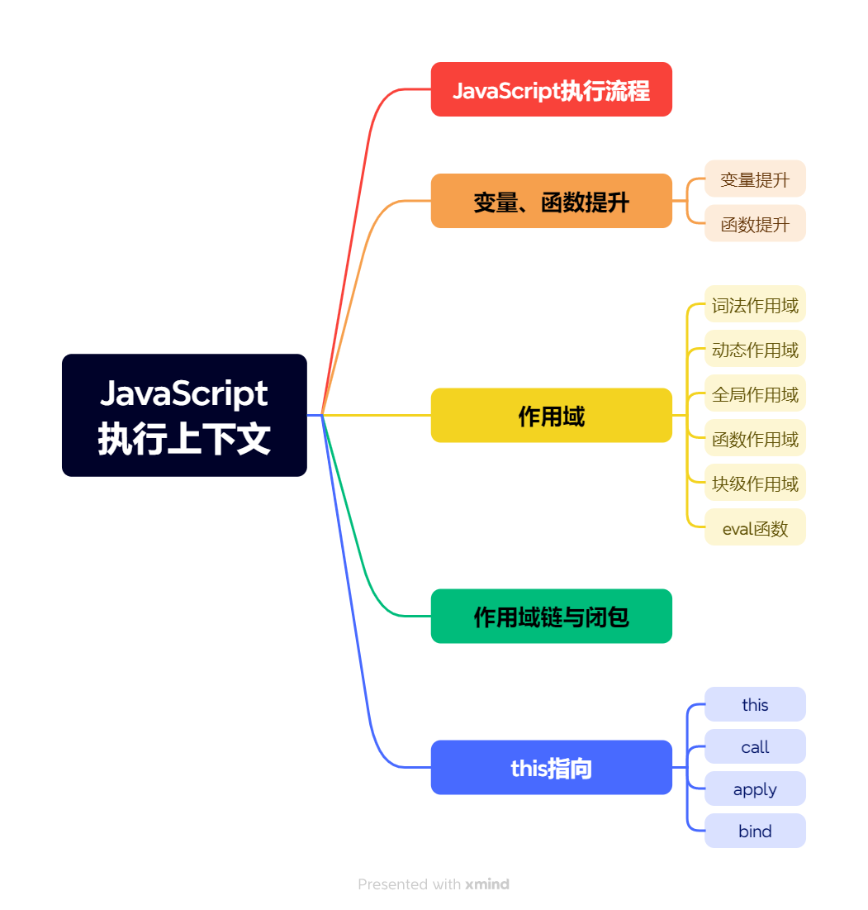

## **JavaScript代码的执行流程**

JavaScript是一门解释性语言，在运行环境中执行前会经历编译阶段生成执行上下文与可执行代码，完整的代码执行流程如下图所示。

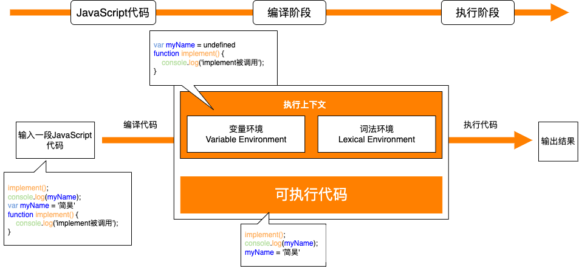

编译阶段生成的**执行上下文**是一个处理JavaScript代码转换和执行的特殊环境，其中包括正在运行的代码和有助于运行代码的所有内容。JavaScript中有三种种执行上下文：全局执行上下文（GEC）、函数执行上下文（FEC）和Eval函数执行上下文，其中Eval函数执行上下文使用场景较少，故暂不讨论。

**全局执行上下文 (GEC)** 是基础/默认的执行上下文，每一个JavaScript文件只能有一个GEC，所有**不在函数内部的JavaScript代码**都在这里执行。

每当函数被调用时，JavaScript引擎就会在GEC内部创建**函数执行上下文（FEC）**，并在FEC中评估和执行函数中的代码。

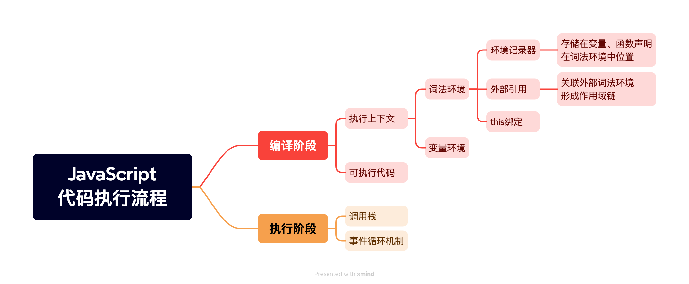

执行上下文主要包含词法环境(LexicalEnvironment组件)和变量环境(VariableEnvironment组件)，官方ES6文档将**词法环境**定义为一种规范类型，用于根据ECMAScript代码的词法嵌套结构定义标识符与特定变量和函数的关联，由一个**环境记录**和一个**可为空的外部引用**组成。简单来说，词法环境就是一个保存标识符与变量的映射结构。**变量环境**也是一个词法环境，因此它具有上述词法环境的所有属性和组件，与词法环境的区别在于前者被用来存储函数声明和变量（**let** 和 **const**）绑定，而后者只用来存储 **var** 变量绑定。

## 变量、函数提升

**变量提升**

变量提升中只有变量声明被提升，变量初始化不会被提升，并且声明会被提升到**当前作用域**的顶端。

_taJFbz7xaL.png>)

_VyVqslRVJf.png>)

**函数提升**

函数提升中，函数声明和函数初始化都会被提升，但函数表达式不会被提升，因为函数表达式本质上是变量，变量提升不会将变量初始化进行提升。

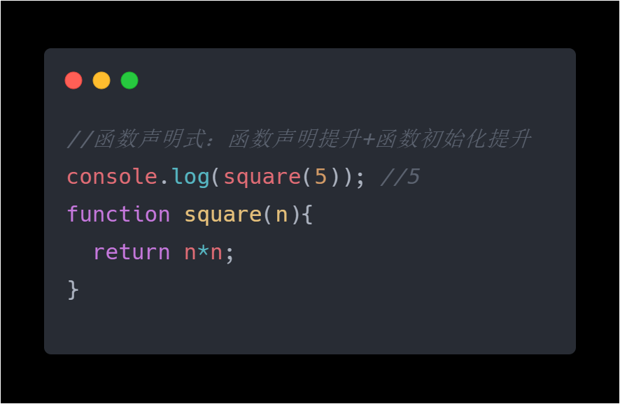

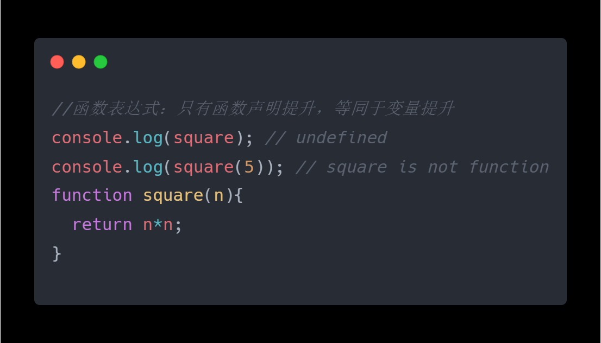

**优先级**

函数提升在变量提升之前，

**原因：**变量提升，声明和赋值是两步，变量提升只提升声明。函数问题，声明和赋值全部被提升。因此在变量声明提升后的赋值阶段会**优先执行函数变量的赋值步骤，再执行普通变量的赋值步骤**。

**变量提升导致的危害**

在开发过程中变量提升，我们随意使用var定义的变量，往往在不经意间，就提升为全局变量。虽然这样我们能够方便的访问变量，但是如果与团队分工合作的前提下，个人定义的变量一旦提升为全局变量，团队中的其他人也采用了同名的变量，那么这两个部分将会想回影响，最终会出现许多难以预料到的问题。

**同名函数和同名变量的提升**

对于同名的变量声明，var声明的变量，变量声明提升，但变量初始化未提升，所以在后声明变量赋值完成前，变量值依然为先声明的变量。let、const声明的变量，同名的变量声明会报错(在同一作用域下，同名变量声明会报错，嵌套作用域中支持同名变量声明，最好不要那么做)。

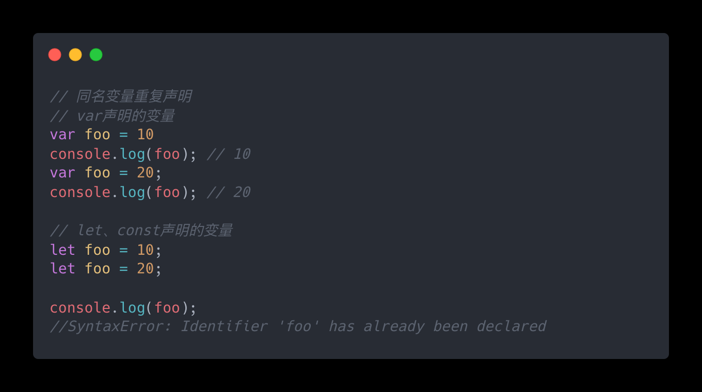

对于同名的函数声明，函数声明式声明的函数，函数声明和函数初始化同时提升，后声明函数完全覆盖前声明的函数。函数表达式声明的函数和var声明的变量相同。

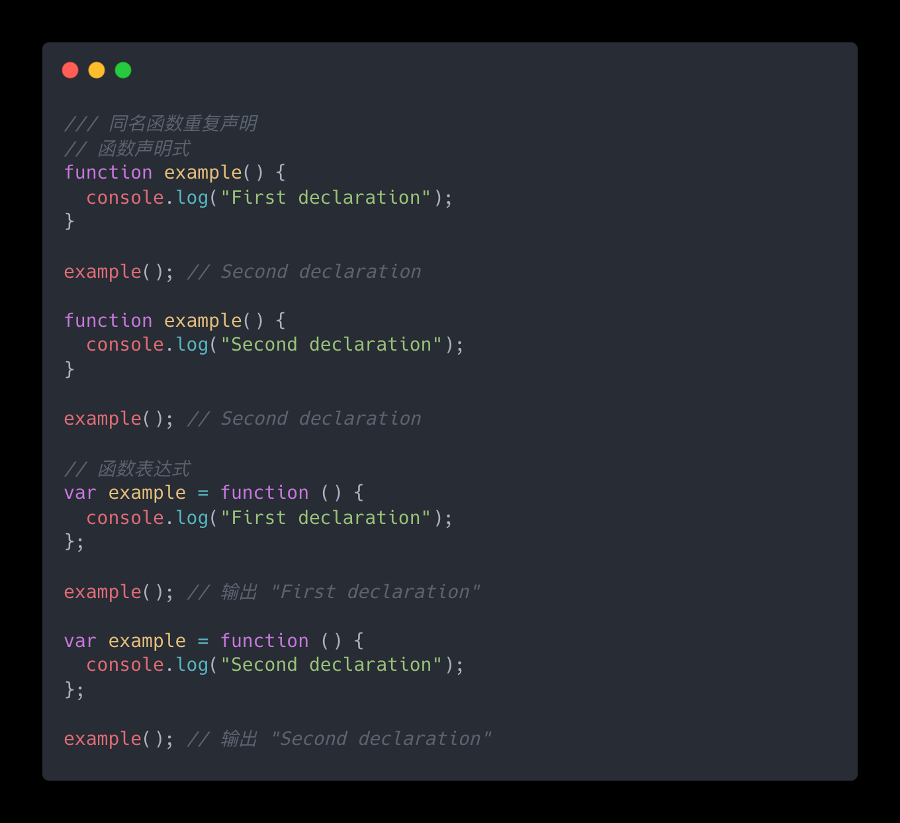

对于同名的函数声明和变量声明，所有声明都会被提到最前，但除了函数声明式声明的函数初始化其他初始化都不会提前，因此值会随着初始化的位置而改变。

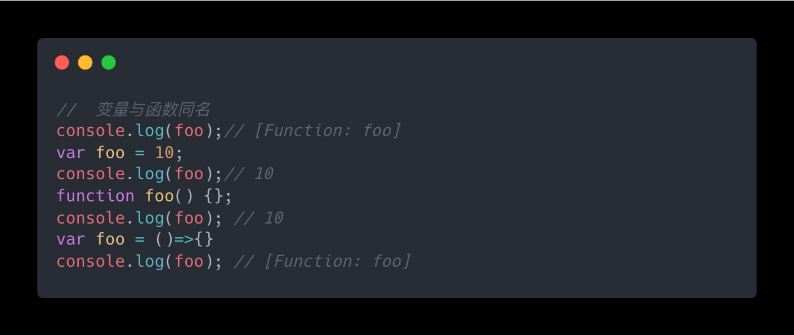

## 作用域

作用域是确定在何处以及如何查找变量（标识符）的一套规则。作用域有两种工作模型，分别是**词法作用域**和**动态作用域**。

**词法作用域：** 是静态作用域，作用域定义过程发生在代码的书写阶段，javaScript引擎就是使用的词法作用域。

**动态作用域：** 作用域在运行时根据函数调用的上下文动态确定。

在 JavaScript 中，作用域又分为四种类型：**全局作用域、函数作用域、块级作用域和eval作用域**。

&#x20;**全局作用域**是整个程序的最外层作用域，包含了所有其他作用域。在全局作用域中声明的变量和函数可以被程序中的任何地方访问。

**函数作用域**是函数内部声明的作用域，在函数内部声明的变量只能在该函数内部访问。

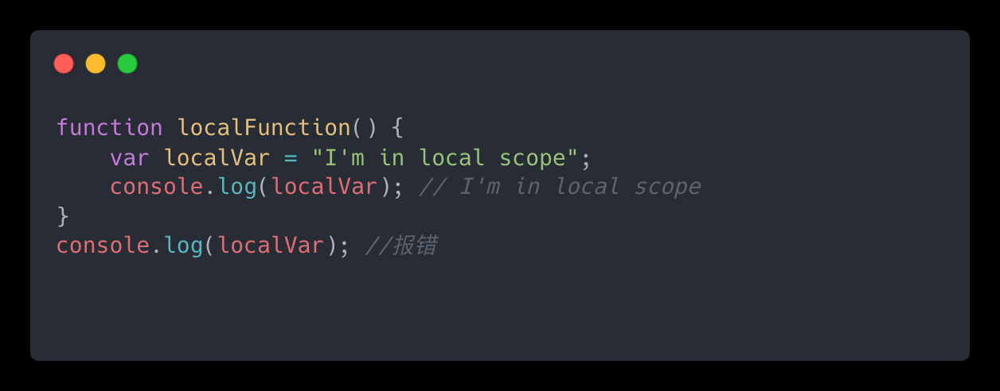

**块级作用域**是 ES6 引入了 let 和 const 关键字后定义的，只在let和const语句所在的代码块中有定义。粗略地讲，如果变量或常量声明在一对花括号中，那这对花括号就限定了该变量或常量有定义的代码区域。

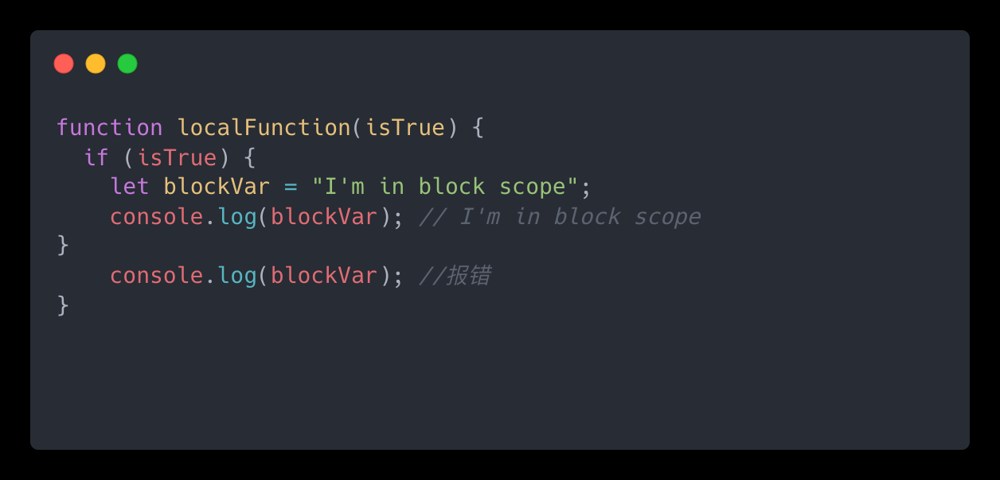

**eval()函数**会将传入的字符串当做 JavaScript 代码进行执行，即一句代码一个作用域。

## 作用域链与闭包

**作用域链：**每个执行上下文的变量环境中都包含一个外部引用用来指向外部执行上下文。当JavaScript代码中出现变量时，JavaScript引擎首先会在当前执行上下文中查找，如果当前上下文中未找到时会继续在outer所指向的外部执行上下文中寻找，直到全局。**值得注意的是**，JavaScript是词法作用域，作用域链由**代码中函数声明的位置来决定**。

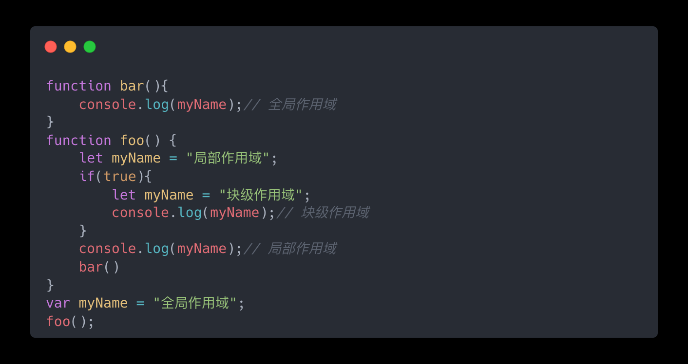

**闭包：** 闭包是一种保护私有变量的机制，在函数执行时形成私有的作用域，保护里面的私有变量不受外界干扰。直观的说就是形成一个不销毁的栈环境。—菜鸟教程

**形成闭包的条件：** 函数嵌套函数、内部函数中使用了父函数的变量、内部的私有变量外界可以引用，但无法改变，且不轻易被销毁。

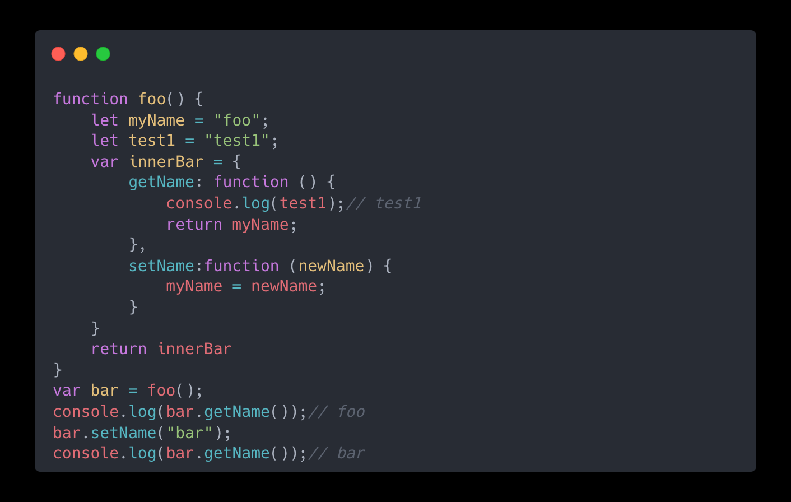

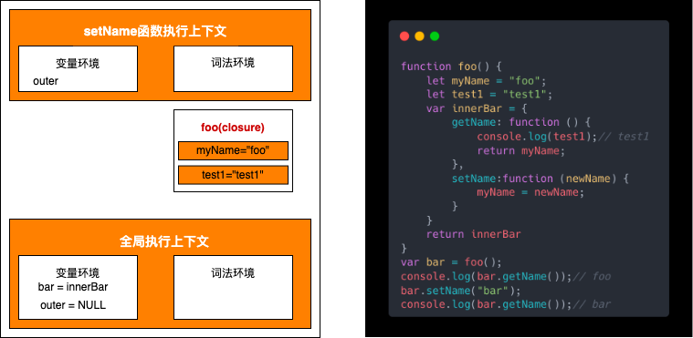

优点：变量长期保存内存中；避免全局变量污染；私有成员的存在。

缺点：常驻内存，增加内存使用量；使用不当造成内存泄漏。

## this指向

“this” 关键字允许在调用函数或方法时决定哪个对象应该是焦点。

**普通函数的this指向：**

普通函数中的this指向分为四类，隐式绑定、显示绑定、new绑定和全局绑定。普通函数的this指向修改本质上都是call的作用。call是每个普通函数都有的一个属性，所有函数和对象的调用都可以转为call的形式，this指向第一个参数。不同于箭头函数，普通函数的this只有在执行时才会确定，哪里调用函数/对象，call方法就将this指向哪里。

1.隐式绑定：this指向（.）左侧的对象。

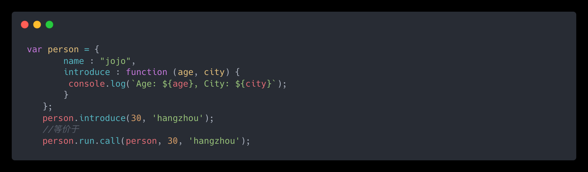

2.显示绑定：通过显式apply、call、bind 调用，this指向第一个参数，若第一个参数为undefined、null时默认指向windows。

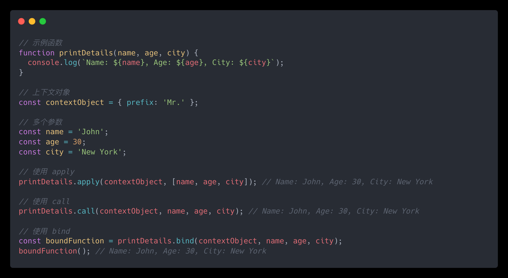

apply、call、bind 区别：

执行时机不同：apply和call会立即执行，bind不会立即执行，会返回一个永久改变this指向的函数。

传参形式不同：apply以数组形式传参，call和bind以参数列表形式传参。apply和call传参必须一次性完成，bind可以分多次传参。

3.关键字new绑定：构造函数new一个新对象，this指向新对象。

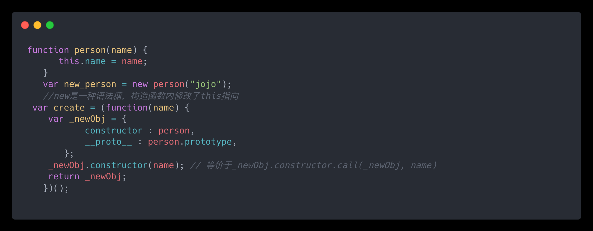

4.windows绑定：非严格模式中全局作用域的this默认指向windows，严格模式中中全局作用域的this默认指向undefined。

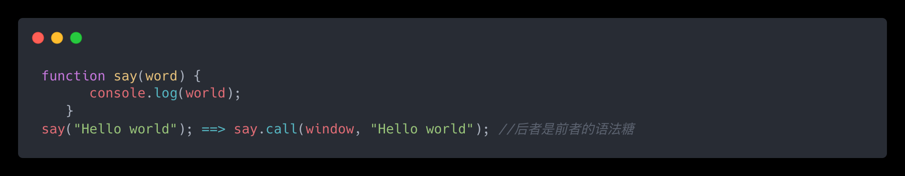

经典例子：

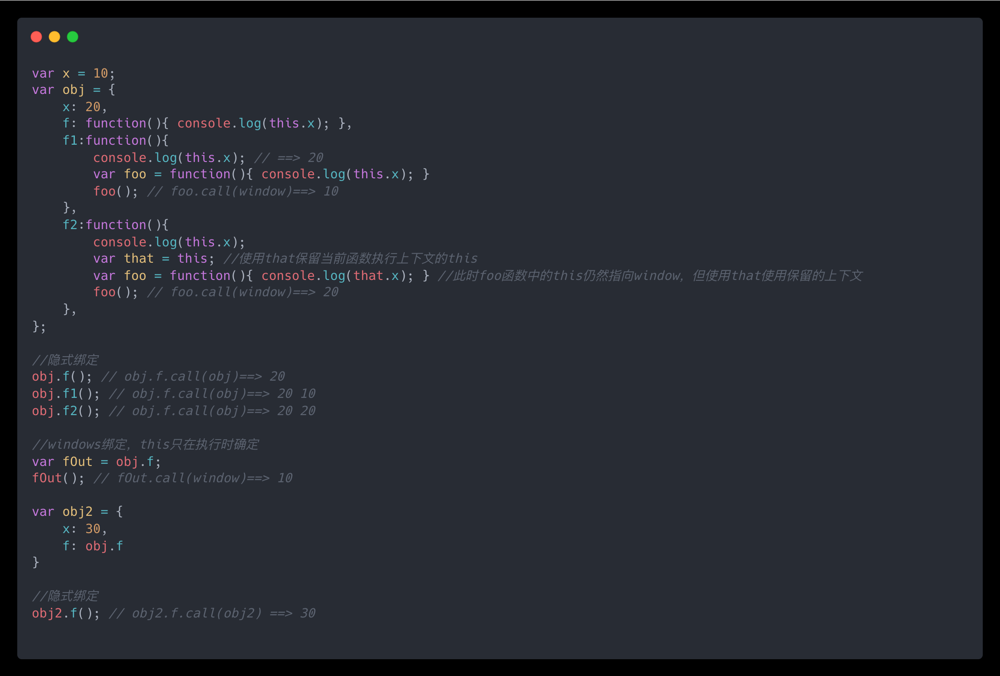

**箭头函数的this指向：** 箭头函数中this永远由上下文决定，不能修改指向。也可以说箭头函数本身没有this。

## 参考资料

> “Understanding the this keyword, call, apply, and bind in JavaScript"                [https://ui.dev/this-keyword-call-apply-bind-javascript](https://ui.dev/this-keyword-call-apply-bind-javascript "https://ui.dev/this-keyword-call-apply-bind-javascript")

> “JavaScript中this用法”[https://www.ruanyifeng.com/blog/2010/04/using\_this\_keyword\_in\_javascript.html](https://www.ruanyifeng.com/blog/2010/04/using_this_keyword_in_javascript.html "https://www.ruanyifeng.com/blog/2010/04/using_this_keyword_in_javascript.html")

> “学会JS的this这一篇就够了，根本不用记”[https://www.imooc.com/article/1758](https://www.imooc.com/article/1758 "https://www.imooc.com/article/1758")

> “JavaScript 执行上下文——JS 的幕后工作原理”[https://www.freecodecamp.org/chinese/news/execution-context-how-javascript-works-behind-the-scenes/](https://www.freecodecamp.org/chinese/news/execution-context-how-javascript-works-behind-the-scenes/ "https://www.freecodecamp.org/chinese/news/execution-context-how-javascript-works-behind-the-scenes/")

> “浏览器工作原理与实践”—李兵
