# JavaScript执行机制

## 前言

上一篇文章在讲述执行上下文内容的时候讲到了当一段JavaScript代码被执行时，JavaScript 引擎先会对其进行编译，并创建执行上下文。本文将概述生成执行上下文后，JavaScript 引擎将如何执行代码。

## 目录

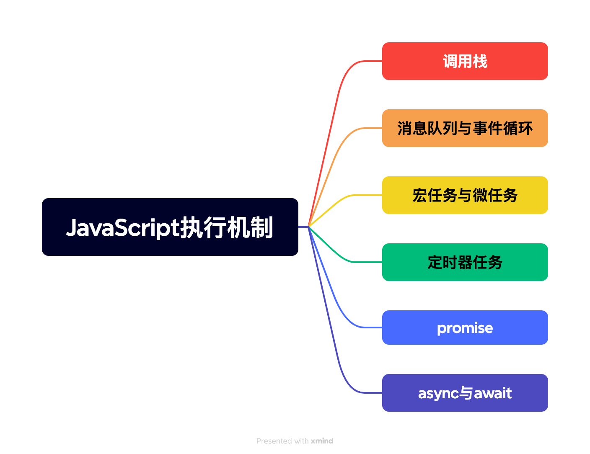

## 调用栈

JavaScript 是一门单线程的语言，这意味着它只有一个调用栈，因此，它同一时间只能做一件事。调用栈是一种拥有 LIFO（后进先出）数据结构的栈，被用来存储代码运行时创建的所有执行上下文。通俗地说，调用栈记录了代码的执行位置。当JavaScript 引擎第一次遇到你的脚本时，它会创建一个全局的执行上下文并且压入当前执行栈。此后，每当引擎遇到一个函数调用，都会为该函数创建一个新的函数执行上下文并压入栈顶。引擎会执行位于栈顶的函数，当函数执行完成后，该函数的执行上下文会从栈顶弹出，从而达到利用调用栈追踪执行函数、控制函数执行流程的效果。

对于调用栈，引用MDN的解释如下：调用栈是解释器（比如浏览器中的 JavaScript 解释器）追踪函数执行流的一种机制。当执行环境中调用了多个函数时，通过这种机制，我们能够追踪到哪个函数正在执行，执行的函数体中又调用了哪个函数。

- 每调用一个函数，解释器就会把该函数添加进调用栈并开始执行。
- 正在调用栈中执行的函数还调用了其他函数，那么新函数也将会被添加进调用栈，一旦这个函数被调用，便会立即执行。
- 当前函数执行完毕后，解释器将其清出调用栈，继续执行当前执行环境下的剩余的代码。
- 当分配的调用栈空间被占满时，会引发“堆栈溢出”错误。

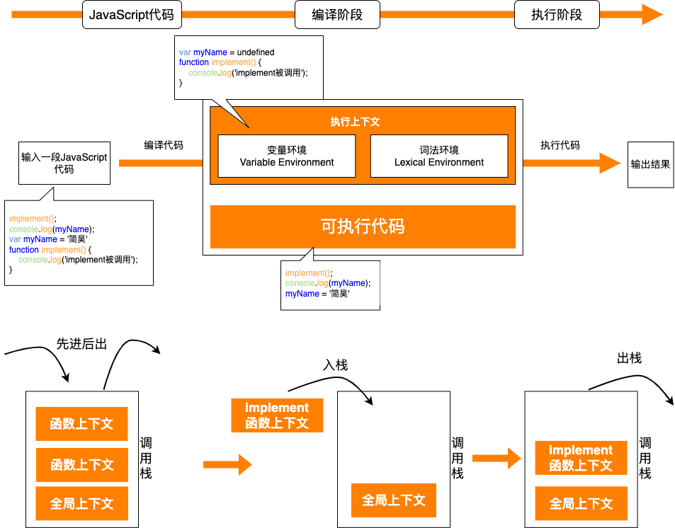

**为什么JavaScript是单线程的呢？**

对于这个问题阮一峰老师在博文中解释的很通俗易通，设计JavaScript为单线程与其设计意图强相关。作为浏览器脚本语言，JavaScript主要用途是与用户互动，操作DOM。如果是多线程会带来复杂的同步问题：比如，JavaScript同时有两个线程，一个线程在某个DOM节点上添加内容，另一个线程删除了这个节点，这时浏览器应该以哪个线程为准？

为了规避复杂性，JavaScript只可能是单线程的，哪怕为了利用多核CPU能力，允许JavaScript脚本创造多个线程，也是子线程受主线程控制且不允许操作DOM。这也没有破坏JavaScript是单线程的设计特点。

## 消息队列与事件循环

本文暂且将JavaScript引擎中负责解释和执行JavaScript代码的线程称为主线程，将处理网络请求、DOM时间、定时器任务等子线程称为工作线程。

如果只有一个线程，且线程任务全是同步任务，只要将任务排好顺序按序执行即可。

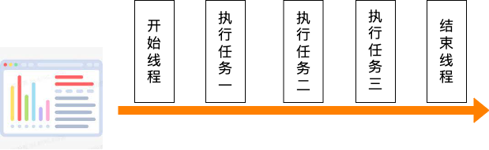

但并不是所有的任务都是在执行之前统一安排好的，大部分情况下，新的任务是在线程运行过程中产生的。要想在线程运行过程中，能接收并执行新的任务，就需要采用**事件循环机制**，让主线程不从消息队列中取消息、执行。

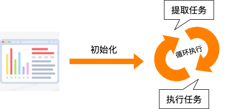

解决了单线程处理消息的流程问题，就需要考虑如何处理其他线程发过来的任务。上述模型中左右任务都是来自于线程内部，如果工作线程想让主线程执行一个任务该如何消息优先级，有序接受处理其他线程发送的消息呢？一个通用模式是使用**消息队列**来存放要执行的任务。**消息队列**是一种数据结构，符合队列“先进先出”的特点，也就是说要添加任务的话，将任务添加到队列的尾部；要执行任务的话，从队列头部去取任务信息。

具体流程分为三步：1.添加一个消息队列；2.IO 线程中产生的新任务添加进消息队列尾部；3.渲染主线程会循环地从消息队列头部中读取任务，执行任务。

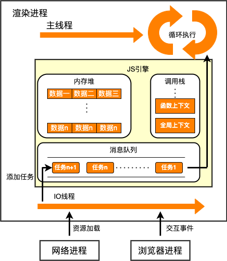

## 宏任务与微任务

**消息队列+事件循环**的通知机制，有效解决了工作线程在异步操作完成后如何通知主线程进行操作的问题。但随着浏览器应用领域的不断扩大，消息队列中粗颗粒度的任务管理已经无法满足部分领域的需求，为在实时性和效率之间做一个有效的权衡，**微任务**的概念应运而生。

**为什么需要微任务？**

页面中大部分任务都在主线程上执行，例如：渲染、用户交互、脚本执行等。主进程为协调消息的执行顺序需维护多个消息队列，这些维护在消息队列中的任务称为宏任务。宏任务虽然对于维护消息的执行顺序有一定的作用，但很难满足对时间精度要求较高的需求。因为添加事件操作由系统完成，许多事件由于触发时机的不同随时可能被添加到消息队列中，导致JavaScript代码不能准确掌握任务在消息队列中的位置，很难控制开始执行任务的时间。

**什么是微任务？**

引用李兵老师的解释：异步回调分为两种，一种封装成宏任务添加到消息队列尾部，一种封装成微任务在主函数执行之后宏任务结束之前执行回调函数。

**微任务执行机制**

产生微任务的方式分为两种，第一种是使用MutationObserver监控DOM节点，产生DOM变化记录的微任务。第二种是使用promise。JavaScript引擎执行脚本时，V8引擎在创建全局上下文的同时也会创建一个微任务队列来维护宏任务执行过程中产生的微任务。微任务队列在v8引擎内部使用，无法通过JavaScript直接访问。

加入微任务后现代浏览器的事件循环机制基本定型。流程如下：

1.JavaScript引擎执行脚本时，首先会创建一个全局上下文并压入调用栈，每遇到函数会创建函数执行上下文压入调用栈。

2.在主调用栈之外存在宏任务队列和微任务队列，微任务与宏任务是绑定的，每个宏任务执行过程中都会创建属于自己的微任务队列。调用栈会优先执行同步任务，遇到异步任务会根据任务等级将任务分别压入对应队列执行。异步任务不会阻塞同步任务执行。

3.调用栈中所有同步任务执行完毕后会优先去读取微任务队列再读取宏任务队列，在执行宏微任务时产生的异步任务同样会根据任务等级压入对应的任务队列。无论什么情况下微任务都早于宏任务执行

4.主线程不断重复以上的步骤。

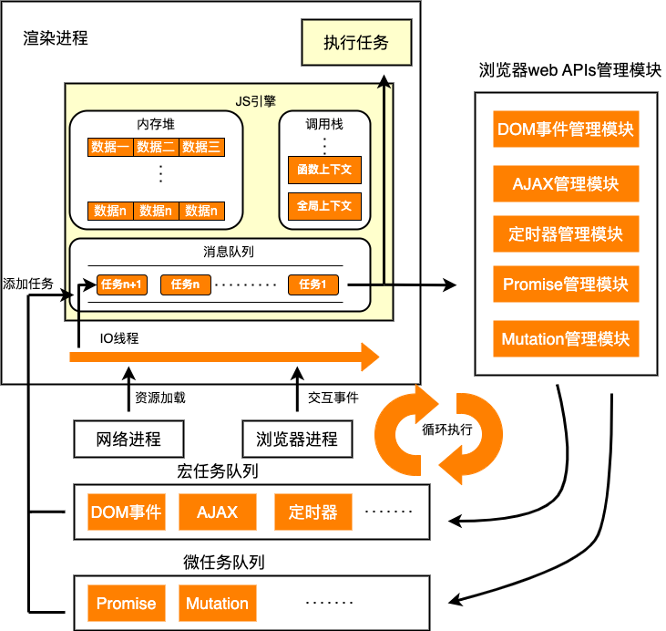

## 定时器任务

**常见的定时器任务：**

1. window\.setTimeout 用于在指定的毫秒数后执行某段既定的代码
2. window\.setInterval 用于每隔一段毫秒数重复执行既定的代码

虽然函数设定是希望可以按照我们设定的时间精确执行代码，但JavaScript并不能保证代码恰好在某个时间点运行，原因有两个。其一是浏览器并没有精确到毫秒级的触发机制，会存在时间差，老版本的ie甚至可能误差较大。其二是由于JavaScript单线程的语言特性，设置的间隔时间仅代表过多少时间会将该任务插入任务队列，而执行时间还要取决于任务队列中的调度。

**精确的定时器任务：**

window\.requestAnimationFrame()用于在浏览器下一次重绘之前调用指定回调更新动画。该api由系统决定回调时机，在每一次系统绘制前会主动调用回调函数，调用频率与浏览器刷新频率同步。由于是系统级控制的，因此它的时间是可靠的。返回值是一个**long**整数，非零值，作为任务唯一ID没有任何意义仅供取消操作使用。

## promise

**Promise** 是一个对象，代表了一个异步操作的最终完成或者失败的一个状态。Promise本质上不是回调，而是一个**内置的构造函数**，是程序员自己 new 调用的。李兵老师曾在文章中将promise形容成现代前端的“水”与“电”，可见promise的重要性。

用一个形象的比喻句来描述同步异步：打电话是同步，发消息是异步。上面章节我们在浏览器层面讲述了JavaScipt引擎是如何处理好同步与异步任务的执行顺序，保证在不出错的前提下提升代码效率。下面我们说一下promise是如何在代码层面解决了困扰开发者许久的嵌套调用和任务不确定性这两个问题的。

在promise之前，常用纯回调的方式进行异步编程，异步流程如下所示。

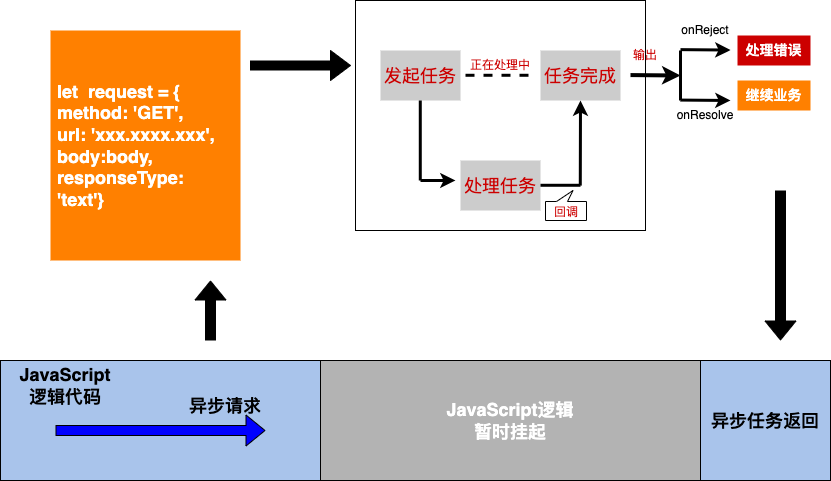

由下图代码可见，如果请求成功后再发送一次请求，这就形成了嵌套调用。三层嵌套调用就已经让代码变得混乱不堪，可读性极差。造成这种情况的主要原因有二，首先是由于**嵌套调用**，后面的任务依赖于前面任务的结果并且需要把后面的业务逻辑也写在前面函数体中，这就导致函数体显得臃肿且难以理解。其次是需要**对任务的不确定性做判断**，任务都有成功或失败两种可能，对每次任务都需要进行一次额外的错误判断，这显然增加了代码的体量。

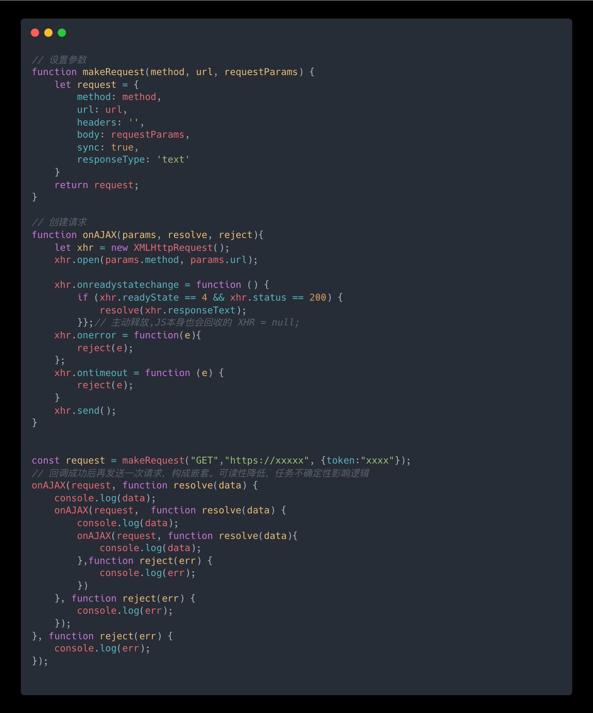

promise设计的初衷就是为了解决这两个问题，**消灭嵌套调用、合并多个任务的错误处理，** 其基本流程如下：

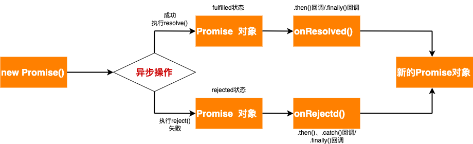

首先，通过new关键词构造一个promise对象，构造对象的同时需要传入一个执行函数，执行函数是**同步任务**会立即在主线程上执行。executor 函数可以接收两个函数作为形参，分别是resolve和reject，通过这两个函数来更改promise状态。**值得注意的是**，每一个promise实例都有三种状态：初始化（pending）、成功（fulfilled）、失败（rejected），且**只能改变一次**。调用 resolve，会让 Promise 实例状态变为 fulfilled ，同时可以指定成功的 value。调用 reject，会让 Promise 实例状态变为 rejected ，同时可以指定失败的 reason。触发promise对象状态改变后，可以使用.then()、.catch()或.finally()来设置回调函数。.then()即可以设置成功的回调又可以设置失败的回调；.catch()只能设置失败的回调；.finally()不依赖于promise的操作结果，无论成功与否最后都会执行。

使用promise可以将上面嵌套代码更改为如下所示：

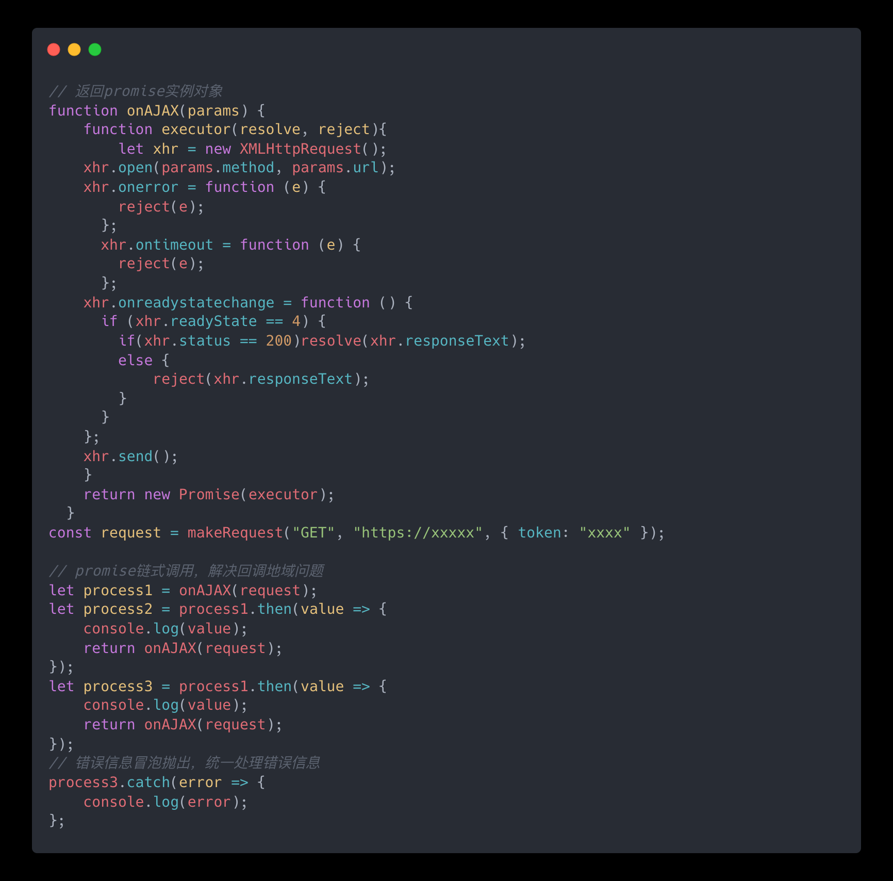

为处理嵌套函数，promise首先实现了回调函数的延时绑定。纯回调必须先设置回调函数再触发回调函数，而promise可以在触发后再设置回调函数，这样设计可以避免后来任务的回调函数必须写入之前任务的函数体，防止嵌套导致的函数体臃肿。其次，需要将回调函数 onResolve 的返回值穿透到最外层。在promise中回调函数的返回值都是一个promise对象，这样设计可以彻底摆脱嵌套循环带来的问题。

promise 对象的错误具有“冒泡”性质，会一直向后传递，直到被捕获为止。与此同时，Promise在客户端中产生的内部错误并不会影响外部代码，即“promise会吃掉错误”。借用阮一峰老师的例子如下：

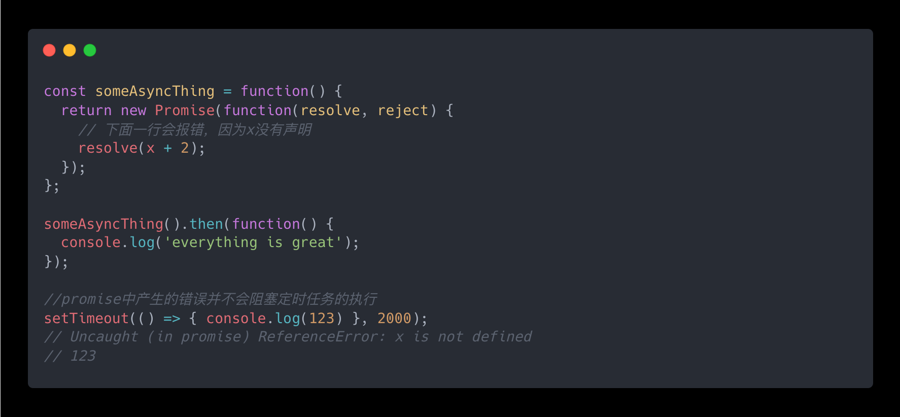

一般建议promise对象后都需要跟一个.catch()回调来捕获内部错误。但也需要注意.catch()回调函数的位置，因为.catch()的返回值依然可能是一个失败状态的promise对象并且promise遵循链式调用，前面的.catch()回调无法捕获后面回调产生的错误。

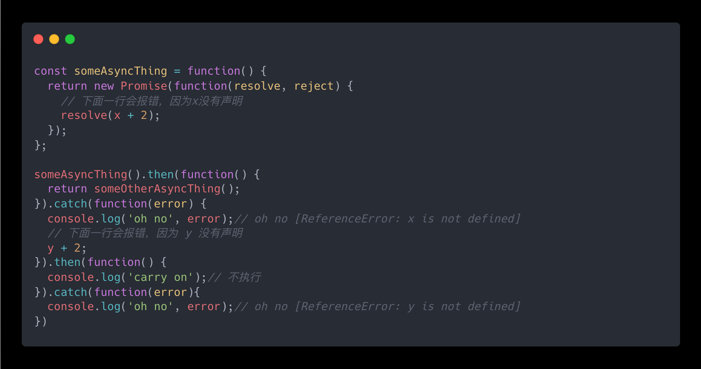

除此之外，为迎合各类场景promise还有.all()、race()、.allSettled()、.any()这些Api，具体场景不再赘述详情可见阮一峰老师的[ECMAScript6入门](https://es6.ruanyifeng.com/#docs/promise "ECMAScript6入门")。

## async与await

promise在一定程度上降低了异步代码的复杂度，但链式调用充斥着.then()、.catch()方法。例如上一节最后例子所示，反复的链式调用并不能很好的表达执行流程和代码逻辑。因此，ES7引入了**async/await**，在不阻塞主线程的情况下使用同步代码实现异步访问资源的能力，使得代码逻辑更加清晰。如下图所示，以fetch发送请求为例展示**promise**和**async/await**函数的不同。

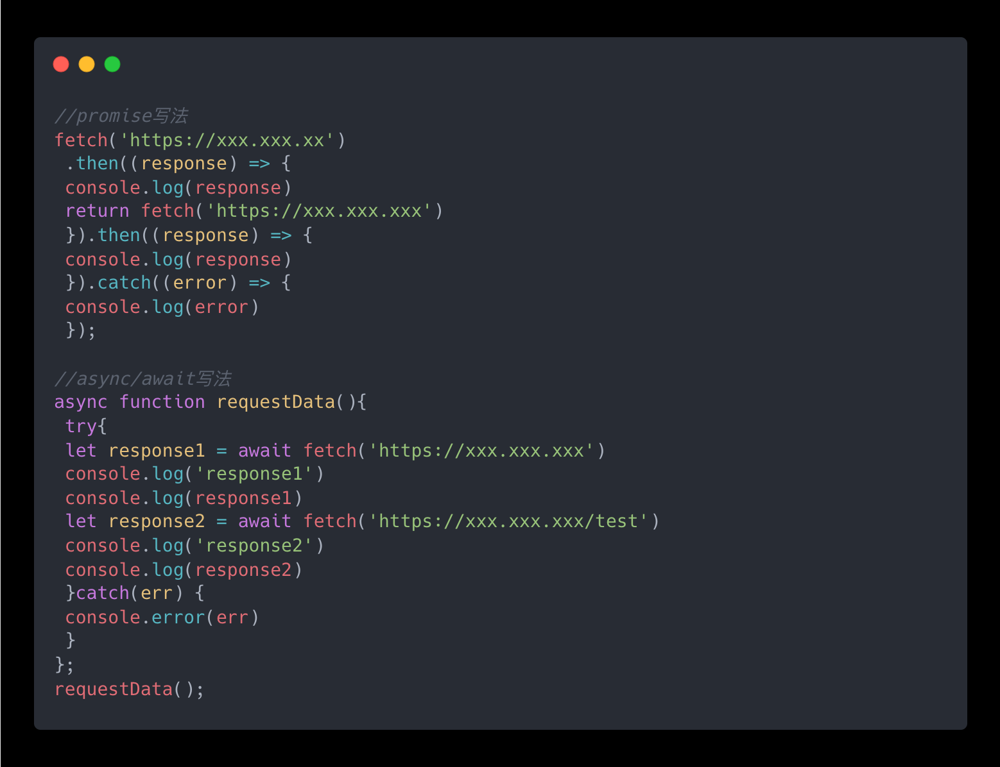

### 生成器与协程

简单来说，**async**函数是**Generator**函数的语法糖。**Generator**函数可以控制代码执行的启停，是一个封装多个内部状态的状态机，会返回一个遍历器对象。

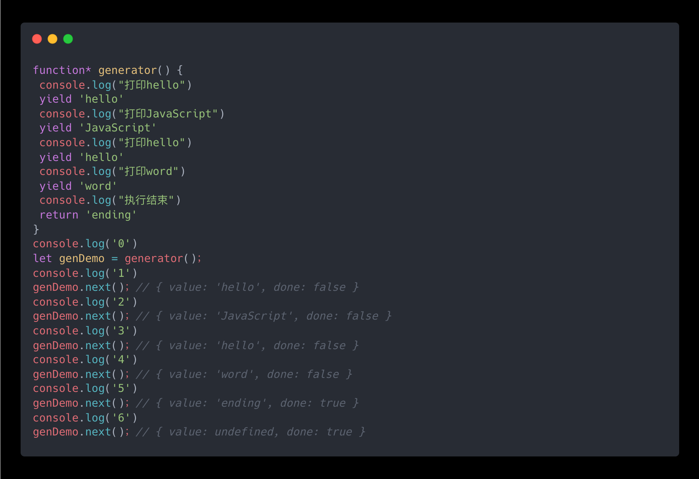

**Generator**函数有两个特征，其一是函数名前加星号，其二是函数内部使用**yield**表达式定义不同的内部变量。由上面代码可知**Generator**函数的具体使用方法：

1.**Generator**函数调用后并不执行而是返回一个遍历器对象。

2.调用遍历器对象上的**next**方法分段执行函数，从函数头部或上次暂停地方起到下一个**yield**标记地方止。**yield**表达式是暂停执行标志，**next**方式是开始执行语句，会返回一个对象，value代表**yield**或**return**返回的值，done代表遍历器遍历状态。

3.全局代码与**Generator**函数交替执行，遍历器对象遍历结束后依然可调用next方法，返回对象中value为**undefined**。

#### **Generator**函数如何做到函数的暂停恢复

前端代码都运行在浏览器的进程中，一个进程可以拥有多个线程，而一个线程又可以拥有多个协程。**值得一提的是**，协程不是被操作系统内核所管理，而完全是由程序所控制（也就是在用户态执行）。使用协程带来的好处是性能可以得到很大提升，不会像线程切换那样消耗资源。可以把协程看成是跑在线程上的任务，一个线程上可以存在多个协程，但是统一线程上只能同时执行一个协程。假设同一线程上存在A、B两个协程，正在执行的A协程要启动B协程，就得先暂停 A 协程再启动B协程。通常，如果从 A 协程启动 B 协程，我们就把 A 协程称为B 协程的父协程。借助协程，**Generator**函数变实现了函数的启停过程，具体流程如下：

1.通过调用生成器函数generator() 来创建一个协程 genDemo，创建之后，genDemo 协程并没有立即执行。

2.要让 genDemo 协程执行，需要通过调用 genDemo.next()。当协程正在执行的时候，可以通过 yield 关键字来暂停 genDemo 协程的执行，并返回主要信息给父协程。父子协程在线程上交替执行，并不会出现调用栈混乱问题。

3.如果协程在执行期间，遇到了 return 关键字，那么 JavaScript 引擎会结束当前协程，并将 return 后面的内容返回给父协程。

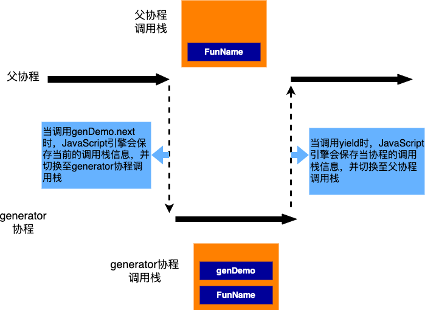

使用**Generator**函数配合co函数可以将fetch发送请求事例改写为同步的方式：

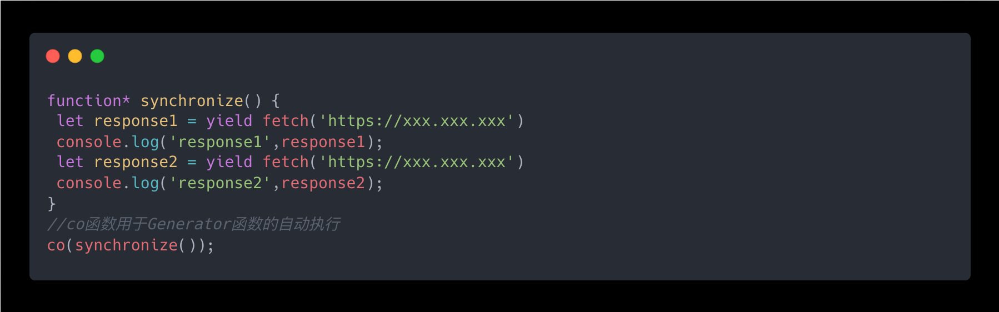

#### async/await

**async**函数是一个通过异步执行并隐式返回 Promise 作为结果的函数，**async**函数可能包含0个或者多个await表达式。**await** 表达式会暂停整个 **async** 函数的执行进程并出让其控制权，只有当其等待的基于 promise 的异步操作被兑现或被拒绝之后才会恢复进程。—MDN

fetch发送请求事例使用**async/await**便可以脱离三方库的帮助，直接使用同步的方式写异步逻辑：

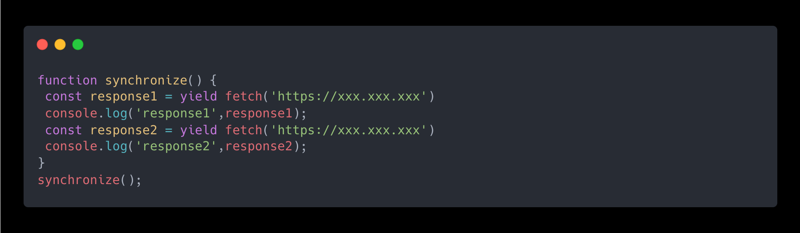

## 参考资料

> Call stack（调用栈）[https://developer.mozilla.org/zh-CN/docs/Glossary/Call\_stack](https://developer.mozilla.org/zh-CN/docs/Glossary/Call_stack "https://developer.mozilla.org/zh-CN/docs/Glossary/Call_stack")

> 从浏览器多进程到JS单线程，JS运行机制最全面的一次梳理[https://juejin.cn/post/6844903553795014663](https://juejin.cn/post/6844903553795014663 "https://juejin.cn/post/6844903553795014663")

> 解读 JavaScript 之引擎、运行时和堆栈调用                                        [https://www.oschina.net/translate/how-does-javascript-actually-work-part-1](https://www.oschina.net/translate/how-does-javascript-actually-work-part-1 "https://www.oschina.net/translate/how-does-javascript-actually-work-part-1")

> 阮一峰老师的JavaScript 运行机制详解：再谈Event Loop [https://www.ruanyifeng.com/blog/2014/10/event-loop.html](https://www.ruanyifeng.com/blog/2014/10/event-loop.html "https://www.ruanyifeng.com/blog/2014/10/event-loop.html")

> “浏览器工作原理与实践”—李兵

> 前端编程中的异常处理机制[https://juejin.cn/post/7327725037678952474](https://juejin.cn/post/7327725037678952474 "https://juejin.cn/post/7327725037678952474")

> try-catch-finally机制中的return执行时机[https://blog.csdn.net/m0\_52509987/article/details/135933290](https://blog.csdn.net/m0_52509987/article/details/135933290 "https://blog.csdn.net/m0_52509987/article/details/135933290")

> ECMAScript6入门—promise [https://es6.ruanyifeng.com/#docs/promise](https://es6.ruanyifeng.com/#docs/promise "https://es6.ruanyifeng.com/#docs/promise")
