# 前端依赖管理-npm 依赖管理机制

## 前言

在众多前端工程化步骤中，依赖包的管理最直接影响着每一位开发者。安装、更新依赖包是每一个开发都会接触的事。但是，在排查 bug 的时候依赖包问题又往往是最容易被忽略的。因此，本文以 node 官方的包管理器 npm 为例，讲一下依赖包管理的问题。

## npm 的安装机制

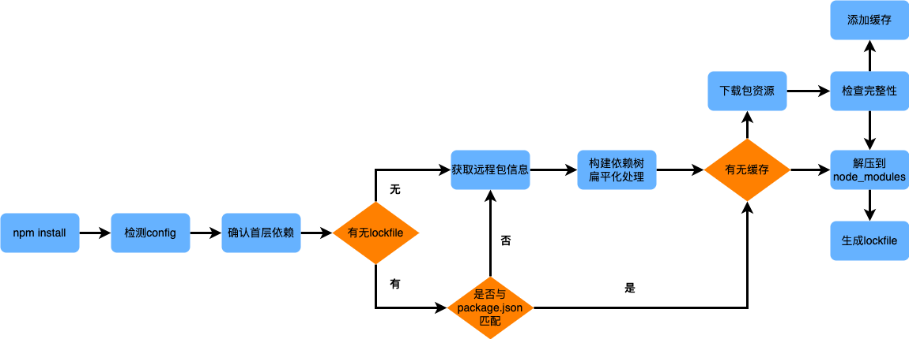

npm 安装依赖的具体流程如上图所示，**需要注意的是**，当 package.json 与 package-lock.json 中依赖包声明版本不一致时会根据 npm 版本的不同进行不同安装策略。在 npm v5.0.x 中会根据 package-lock.json 下载；在 npm v5.1.0 - v5.4.2 中会根据 package.json 版本安装并更新 package-lock.json 文件；在 npm v5.4.2 及以上版本中当 package.json 声明的依赖版本规范与 package-lock.json 声明版本兼容则根据 package-lock.json 安装，如果不兼容，则按照 package.json 安装并更新 package-lock.json。

#### 依赖树扁平化

npm 在确定首层依赖后会递归构建依赖树，工程本身为依赖树根节点，每个首层依赖模块都为根节点下的子树。每个节点在递归工程中会确定节点模块信息如版本、下载地址、压缩包地址等。在 npm v2 版本时，安装依赖包仅采用简单的递归安装，在根据 dependencies 和 devDependencies 属性中指定的包确定首层依赖后便递归安装各个包到子依赖的 node_modules 中，直到子依赖不再依赖其他模块。形成的依赖树如下图所示：

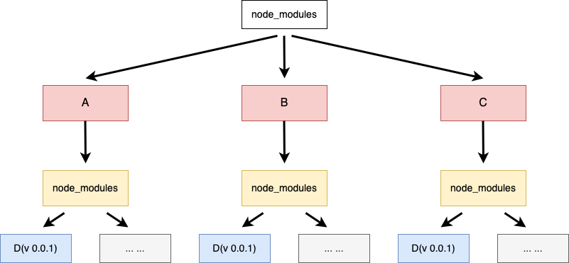

这样的目录结构层次分明、增删简单，但重复依赖会不断增大项目体积，造成大量冗余。为解决此类问题，npm v3 的 node_modules 目录改成了更为扁平状的层级结构，尽量把依赖以及依赖的依赖平铺在 node_modules 文件夹下共享使用。npm v3 会遍历所有节点，当发现重复模块时直接丢弃，只有遇到依赖版本不兼容时继续采用 npm v2 的处理方式继续安装。形成的依赖树如下图所示：

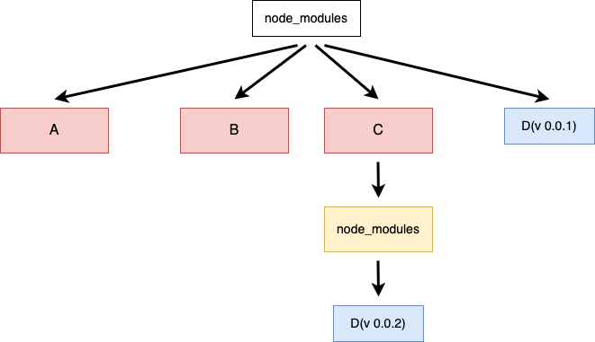

但是 npm v3 会带来一个新的问题，如果 package.json 中依赖顺序变化会导致依赖树的变化，具体如下图所示：

由此可见，npm v3 带来的扁平化管理并未完全解决冗余问题。这类问题最后在 npm v5 版本引入 package-lock.json 文件配合依赖树扁平化得以解决。

#### 缓存机制

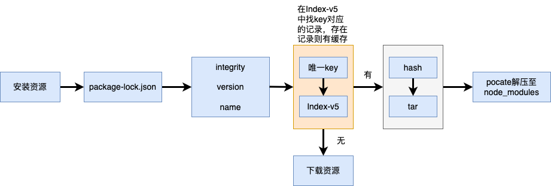

通过`npm config get cache` 指令可以查看本地缓存，通常在/.npm 文件下的\_cacache 目录下有三个文件：**content-v2**、**index-v5**、**tmp**。**index-v5**中存放的是**content-v2**文件的索引，而**content-v2**中存放的是依赖包的二进制文件。在安装资源的时候会根据 package-lock.json 文件中**integrity**、**version**和**name**三个属性生成唯一的 key，通过 key 去匹配**index-v5**文件中的缓存记录。如果存在缓存记录，并根据记录中的 hash 值去寻找在**content-v2**中对应的 tar 包。最后，通过**pacote**将二进制文件解压至项目中的 node_modules 目录中，省去了资源下载的网络开销。其中，**pacote**是依赖 npm-registry-fetch 来下载包的，npm-registry-fetch 可以通过设置 cache 字段进行相关的缓存工作。**值得注意的是**，缓存策略是从 npm v5 开始的，在 npm v5 之前每个缓存模块都在\~./npmrc 文件中以模块名的格式直接存储，存储格式为 **{cache}{name}{version}**。

#### npm ci 与 npm install

根据`npm install`的安装机制，package-lock.json 文件有可能会因为手动操作而改变。但有时候我们并不想 lockfile 有任何变化需要确保依赖树的绝对一致。`npm ci`指令与`npm install`相比，就具备确保依赖树一致的功能。`npm ci`会完全按照 lockfile 去安装依赖，但值得注意的是，当 lockfile 中的声明版本不满足 package.json 中声明版本指定的 semver 规则会报错退出，并不会往下执行或更新 lock 文件。

## package.json

无论使用什么包管理器，package.json 文件都是依赖库管理的核心文件。

#### 创建 package.json

创建 package.json 主要分为两种方法：当使用脚手架生成项目时，脚手架会自动生成 package.json；使用**npm init**或 **npm init -y**手动创建 package.json。生成的基础内容如下：

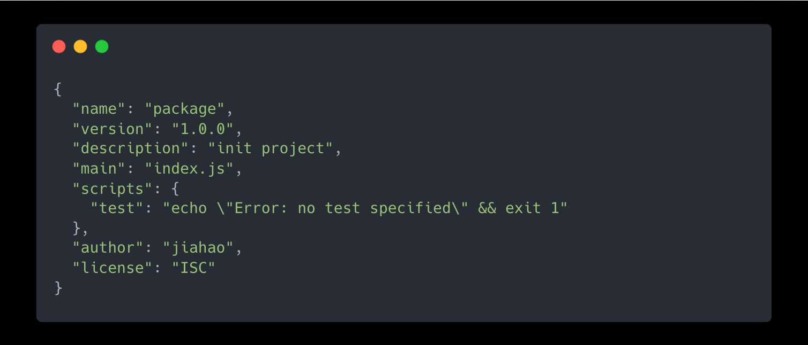

#### 常见属性

package.json 中有许多属性，用以进行控制版本依赖、发包、校验等工作。具体属性及简要作用如下图所示：

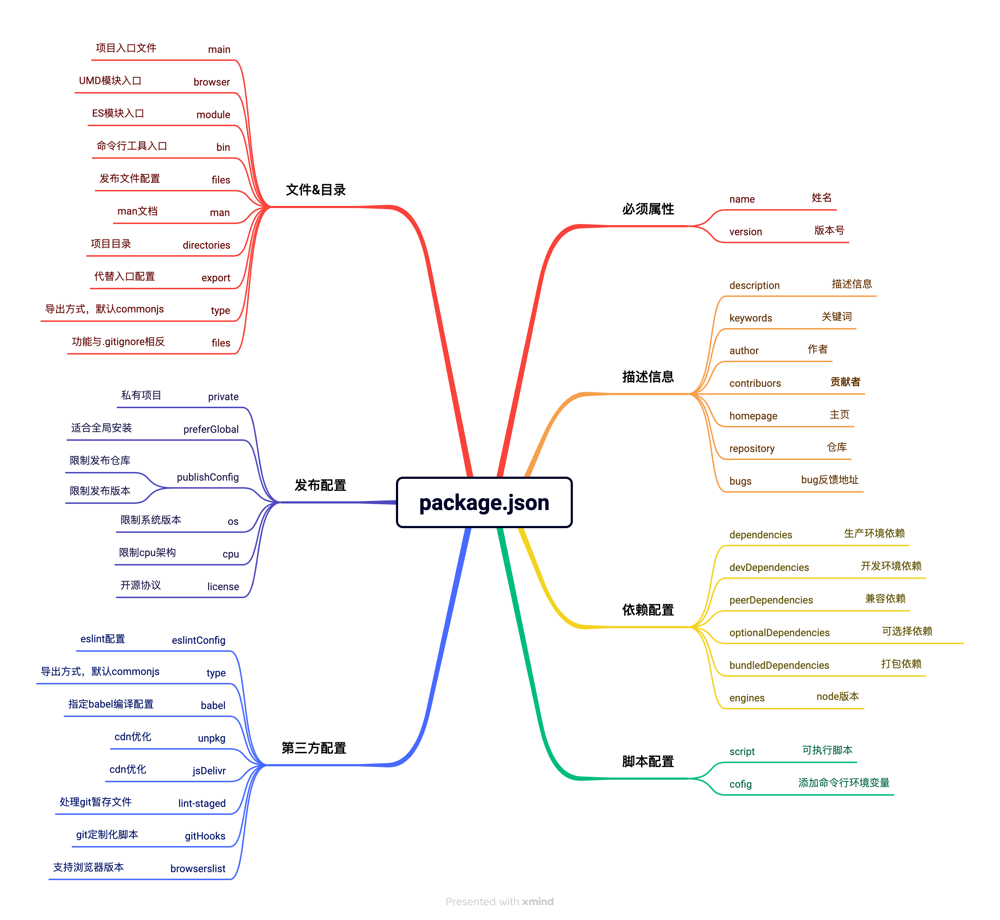

在众多属性中，着重讲一下重要属性 name、version、xxxxDependencies、resolutions 及脚本配置属性 script：

\*\*name: \*\*表示项目名称，该字段决定了你发布的包在 npm 的名字。

**name 属性命名规则：**

- 名称必须小于或等于 214 个字符。这包括范围包的范围。
- 作用域包的名称可以以点或下划线开头。如果没有范围，这是不允许的。
- 新包的名称中不得包含大写字母。
- 该名称最终成为 URL、命令行参数和文件夹名称的一部分。因此，名称不能包含任何非 URL 安全字符。

---

**version:** 表示项目的版本号，**version**属性必须采用**major.minor.patch**格式。**minor**代表主版本号，不可向前兼容的更改，比如系统重构、API 重构等。**minor**为次版本号，代表功能模块变更这类可兼容的更改，一般为 API 新增等操作。**patch**为补丁版本，一般用于 bug fix 或安全问题。

如果计划发包，「name」和「version」字段是必须的，名称和版本号会形成唯一标识。

---

**xxxxDependencies**

- dependencies 生产环境依赖：线上生产环境的依赖包
- devDependencies 开发环境依赖：开发依赖，不会自动被下载，只在开发环境中使用
- peerDependencies 兼容依赖：用于声明宿主环境所需依赖兼容版本，属性中声明的包不会被自动检测并安装也不会被打包。如果项目中以来不满足 peerDependencies 条件会打印警告。
- bundledDependencies 捆绑依赖：`npm pack`打包时将该属性所写依赖项打包到发布包中，方便用户安装时不需要手动安装这些依赖项。
- optionalDependencies 可选依赖：表示安装对应依赖失败也不会影响安装过程，optionalDependencies 会覆盖 dependencies 中的同名依赖包，不建议使用会造成项目的不确定性和复杂性。

---

**resolutions：** 用于解决依赖项冲突的 npm 特殊字段，如果项目依赖于 package-a 和 package-b，而这两个包都依赖于 package-c，且两者依赖的 package-c 版本不同，可以用**resolutions** 字段来指定应该使用哪个版本。

---

**script:** 定义可执行脚本命令，供 npm 直接调用。

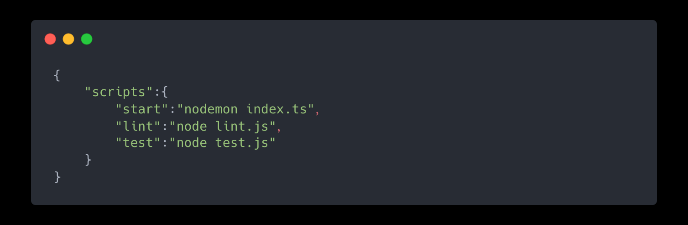

在终端中执行 npm run start 相当于执行 nodemon index.ts，而 npm run 是 npm run-script 的缩写。每当执行 npm run，系统会自动新建一个 Shell（一般是 Bash），并在这个 Shell 中执行命令，所以只要 Shell 可执行的命令都可以写在脚本中。与此同时，系统当前目录的 node_modules/.bin 子目录加入 PATH 变量，执行结束后，再将 PATH 变量恢复原样。所以 node_modules/.bin 子目录里面的所有脚本，都可以直接用脚本名调用，而不必加上路径。

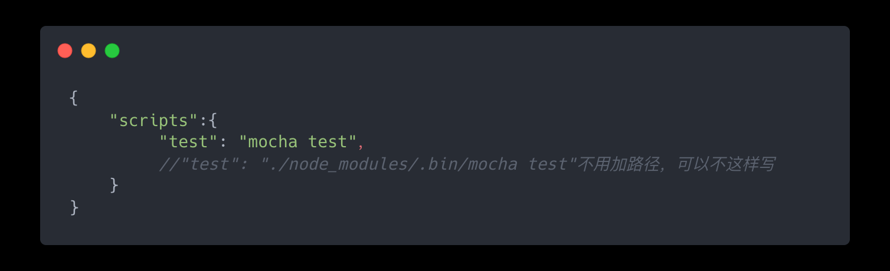

脚本中可以使用 Shell 通配符和传参：

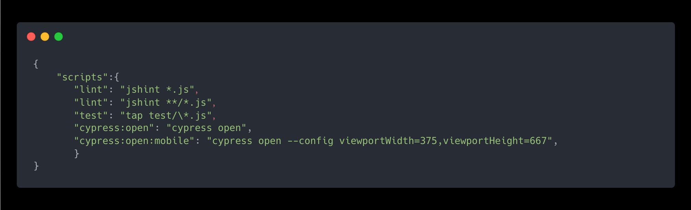

其中，_表示任意文件名，_ \*表示任意一层子目录，用- -标明传入参数，也可以使用命令传入参数。

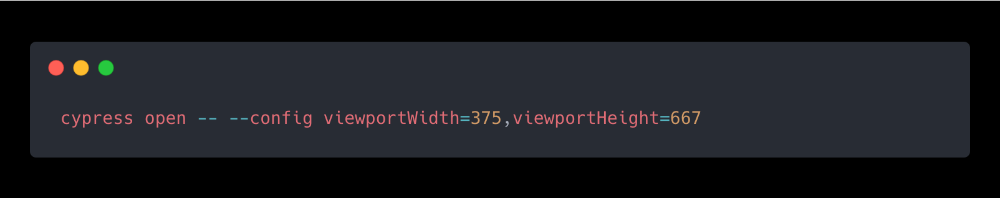

每个 npm script 有 pre 和 post 两个钩子, pre 钩子在脚本执行前将被触发, post 则是在脚本执行后触发。例如**build**脚本命令的钩子就是**prebuild**和**postbuild**。

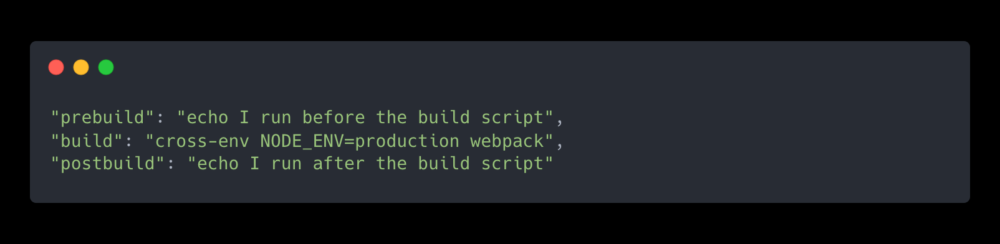

在执行**npm run build**的时候，会自动执行`npm run prebuild && npm run build && npm run postbuild`。因此可以在**prebuild**和**postbuild**中添加一些操作来优化流程。npm 中默认提供的脚本命令如下：

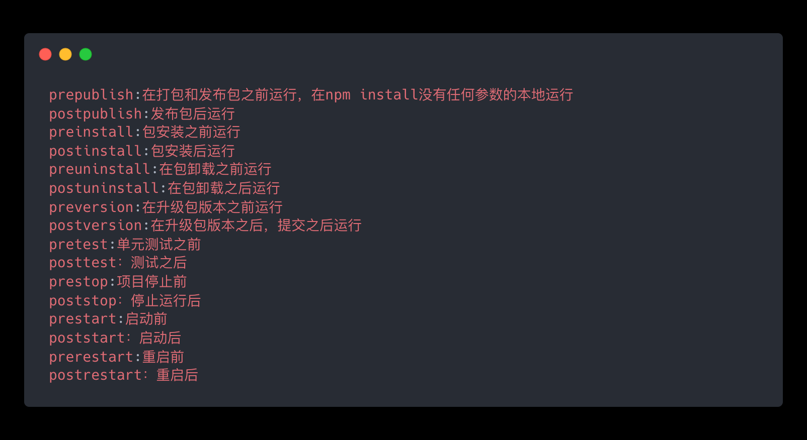

除了默认脚本命令，自定义脚本命令也同样有这两个钩子，但是不支持**双重 pre**或者**双重 post**即 preprebuild、postpostbuild。

除此以外，还可以通过环境变量`process.env` 对象与`npm_package_`前缀拿到 package.json 的字段值。

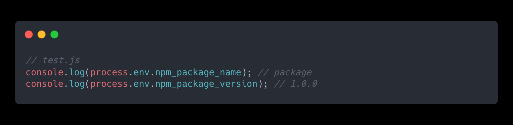

#### package.json 中的版本锁定

在安装依赖时，无论是开发环境还是生产环境，package.json 文件在版本号前可能会出现多种标志，

这些标志代表着 package.json 对于依赖包版本的不同管理控制策略。

- **^** 表示更新【次版本】，例如 package.json 中版本号是^2.1.0，当发布包更新到 2.2.0，哪怕没有重新安装，依赖库也可能自动更新到 2.2.0。不过当发布包更新到 3.0.0 版本时表示为主版本更新，本地依赖库是不会更新到 3.0.0 版本的。
- \~表示更新【补丁版本】，例如 package.json 中版本号是^2.1.0，当发布包更新到 2.1.1，依赖库会自动更新到 2.1.1，但当发布包更新到 2.2.0 时，依赖库不会更新至 2.2.0 版本。
- \*表示会安装最新版本的依赖包，比如\*2.1.0，发布包更新到 3.x.x 的时候依赖库便会下载 3.x.x。
- **>：** 接受高于指定版本的任何版本。
- **≥：** 接受等于或高于指定版本的任何版本。
- **≤：** 接受等于或低于指定版本的任何版本。
- **<：** 接受低于指定版本的任何版本。
- **无符号:** 仅接受指定的特定版本。
- \*\*latest: \*\*使用可用的最新版本。

因此，只要去掉 package.json 版本号前的标志就可以“绝对锁定”依赖版本号，去除依赖版本差异带来的 bug。

## package-lock.json

在 npm install 之后，项目希望总是生成完全相同的 node_modules 树以确保项目稳定性。但 npm3 的安装机制会按照 package.json 里的顺序依次解析，依赖的顺序会影响 node_modules 树的生成。此外，package.json 文件也只能束缚项目的直接依赖，对于间接依赖没有管理锁定也会导致生成的 node_modules 树不完全相同。

为解决上述问题，确保同一项目总是会生成相同的 node_modules 树以确保稳定性。npm5 中引入了 package-lock.json 文件来规范 node_modules 树的生成。

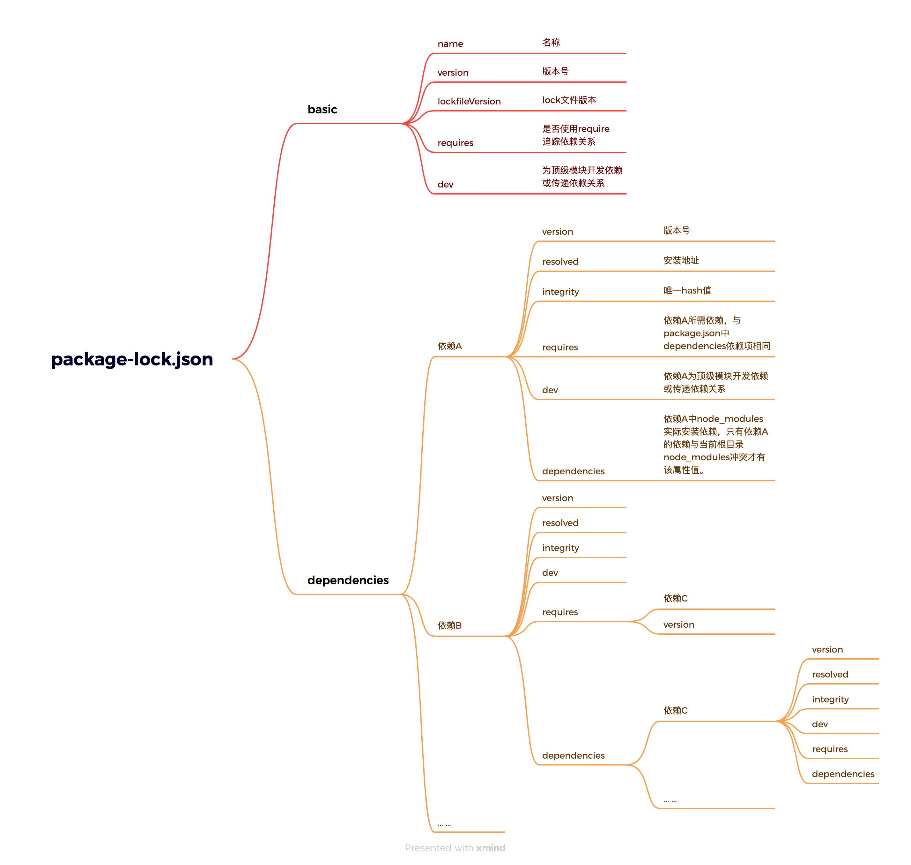

package-lock.json 文件构成如上图所示，该文件将 node_modules 树的生成数据化，使依赖包的依赖关系一目了然。其中，`requires`与 dependencies 字段的功能常令人混淆。简单来说，`requires`表示所有需要安装的依赖，而`dependencies` 表示与根目录 node_modules 冲突的依赖，冲突的依赖会在`dependencies`属性中记录并安装在当前依赖下的 node_modules 文件中。

**package-lock.json 什么时候会变**

- package-lock.json 文件在`npm install`的时候会自动生成
- 修改依赖位置，将部分依赖从开发依赖变成生产依赖，会影响 package-lock.json 中依赖的 `dev` 字段
- 切换镜像时，执行 `npm install` 时也会修改 package-lock.json 中的`resolved`字段
- 使用`npm install`添加或`npm uninstall`移除包的时候，也会修改 package-lock.json
- 更新某个包的版本的时候，也会修改 package-lock.json

**package-lock.json 需要递交到仓库嘛？**

npm 官网建议：把 **package-lock.json** 一起提交到代码库中，不要 ignore，以此确保团队所有开发者及 CI 环节执行生成的依赖树一致。但是在执行 npm publish 进行发包的的时候，应该将其忽略。因为发布的 npm 包需要被其他仓库所依赖，如果锁定了依赖包的版本，会导致发布的包与项目其他依赖包无法共享依赖造成不必要的冗余。npm 默认不会把 package-lock.json 文件发不出去。

## 最佳实践建议

借用[字节的一个小问题 npm 和 yarn 不一样吗？(续篇)](https://juejin.cn/post/7071659901654827039 "字节的一个小问题npm 和 yarn不一样吗？(续篇)")文章作者的建议，个人认为很合理，仅供参考：

- 优先去使用 **npm** 官方已经稳定的支持的版本, 以保证 **npm** 的最基本先进性和稳定性
- 当我们的项目第一次去搭建的时候, 使用 `npm install` 安装依赖包, 并去提交 package.json、package-lock.json, 至于 node_moduled 目录是不用提交的。
- 当我们作为项目的新成员的时候, `checkout/clone`项目的时候, 执行一次 `npm install` 去安装依赖包。
- 当我们出现了需要升级依赖的需求的时候:
  - 升级小版本的时候, 依靠 **npm update**
  - 升级大版本的时候, 依靠 \*\*npm install@ \*\*
  - 当然我们也有一种方法, 直接去修改 **package.json** 中的版本号, 并去执行 **npm install** 去升级版本
  - 当我们本地升级新版本后确认没有问题之后, 去提交新的 **package.json** 和 \*\*package-lock.json \*\*文件。
- 对于降级的依赖包的需求： 我们去执行**npm install @** 命令后，验证没有问题之后, 是需要提交新的 **package.json** 和 **package-lock.json** 文件。
- 删除某些依赖的时候:
  - 当我们执行 **npm uninstall** 命令后， 需要去验证，提交新的 package.json 和 package-lock.json 文件。
  - 或者是更加暴力一点, 直接操作 `package.json`, 删除对应的依赖, 执行 **npm install** 命令, 需要去验证，提交新的**package.json** 和 **package-lock.json** 文件。
- 当你把更新后的**package.json** 和 **package-lock.json**提交到代码仓库的时候, 需要通知你的团队成员, 保证其他的团队成员拉取代码之后, 更新依赖可以有一个更友好的开发环境保障持续性的开发工作。
- 任何时候我们都不要去修改 **package-lock.json**，这是交过智商税的。
- 如果你的 **package-lock.json** 出现冲突或问题, 我的建议是将本地的 **package-lock.json**文件删掉, 然后去找远端没有冲突的 **package.json** 和 **package-lock.json**, 再去执行 `npm install` 命令。

## 总结

以前端基础建设与架构 30 讲中的五个问题作为总结。

1. 删除 node_modules 和 lockfiles 文件再重新 install 的操作是否存在风险？答：存在风险，轻易删除 lockfiles 文件会导致项目安装的依赖在 package.json 版本控制范围内变动。
2. 把所有依赖都安装到 dependencies 中，不区分 devDependencies 会有问题嘛？答：具体根据项目性质而定，前端 spa 应用项目或者 ssg 项目可以，后端、ssr 或公开库不建议那么做。
3. 应用依赖了公共库 A 和公共库 B，同时公共库 A 也依赖了公共库 B，那么公共库 B 会被多次安装或者重复打包嘛？答：应用依赖的公共库 B 与公共库 A 依赖的公共库 B 如果不存在冲突则会共用一个不会重复安装、打包。如果存在版本冲突，会在公共库 B 的依赖目录下再添加一个公共库 B 的依赖。
4. 一个项目中，可以即有人用 npm 又有人用 yarn 嘛？答：lock 文件不同，可能会存在冲突导致最终安装版本不一致。
5. 是否应该递交 lockfiles 文件到项目仓库？答：通常应该把 **package-lock.json** 一起提交到代码库中，不要 ignore，以此确保团队所有开发者及 CI 环节执行生成的依赖树一致。但是在执行 npm publish 进行发包的的时候，应该将其忽略。因为发布的 npm 包需要被其他仓库所依赖，如果锁定了依赖包的版本，会导致发布的包与项目其他依赖包无法共享依赖造成不必要的冗余。npm 默认不会把 package-lock.json 文件发不出去。

## 参考资料

> 阮一峰老师的 npm script 的使用[https://www.ruanyifeng.com/blog/2016/10/npm_scripts.html](https://www.ruanyifeng.com/blog/2016/10/npm_scripts.html "https://www.ruanyifeng.com/blog/2016/10/npm_scripts.html")

> 工程的 package.json 中的 ^\~ 该保留吗？[https://juejin.cn/post/7244818841502826553](https://juejin.cn/post/7244818841502826553 "https://juejin.cn/post/7244818841502826553")

> npm 依赖管理中容易被忽略细节[https://blog.csdn.net/weixin_39843414/article/details/108557510](https://blog.csdn.net/weixin_39843414/article/details/108557510 "https://blog.csdn.net/weixin_39843414/article/details/108557510")

> 前端基础建设与架构 30 讲

> 字节的一个小问题 npm 和 yarn 不一样吗？(续篇)[https://juejin.cn/post/7071659901654827039](https://juejin.cn/post/7071659901654827039 "https://juejin.cn/post/7071659901654827039")
