# 前端开发者应懂的n个概念-概述React

## 前言

React19发布了，重新阅读了一下官方文档和[build own your react](https://pomb.us/build-your-own-react/ "build own your react")，分三篇记录下学习过程。第一篇记录一些React中共性的东西，从JSX开始了解React。

## 目录

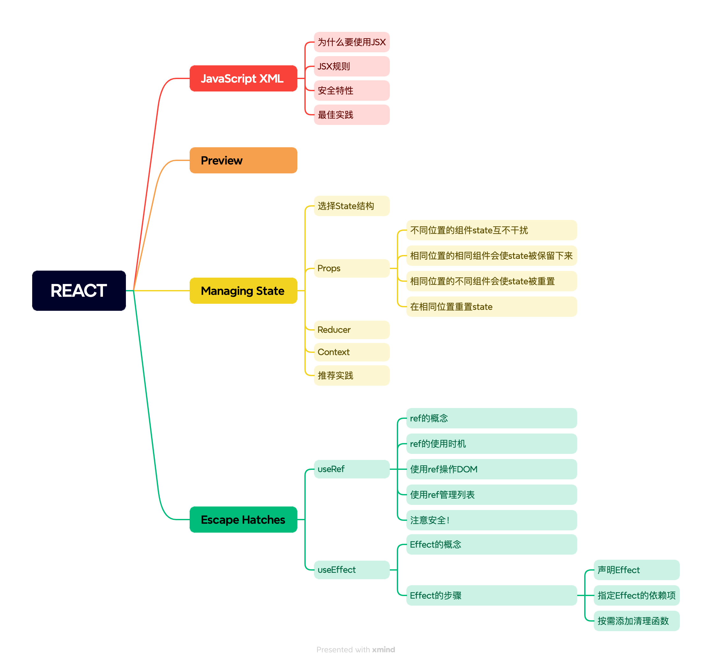

## **JavaScript XML**

### 为什么要使用JSX

网页是构建在 HTML、CSS 和 JavaScript 之上的。多年以来，开发者习惯将内容、样式与逻辑存放在不同的文件中。但随着Web交互性的逐渐增强，逻辑逻辑越来越决定页面中的内容。因此**JSX**将**渲染逻辑与标签存放在同一个文件中—组件**，这样做可以保证每次编辑代码时标签与逻辑可以保持同步并且彼此无关的细节可以相互隔离。

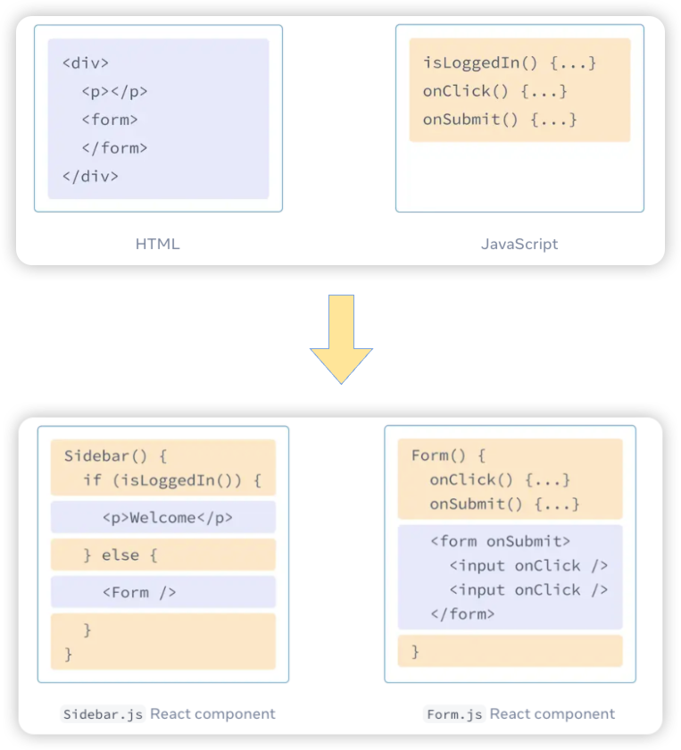

**值得注意的是，** JSX和React是相互独立的东西，**JSX是一种拓展语法**，而React则是一个JavaScript库。

### JSX规则

1. **只能返回一个根元素**
   1. 如果一个组件包含多个元素，需要用一个父标签把它们包裹起来。可以使用空标签<>\</>来代替，React Fragment 将子元素分组，而不会在 HTML 结构中添加额外节点。
   2. **JSX底层会被转换为JS对象，我们无法在一个函数中返回多个对象，除非使用数组包裹起来。** 这就是JSX为什么需要使用父元素包裹多个标签的原因。
2. **标签必须闭合**
   1. 例如HTML中可以使用\，但JSX中需要写成自闭合标签\
   2. 例如HTML中允许\<li>只有开始标签，但JSX中需要带上闭合标签\<li>\<li/>
3. **使用驼峰式命名法给****大部分属性****命名**
   1. 对于原生HTML属性，JSX中必须使用小驼峰形式，例如className、tabIndex等
   2. 对于自定义属性，可以使用小驼峰形式，也可以使用大驼峰形式，但推荐使用小驼峰形式保持一致。
   3. 对于数据属性data-*可访问属性aria-* 遵守原生规范保持扩折号形式。
4. **在JSX中通过大括号使用JavaScript**
   1. 传递变量、函数和对象
   2. 单括号：JSX标签中的文本、用变量给标签属性赋值
   3. 双括号：JSX中的CSS和对象

### 安全特性

防止注入式攻击在使用JSX编写应用时非常重要，React和Vue对于相关都做出了严谨的措施。

1. **自动转义表达式**

   框架默认会对所有插入到 JSX 中的 JavaScript 表达式进行自动转义。这意味着当你使用 `{}` 插入变量或表达式时，框架会将这些内容转换为字符串，并且任何 HTML 或 JavaScript 特殊字符都会被转换为安全的实体。

   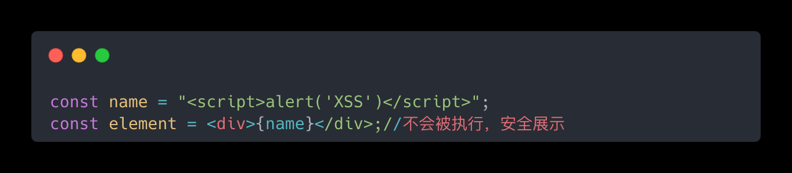
2. **框架的合成事件系统有助于减少直接操作 DOM 的需求，从而降低了因不当处理用户输入而导致的安全风险。**

用户也应该规范使用习惯，尽量不要使用 `dangerouslySetInnerHTML` 属性，因为它允许你直接插入 HTML 内容，这可能会导致 XSS 漏洞。如果你确实需要插入 HTML，请确保对输入进行了严格的验证和清理。

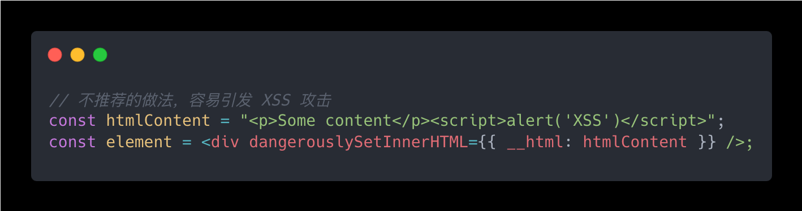

如果你需要处理用户生成的内容并将其作为 HTML 插入页面，考虑使用一个可靠的 HTML 净化库，比如 DOMPurify。DOMPurify 可以帮助你安全地解析和清理 HTML 字符串，移除潜在危险的代码。

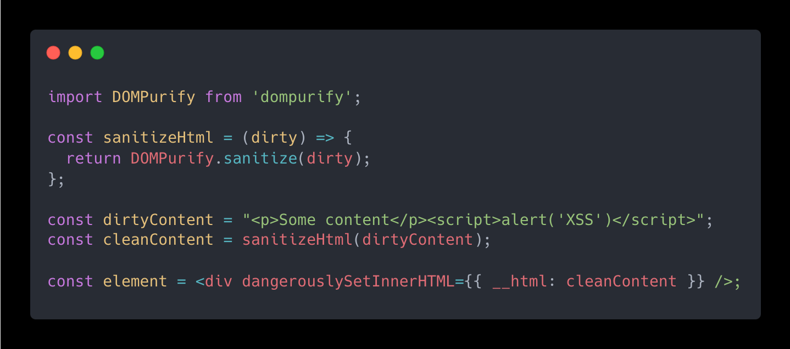

### 最佳实践

1. **使用 Fragment 避免多余标签；**
2. **可以通过三元表达式或逻辑与运算符实现条件渲染；**
3. **推荐使用 classnames 库简化复杂的类名逻辑；**
4. **当 JSX 结构过于复杂时，推荐将其拆分为多个组件，以提高代码的可读性和可维护性；**

## Preview

我们只需三行代码就可以确定一个React应用，第一行定义一个React元素，第二行获取DOM节点，第三行将React元素渲染到容器内。

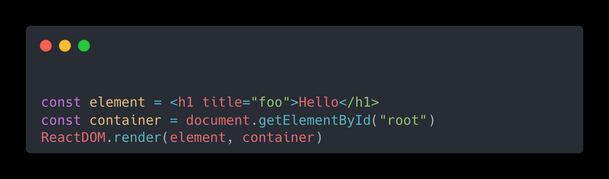

**对于第一行JSX语句****，** 通常可以使用babel工具简单的转换为JS。我们只需要将标签内的tag name、props、children作为参数传入`React.createElement`，`React.createElement`可以根据这些信息创建一个对象，并且还会进行一些安全性验证。因此我们可以安全地使用函数的输出。

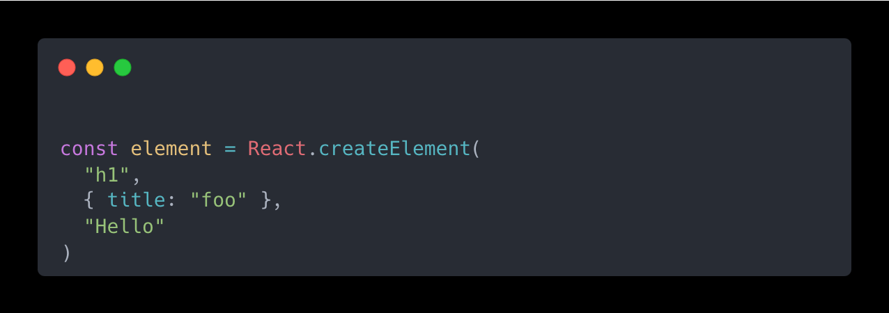

生成后的**element对象**如下图所示，对象含有type和props两个属性(其实还有其他[更多属性](https://github.com/facebook/react/blob/f4cc45ce962adc9f307690e1d5cfa28a288418eb/packages/react/src/ReactElement.js#L111 "更多属性")，但只关注这两个属性就可以)。type是一个特殊的字符串或函数，代表我们想要创建的HTML element的tag name，props含有所有JSX的属性，其中`children`属性是最值得关注的。`children`可以使一个字符串或者一个包含更多元素的数组。这就是为什么元素是以树状结构存储的原因。

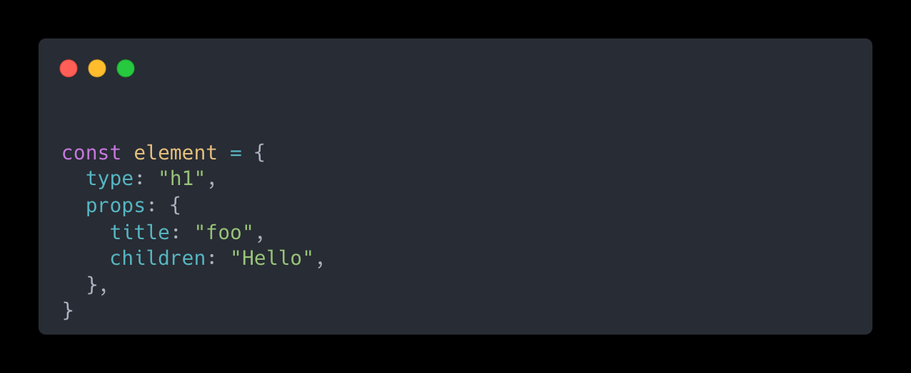

**对于第三行Render函数**， `ReactDOM.render`是React更改DOM的地方。根据上述代码，**Render函数**主要分为三步：创建父节点、创建子节点、填充节点。

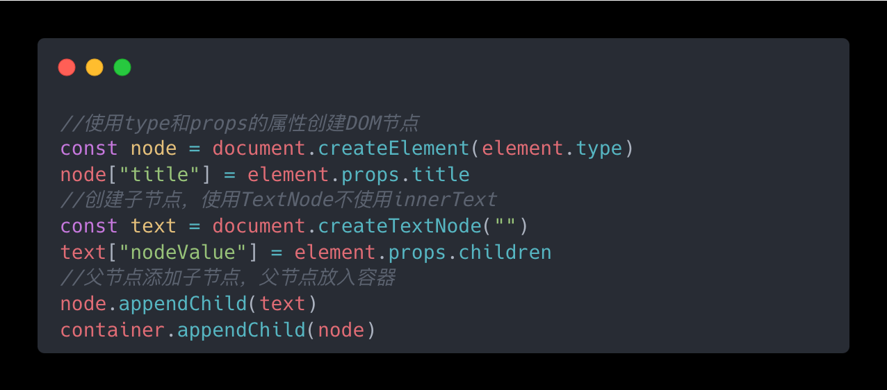

## Managing State

为降低复杂系统的维护难度，**React**采用**声明式编程**，我们不再需要直接操作UI关注整个操作路径，只需要声明想要展示的不同状态的内容并通过state进行控制切换。所以在React中，如何更好地维护state需要格外注意。

### 选择State结构

下面给出React官网提供的合理构建原则以便参考，原则的初衷都是为了**使 state 易于更新而不引入错误**。

1. **合并关联的 state**。如果你总是同时更新两个或更多的 state 变量，请考虑将它们合并为一个单独的 state 变量。**值得注意的是**，[如果你的 state 变量是一个对象，你不能只更新其中的某一个字段，而需要再显式的复制其他字段](https://zh-hans.react.dev/learn/updating-objects-in-state "如果你的 state 变量是一个对象，你不能只更新其中的某一个字段，而需要再显式的复制其他字段")。
2. **避免互相矛盾的 state**。当 state 结构中存在多个相互矛盾或“不一致”的 state 时，你就可能为此会留下隐患。应尽量避免这种情况。
3. **避免冗余的 state**。如果你能在渲染期间从组件的 props 或其现有的 state 变量中计算出一些信息，则不应将这些信息放入该组件的 、state 中。**值得注意的是**，不要在State中镜像props，这样可能会导致props无法触发更新。
4. **避免重复的 state**。当同一数据在多个 state 变量之间或在多个嵌套对象中重复时，这会很难保持它们同步。应尽可能减少重复。
5. **避免深度嵌套的 state**。深度分层的 state 更新起来不是很方便。如果可能的话，最好以扁平化方式构建 state。

### Props

React奉行 \*\*“可信单一数据源”**原则，**对于每个独特的状态，都应该存在且只存在于一个指定的组件中作为 state**。在 React 中，**props**是传递数据和修改数据的的主要方式。这种方式只允许父组件向子组件传递信息，确保了父子组件之间的单向数据流。为了确保可信度，**props**被设置为只读属性，子组件任何试图修改**props\*\*的操作都会导致错误或警告。

在React中，**状态与渲染树的位置有关。** 组件状态并非存放在组件中，而是由React进行统一管理。组件的状态与组件对应的渲染树位置有关。因此，理解React何时保留、何时重置状态对于编码十分有用。

#### 不同位置的组件state互不干扰

不同位置的组件状态互不干扰，下列代码中存放着两个独立的counter，它们在树中被渲染在各自的位置。

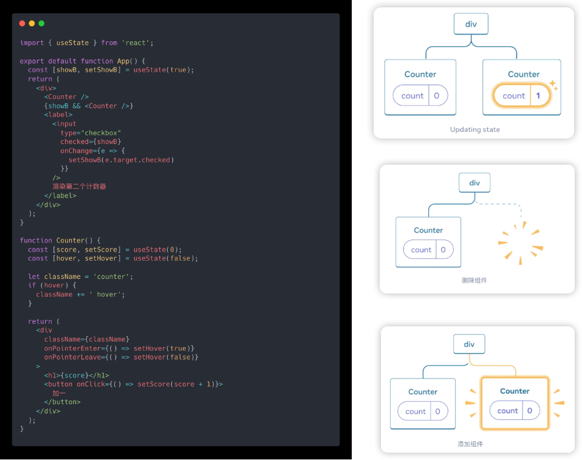

#### **相同位置的相同组件会使state被保留下来**

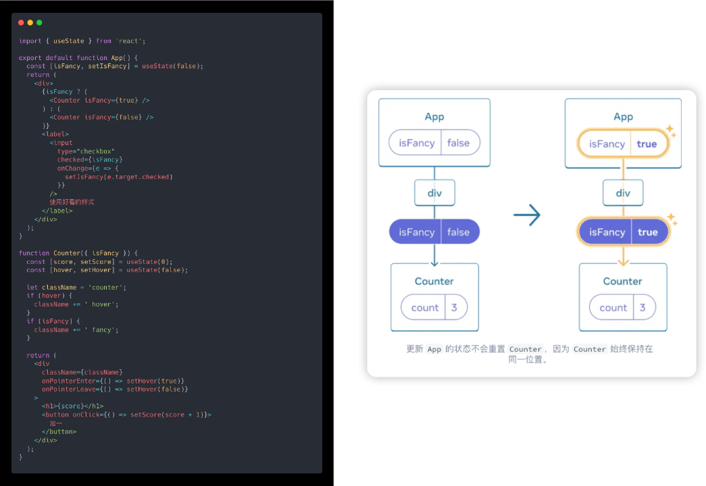

**值得注意的是：** ​**对 React 来说重要的是组件在 UI 树中的位置,而不是在 JSX 中的位置！** React 不知道你的函数里是如何进行条件判断的，它只会“看到”你返回的树。

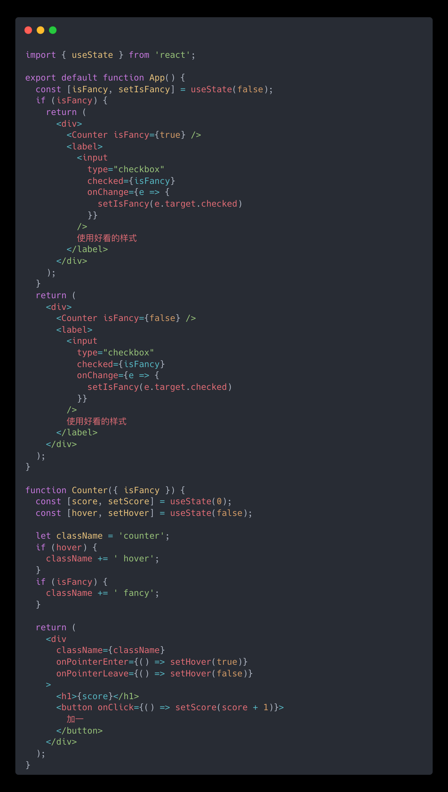

#### **相同位置的不同组件会使state被重置**

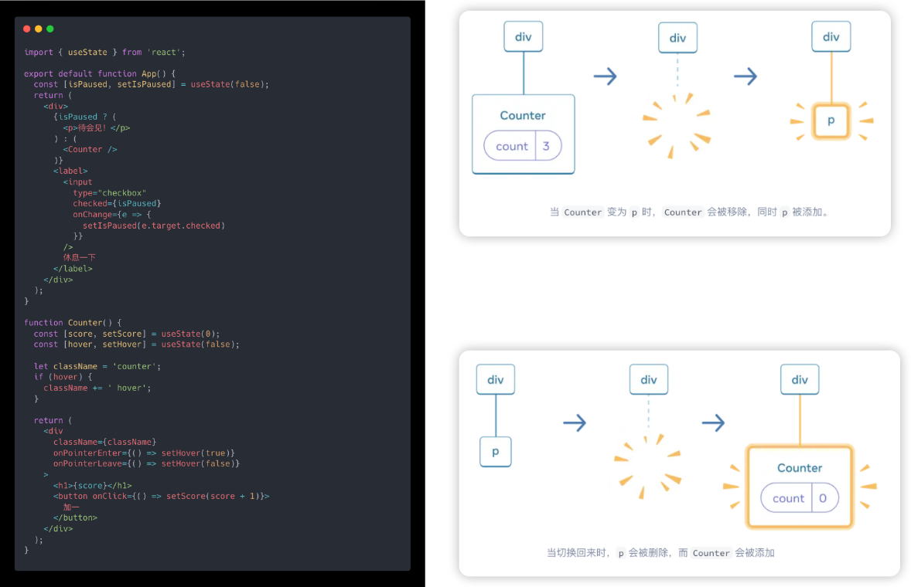

**值得注意的是：当你在相同位置渲染不同的组件时，组件的整个子树都会被重置**。

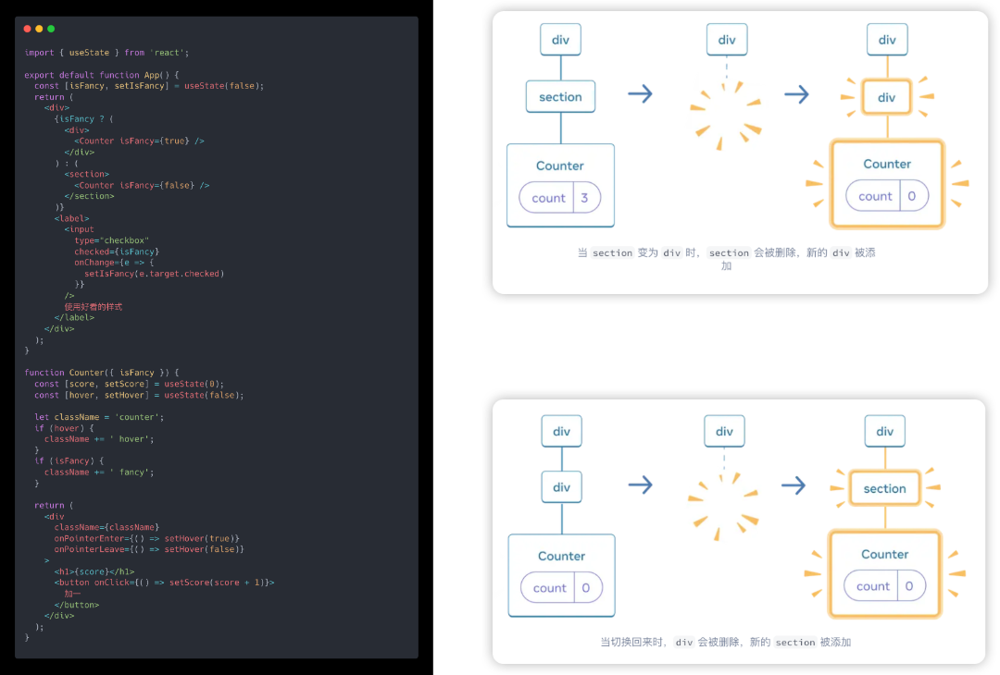

&#x20;此外，在组件内部嵌套定义组件，会导致子组件每次都重新挂载，重新挂载的子组件会被判定为相同位置的不同组件，所以React会将其下所有state都重置。因此，**永远要将组件定义在最上层**并且不要把它们的定义嵌套起来。

#### **在相同位置重置state**

有时可能对于相同位置的组件需要强行重置state，官方提供了下述两条建议：

1. 将组件渲染在不同位置
2. 使用key重置state

### Reducer

对于拥有许多状态更新逻辑的组件来说，过于分散的事件处理程序可能会令人不知所措。对于这种情况，你可以将组件的所有状态更新逻辑整合到一个外部函数中，这个函数叫作 `reducer`。`reducer`函数接收目前的状态和action然后返回下一个状态，这样action会随着时间积累到状态中去。简单来说，`reducer`函数就是**轻量版的局部作用域的Redux**。

我们只需三步就可以将useState迁移到useReducer中去：

1. 将设置状态的逻辑 **修改** 成 dispatch 的一个 action；action对象可以有多种结构，但惯例会添加type字段来描述发生事件，并通过其他字段传递信息。
2. **编写** 一个 reducer 函数；在reducer中使用switch语句而不是if-else有助于提高可读性。
3. 在你的组件中 **使用** reducer。

**值得注意的是：**

1. reducer**必须是纯粹的**，因为reducer是在渲染时运行的，action会排队直到下一次渲染。不应该出现任何异步请求、定时器或者副作用。
2. 每个aciton应该**描述单一的用户交互**，即使它会引起数据的多处变化。
3. 使用**Immer库**来简化reducer，如果不使用Immer，对于reducer都要注意使用不可变值的方法去更新数组和对象。使用`useImmerReducer`可以通过push或者arr\[i]等操作来修改state。

### Context

构建应用的难度会随着时间和规模呈指数式增长。复杂的前端界面需要进行组件的多层次嵌套，极易出现[propdrilling](https://link.juejin.cn/?target=https://kentcdodds.com/blog/prop-drilling "propdrilling")现象。

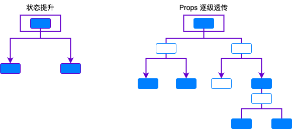

为了避免prop drilling的影响，react提供Context进行深层次传递。通过发布-订阅的模式，简化了状态管理，很好的解耦了父子组件。

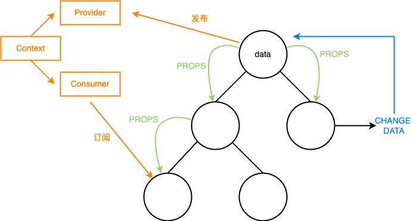

**Context** 虽然避免“prop drilling”的问题。但是，每当 **Context.Provider** 的 value 更新时，**所有依赖该 Context 的组件都会重新渲染**。如果这些组件的渲染开销较大，或者组件树很深，就会造成性能问题。除此以外，管理Context也是一件不容易的事情。如果有多个 **Context** 或复杂的数据结构，管理这些状态和 **Context** 的依赖关系可能会变得混乱，特别是当多个组件都依赖不同的 **Context** 时，可能会导致不可预测的渲染和数据更新问题。

### 三方库

在[前端开发者应懂的n个概念-状态管理](https://juejin.cn/post/7442584469158838311 "前端开发者应懂的n个概念-状态管理")一文中概述了目前状态管理库的主要**心智模型**和流行库，本文就不再赘述基础概念，推荐一种目前觉得好用的状态管理实践方案：**zutand+Context**。

官方这么介绍zustand：基于 `Flux` 模型实现的小型、快速和可扩展的状态管理解决方案，拥有基于 `hooks` 的舒适的API，非常地灵活且有趣。实际上手后就是感觉好用，大量的优化处理陷阱问题，如

[**zombie child**](https://react-redux.js.org/api/hooks#stale-props-and-zombie-children "zombie child")、[**react concurrency**](https://github.com/bvaughn/rfcs/blob/useMutableSource/text/0000-use-mutable-source.md "react concurrency")、以及 [**context loss**](https://github.com/facebook/react/issues/13332 "context loss") 问题，简单的API一目了然。不过，正如[TkDodo's blog](https://tkdodo.eu/blog "TkDodo's blog")提到的，或许我们并不是完全需要**全局状态管理工具**，使用**Context**配合**zustand**去按照功能创建多个**小型的状态管理仓库**可以更好地做到状态管理。当然，我不提倡绝对，因此这里我们只讨论下使用**zustand**进行**全局状态管理**和**局部状态管理**应该怎么做。

作**全局状态管理**工具，**zustand**官网推荐直接使用 `create` 来`create` 函数可以直接返回钩子以供使用。直接在全应用中通过 `useStore` 访问。

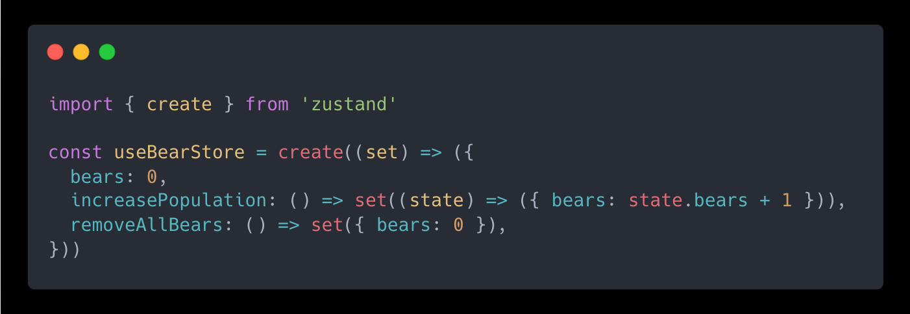

在**局部状态管理**中，[TkDodo's blog](https://tkdodo.eu/blog "TkDodo's blog")中提倡使用`createStore`进行初始化，`createStore` 与`create` 不同的是，该API不直接返回hooks而是返回一个纯粹的Store。再通过`useStore(store, selector)` 从 `store` 中获取特定的状态，并指定`selector` 函数，试组件可以灵活选择并订阅自己关心的状态，避免不必要的 re-render。

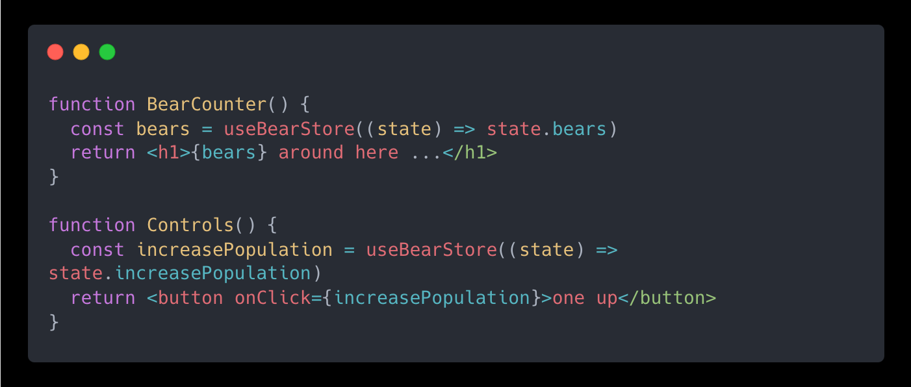

通过 `React.Context`，将 `Zustand` 的 `store` 提供给组件树中的一部分，而不是将它暴露给整个应用。这样，只有被包裹在 `Context.Provider` 中的子组件能够访问到状态。避免将不必要的状态暴露给全局应用范围。

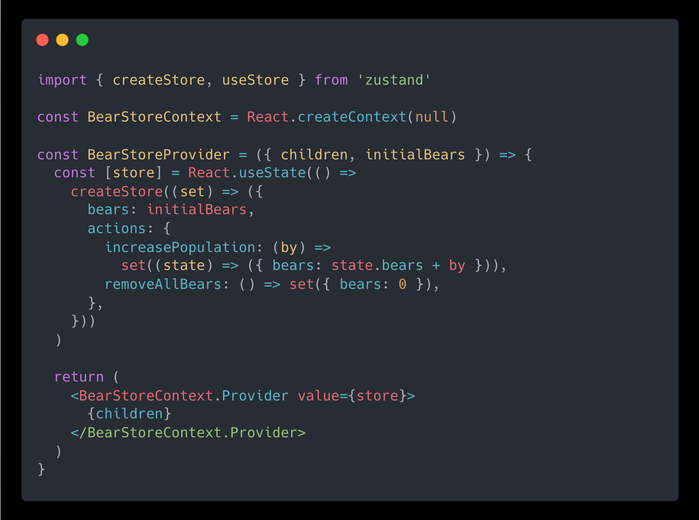

初始化时，必须确保创建状态仓库的行为只会发生一次。这个效果可以用ref来解决，但blog更倾向于用`useState`，理由[见此文章](https://tkdodo.eu/blog/use-state-for-one-time-initializations "见此文章")。

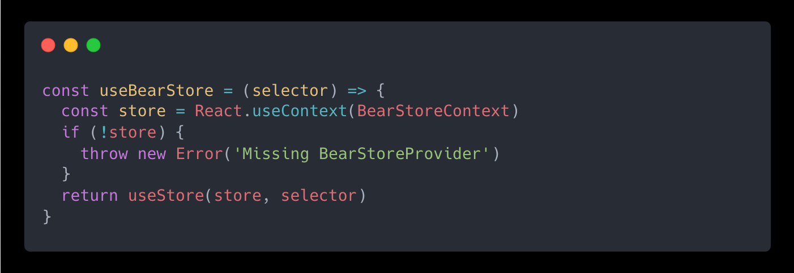

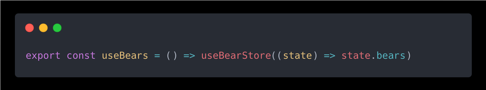

上面写法还带来了一些好处：我们可以使用props中的init进行初始化，并且初始化后，仓库中的数值不会根据props的变化而变化。局部状态管理往往可以给测试用例带来一些便利，zustand的全局测试文档十分复杂。

## Escape Hatches

有些高级组件需要控制和同步React之外的系统，这就需要使用一些“脱围机制”，让系统可以连接外部系统。

### useRef

#### ref的概念

**ref**是一个普通的JavaScript 对象，可以通过调用`useRef` Hook 来让 React生成一个**ref**对象。**ref**对象与**state**功能类似，都可以用来渲染之间的信息，其具有一个名为 `current` 的属性，我们可以对其进行读取或设置。但，与**state**不同的是，设置**ref**的`current`值并不会触发重新渲染。虽然**ref** 似乎没有 **state** 那样“严格”，而且可以实现类似功能，但React官网并不建议多使用它，因为作为“**脱围机制**”使用场景不会很多。**值得注意的是**，不要在渲染过程中读取或写入 `ref.current，`这可能会使你的组件难以预测。

原则上来说，`useRef` 可以在 `useState` 的基础上实现。

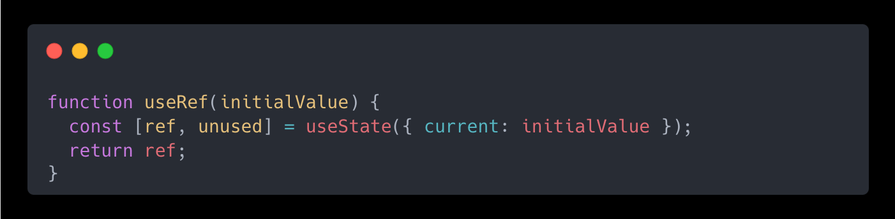

只需要弃用setRef函数，确保useRef总是能返回相同的对象，避免触发渲染。

#### ref的使用时机

通常与是不会影响组件外观的浏览器 API通信时可能需要使用**ref**，或者用于**存储timeout ID**、**DOM元素**与**一些不需要用于计算JSX的对象**。React不希望在渲染阶段访问**ref**，因为渲染阶段应该保证是纯函数，不能掺杂任何副作用。所以，React 在提交阶段设置 `ref.current`。

#### 使用ref操作DOM

React会自动处理跟新DOM以匹配渲染输出，因此我们不需要关心DOM渲染。但，有时可能我们需要访问DOM元素的属性或方法来进行操作。React没有内置相关方法，此时就需要使用一个指向DOM节点的**ref**来实现。如下所示，获取指向节点的ref通常需要三步：

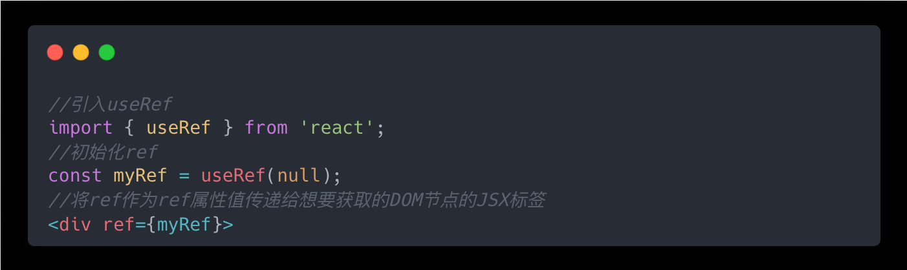

`useRef`会返回一个对象，对象有一个名为`current`的属性。初始化时，`current`属性为null，当React为JSX标签创建DOM节点时会将有**ref**属性的节点引用传入该对象的`current`属性中。至此，我们就可以通过`myRef.current`来访问DOM节点上的属性与方法。

#### 使用ref管理列表

ref数量如果预先确定好，那我们只需要三步就能获取想要的DOM节点。但是**如果事先不知道多少项呢？** 很明显，我们不能在循环语句中Hooks，因此下面做法事错误的：

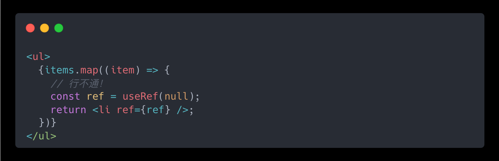

第一种解决方法，类似于**状态提升**。我们也可以将**ref**属性进行提升到父元素再使用`querySelectorAll`来搜索子节点。但这样做十分脆弱，如果DOM结构发生变化可能会导致意想不到的报错。

第二种解决方法，我们可以使用**ref回调**，将函数传递给**ref**属性。当需要设置 **ref** 时，React 将传入 DOM 节点来调用**ref** 回调，并在需要清除它时传入 `null` 。

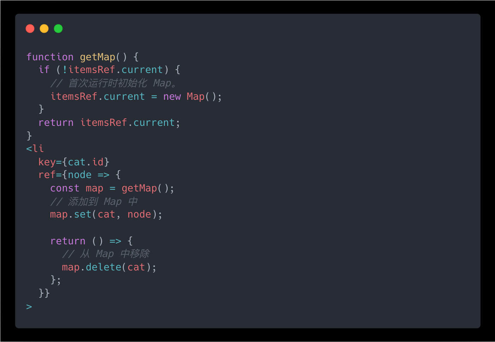

#### useImperativeHandle && forwardRef

**ref**也可以帮助我们控制另一个组件的DOM节点，但是手动操作其它组件的DOM节点可能会变得脆弱，需要使用命令句柄**useImperativeHandle**加以限制。[useImperativeHandle(ref, createHandle, dependencies?)](https://zh-hans.react.dev/reference/react/useImperativeHandle "useImperativeHandle(ref, createHandle, dependencies?)") ，其中，**ref**表示从props中获取的参数，**createHandle**表示需要返回的**ref**句柄，该句柄可以是任何类型，但通常是返回一个包含想要暴露方法的对象，**dependencies**表示反应式的依赖项，React 会使用 `Object.is` 来比较每一个依赖项与其对应的之前值，依赖项的改变会导致**createHandle**的重新执行。**值得注意的是**，React18及之前版本，并不允许直接将**ref**作为props传递给子组件。这主要是由于在React16及更早版本前，通过props传递的**ref**实际上会指向子组件的包装元素，而并不是具体的DOM节点，因此，React 16.3版本引入了`React.forwardRef(render)`，它提供了一种方式让某些类型的组件能够接收`ref`并将其转发到它们的子组件中。从React19开始，ref可以作为一个有效的prop直接进行传递，`React.forwardRef(render)` api被废弃。

#### 注意安全！

**Refs 是一种脱围机制**。只有在必须“跳出React”时使用它们，这些情况通常包括管理焦点、滚动位置或调用 React 未暴露的浏览器 API。**执行这些非破坏性的操作，应该不会遇到任何问题。**但是，我们需要**避免更改由 React 管理的 DOM 节点。** 因为，我们的手动操作可能与React所做的更改发生冲突。如果非要难做，请确保修改的是React没有理由更新的部分。

### useEffect

#### Effect的概念

**Effect** 是 React 中的专有定义——由渲染引起的副作用。React组件通常包含两种逻辑类型：渲染代码、事件处理程序。渲染代码决定页面上展示的JSX，必须是纯函数，只做结果计算，不做任何其他事。事件处理程序包含由特定用户操作引起的“副作用”。与事件处理程序**Event**不同的是，**Effect**不由某种特性交互触发，而是由渲染自身引起的副作用。

#### Effect的步骤

编写一个正确的**Effect**，通常需要三步：声明**Effect**、指定**Effect**依赖及必要时添加清理操作。

#### 声明Effect

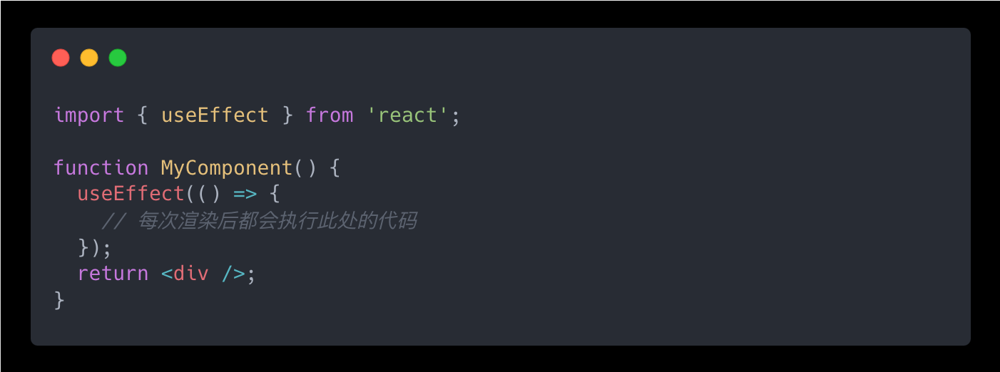

在不指定依赖项的默认情况下，**Effect**会在**每次**渲染后运行。如果仅是为了调整**state**，也许你并不需要使用**Effect**。

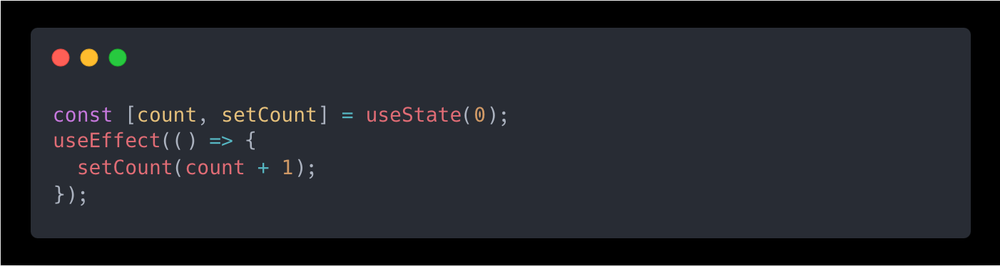

上述代码会进入死循环，渲染、触发**Effect**、更改**state**、再渲染... ...

#### 指定Effect的依赖项

也许，我们并不需要每次渲染都触发**Effect**。因此，我们可以通过指定依赖项来避免无效触发。只有当指定的 **所有** 依赖项的值都与上一次渲染时完全相同，React 才会跳过重新运行该 **Effect**。与**useImperativeHandle**一样 **，** React 使用`Object.is` 来比较依赖项的值。

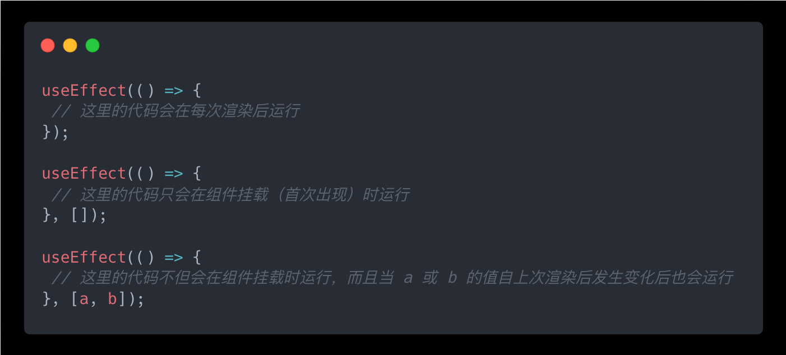

**值得注意的是**，依赖项数组中应该忽略**ref**和`useState`的**set函数**，因为两者均具有**稳定标识**，每轮调用总能获得相同的对象，并不会导致**Effect**重新运行。

#### 按需添加清理函数

严格模式下，React会重新挂载组件。我们需要考虑 **“如何修复 Effect 来让它在重新挂载后正常运行”**，添加清理函数往往是一个很好的选择。[官网](https://zh-hans.react.dev/learn/synchronizing-with-effects "官网")给出了足够多的案例以供参考。

#### 注意事项

1. 移除不必要的Effect
   1. 不必使用 Effect 来转换渲染所需的数据
   2. 不必使用 Effect 来处理用户事件
2. 每个 Effect 应该代表一个独立的同步过程
3. Effect会响应于响应式值，确保依赖项的值是响应式的。\*\*在组件内部声明的 props、state 和其他值都是 响应式 的，因为它们是在渲染过程中计算的，\*\***并参与了 React 的数据流**。可变值（包括全局变量）不是响应式的，因为它可以在 React 渲染数据流之外的任何时间发生变化，而React无法感知
4. 避免将对象和函数作为依赖项

## 总结

A React component is a function that returns something React can render.

## 参考资料

> 📌真的不可以在 React 组件内部嵌套定义子组件吗？[https://prinsss.github.io/react-unstable-nested-components/](https://prinsss.github.io/react-unstable-nested-components/ "https://prinsss.github.io/react-unstable-nested-components/")

> React官网[https://zh-hans.react.dev/](https://zh-hans.react.dev/ "https://zh-hans.react.dev/")

> Zustand and React Context [https://tkdodo.eu/blog/zustand-and-react-context](https://tkdodo.eu/blog/zustand-and-react-context "https://tkdodo.eu/blog/zustand-and-react-context")

> Zustand官网[https://awesomedevin.github.io/zustand-vue/docs/introduce/what-is-zustand](https://awesomedevin.github.io/zustand-vue/docs/introduce/what-is-zustand "https://awesomedevin.github.io/zustand-vue/docs/introduce/what-is-zustand")

> useState for one-time initializations [https://tkdodo.eu/blog/use-state-for-one-time-initializations](https://tkdodo.eu/blog/use-state-for-one-time-initializations "https://tkdodo.eu/blog/use-state-for-one-time-initializations")
