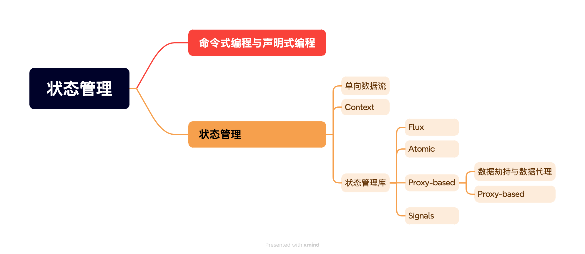
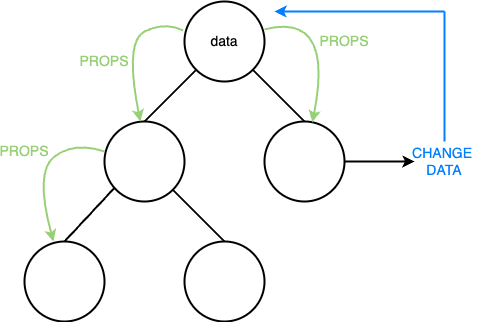
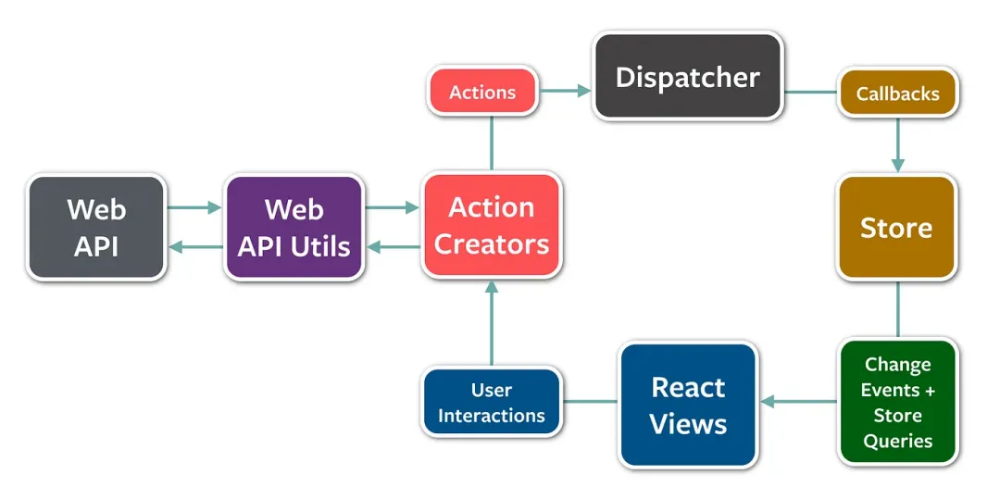
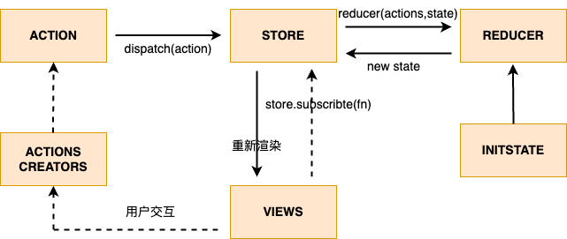
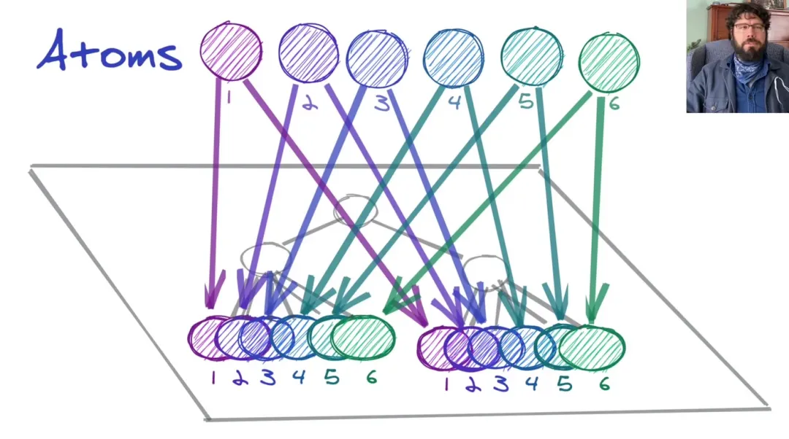
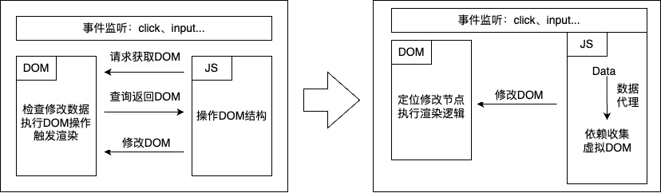
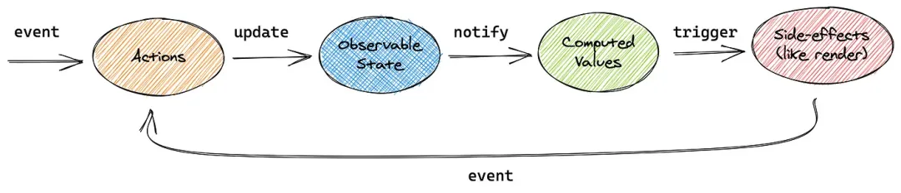

# 前端开发者应懂的n个概念-状态管理

## 前言

数据驱动的声明式编程给前端开发带来了意想不到的便利，而状态管理则是维护驱动视图数据的重要手段。优秀的状态管理可以让代码更易理解、维护。本篇从现代框架的基础数据流入手，以redux作为蓝本讲解状态管理的基础思想。

## 目录

## 命令式编程与声明式编程

命令式编程：关注的是“怎么做”（how to do），强调程序的执行过程。在这种范式中，程序员需要明确地告诉计算机每一步应该做什么，以及如何做。

声明式编程：强调程序的目标而不是具体的执行过程。在这种范式中，程序员只需要描述“做什么”（what to do），而不必关心具体的实现细节。

**REACT官网有着这样的描述：对于独立系统来说，命令式地控制用户界面的效果也不错，但是当处于更加复杂的系统中时，这会造成管理的困难程度指数级地增长。**

因此，声明式编程成为了现在前端框架的首选。在声明式编程中，状态管理起着至关重要的作用。这意味着你需要关注应用程序的状态和如何根据这些状态来渲染 UI，而不是具体的操作步骤。优秀的状态管理工具可以帮助你集中管理应用的状态，确保状态的一致性和可预测性，从而使代码更加简洁、模块化和易于维护。

## 状态管理

### 单向数据流

现代前端框架均 遵循“[可信单一原则](https://en.wikipedia.org/wiki/Single_source_of_truth "可信单一原则")”，**对于每个独特的状态，都应该存在且只存在于一个指定的组件中作为 state**。因此，采用单向数据流的设计模式，只允许数据从父组件流向子组件，而不允许反向流动。这样做可以让数据流动的路径变得清晰且可预测，避免了许多副作用的干扰。

当然，这并不意味着需要一个特定的组件来保存这些状态信息，我们只需要注意不要在组件间复制共享状态，而应该采用状态提升、props传递、事件回调的方式来维护单一的、清晰的数据流。

### Context

构建应用的难度会随着时间和规模呈指数式增长。复杂的前端界面需要进行组件的多层次嵌套，极易[prop drilling](https://kentcdodds.com/blog/prop-drilling "prop drilling")现象。

为了避免prop drilling的影响，react和vue都提供了类似Context的api进行深层次传递。通过发布-订阅的模式，简化了状态管理，很好的解耦了父子组件。

**Context** 虽然避免“prop drilling”的问题。但是，每当 **Context.Provider** 的 value 更新时，**所有依赖该 Context 的组件都会重新渲染**。如果这些组件的渲染开销较大，或者组件树很深，就会造成性能问题。除此以外，管理Context也是一件不容易的事。如果有多个 **Context** 或复杂的数据结构，管理这些状态和 **Context** 的依赖关系可能会变得混乱，特别是当多个组件都依赖不同的 **Context** 时，可能会导致不可预测的渲染和数据更新问题。Redux 作为一种状态管理库，提供了比 **Context** 更为强大和灵活的解决方案。它弥补了 **Context** 在大规模应用中面临的性能和可维护性问题。

### 状态管理库

状态管理库主要围绕解决“props drilling”以及context渲染问题进行研究。在这个前端野蛮发展的时代，状态管理库有非常多的选择。从 mental model 来说可以分成三大类 Flux、Atomic、Proxy、以及Signal。

#### Flux

为了解决MVC架构在大型应用中的数据管理问题，facebook在2014年提出了经典的Flux架构，以单向数据流作为根本，采用动作派发的模式来更改数据中心store中存储的状态。

在**Flux**架构中，**Redux**是最火热也是大部分人在学习状态管理时会碰到的第一个状态管理套件。**Redux**强调状态的不可变性和显式地派发动作更新状态，这确保了状态的变化是可预测的，并且可以轻松地追踪和调试。整体流程如下图所示：

1. **创建 Store**：
   - 使用 `createStore` 函数创建一个 store，传入根 reducer 和初始状态（可选）。
   - Store 是一个对象，它保存了应用的所有状态，并提供了访问和更新这些状态的方法。
2. **定义 Action**：
   - Action 是一个普通的 JavaScript 对象，它描述了发生了什么。Action 通常包含一个 `type` 属性，表示动作的类型，还可以包含其他数据。
3. **定义 Reducer**：
   - Reducer 是一个纯函数，接收当前状态和一个 action，返回新的状态。
   - Reducer 必须是纯函数，即相同的输入总是产生相同的输出，并且没有副作用。
4. **Dispatch Action**：
   - 通过 `store.dispatch(action)` 方法发送 action 到 store。
   - Store 会调用 reducer 来处理这个 action，并生成新的状态。
5. **订阅 State 变化**：
   - 通过 `store.subscribe(listener)` 方法注册一个监听器，当 state 发生变化时，监听器会被调用。
   - 监听器通常用来触发 UI 更新。
6. **获取 State**：
   - 通过 `store.getState()` 方法获取当前的 state。

虽然原生Redux在设置和使用上都比较繁琐，但经过实践验证，其丰富的生态可以大大优化开发效率。Redux Toolkit可以减少创建store、reducer 的 boilerplate code，集成了Immer，让开发者无需特地维护immutable数据。react-redux通过`Provider`、`useSelector` 和 `useDispatch` 等工具，使得 React 组件可以轻松地访问和更新状态，而不需要直接与 Redux store 交互。中间件可以使用`redux-thunk` 或 `redux-saga` 来处理异步操作和副作用。甚至Dva的出现在0api的增加下，完美兼容了umi框架，大大简化了开发路径。

#### Atomic

Atomic 的核心概念就是想让 React 的状态管理可以被分散在 component tree 中，这些状态就是 atom，而 atom 可以像是 context 取得状态，同时又可以让 code-splitting 将元件切分的更细。

#### Proxy-based

#### 数据劫持与数据代理

讲**Proxy-based**之前，先需要了解下数据劫持与数据代理。

\*\*数据劫持：**数据劫持是指通过某种方式拦截和控制数据的访问和修改，以数据为基础去执行额外操作。通常数据拦截使用**Object.defineProperty()\*\*来实现，vue2中便通过数据劫持来实现了系统的响应式。

**数据代理：**数据代理是指通过一个中间对象来间接访问和操作另一个对象。这个中间对象可以对访问和操作进行拦截和处理，从而实现各种功能，如日志记录、权限控制、响应式系统等。在 JavaScript 中，最常用的数据代理方法是使用 **Proxy**。vue3中改用**Proxy**代替vue2中的**Object.defineProperty()** 来实现响应式系统。

传统渲染方案不对渲染频率加以限制，依赖高频率的document接口调用，容易消耗通道大量资源，导致渲染性能下降。现代前端框架常以数据劫持、数据代理为基础配合虚拟DOM等技术来优化渲染流程，减少了通道资源消耗，提升了性能。

#### Object.defineProperty()

MDN中对**Object.defineProperty**做出来如下解释：`Object.defineProperty(obj, prop, descriptor)` 静态方法会直接在一个对象上定义一个新属性，或修改其现有属性，并返回此对象。

其中**descriptor**为定义或修改的属性的描述符，共享可选值：configurable、enumerble、value、writable、get和set。值得注意的是，**Object.defineProperty**通过赋值属性的方式往对象上添加属性，因此对于嵌套数据需要进行遍历赋值。

#### Proxy

通过上述解释可以看出**Object.defineProperty**存在着两个主要问题：1.只能拦截对象的属性访问和修改，对于数组的某些操作、新增属性、对象的删除、枚举和继承都无法拦截。2.通过遍历赋值的形式赋值属性，对于深层嵌套对象存在性能开销问题。因此，Vue3放弃了Vue2中数据拦截的方式，改用Proxy做数据代理。

**Proxy**：` Proxy(target, handler)`是 ECMAScript 6 (ES6) 引入的一种新特性，用于创建一个代理对象，可以拦截并自定义对象的基本操作（如属性的访问、修改、删除等）。`Proxy` 的主要作用是增强对象的行为，使其更具灵活性和可控性。

**Proxy** 的核心在于 **handler** 对象，通过 `handler` 对象可以定义各种拦截操作的处理逻辑，以实现全面拦截的能力。除此以外，与**Object.defineProperty**不同的是**Proxy**并不在初始化环节对所有属性进行处理，而是只在实际操作发生时才做拦截，这大大降低了对于大型对象的性能消耗。

#### Reflect

**Reflect** 是 ECMAScript 6 (ES6) 引入的一个内置对象，提供标准化的方式来执行对象操作，并且能够与 **Proxy** 的拦截器方法很好地配合。在数据代理和依赖收集中，常使用Reflect和Proxy组合来提高代码可读性与一致性。

#### Proxy-based

Proxy-based套件以Mobx和Valtio为代表，通过**Proxy** 拦截和重新定义对象的基本操作，实现了细粒度的状态变化检测和响应式更新。这种方式减少了**Flux**模式中的样板代码，使得状态管理更加直观和高效，其主要流程如下图所示：

#### Signals

**Signals** 机制的核心在于利用 **Proxy** 来实现细粒度的响应式系统。相对于 **Flux**、**Atomic**、**Proxy** 等等套件解决的是组件等级的重新渲染问题，但**Signals** 的目标是 element 等级的渲染问题。目前Vue、Solid、Angular甚至Tailwind都在积极拥抱Signals机制，但是这并不是React 团队所推崇的，因为它破坏了 React 的生命周期。

## 总结

时至今日，我依然相信“天下没有免费的午餐”原则，没有十全十美的解决方案，合适的才是最好的。分享一个公司失败案例，在dva捧上神坛的时候，选择了dva。一个页面connect七八个models，甚至在不清楚api使用的情况在effects中使用while(true)，不报错就是对。现在面临的就是数据追踪困难、代码阅读困难的问题，因此项目只能逐步重构。

## 参考资

> 📌Redux万字详解[https://juejin.cn/post/7248081575320404027?searchId=202411281354022015BCF70918CD9E52DF](https://juejin.cn/post/7248081575320404027?searchId=202411281354022015BCF70918CD9E52DF "https://juejin.cn/post/7248081575320404027?searchId=202411281354022015BCF70918CD9E52DF")

> React状态管理比较与原理实现. Redux,Zustand,Jotai,Recoil, MobX,Valtio[https://mp.weixin.qq.com/s/Dr-1giVL6sCC9o5SmjEr9Q](https://mp.weixin.qq.com/s/Dr-1giVL6sCC9o5SmjEr9Q "https://mp.weixin.qq.com/s/Dr-1giVL6sCC9o5SmjEr9Q")
