# TCP协议的保障机制

## 前言

“想要成为技术牛人？先搞定网络协议！”—趣谈网络协议

想要了解网络通信的概貌—>[前端开发者应懂的n个概念-网络协议模型](https://juejin.cn/post/7373238579839778853 "前端开发者应懂的n个概念-网络协议模型")

## 目录

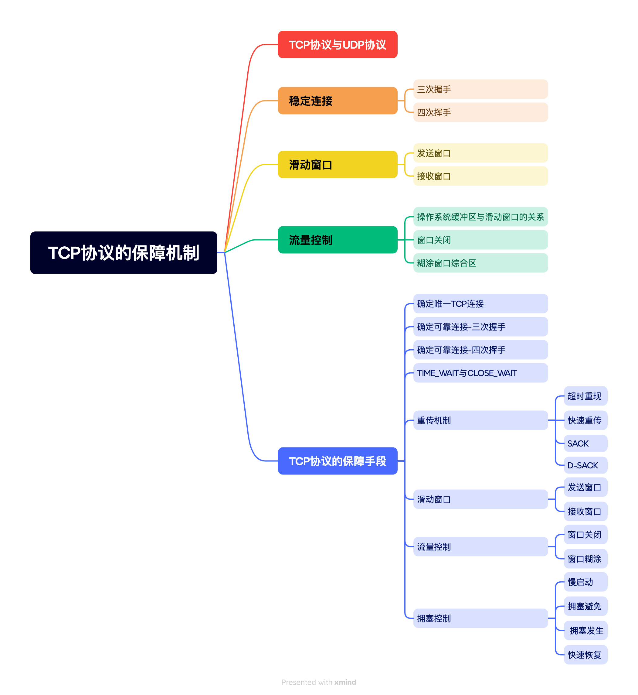

## TCP协议与UDP协议

TCP是**有状态的、面向连接的、可靠的、基于字节流**的传输层通信协议，常用于对网络通信质量有很高要求的地方，如文件传输，邮件发送，远程登录等场景。

UDP是**无状态的**、面向**无连接的、不可靠的、基于数据包**的传输层通信协议，常用于即时通信，如语音、视频、直播等场景。TCP与UDP协议头格式如下图所示：

两者相比，UDP头部格式明显简单，主要差距是UDP并不依赖于各种机制来**维护状态**和**可靠连接**，其头部格式进需要提供源端口号、目标端口号、包长度及校验和这四种信息。与之相比，TCP想要做到**有状态、可靠连接及数据完整有序**，需要如下属性进行校验：

- 序列号：用于维护数据包顺序，初始值由建立连接时的计算机生成，SYN包成功传送一次，序列号**累加**一次该**数据字节数**大小。
- 确认应答号：用来解决丢包问题，发送端接收到的确认应答号便认为该序号之前的数据已成功接收。
- 控制位：
  - ACK：该位为 1 时，**确认应答**的字段变为有效，TCP 规定除了最初建立连接时的 SYN 包之外该位必须设置为 1 。
  - RST：该位为 1 时，表示 TCP 连接中出现异常必须强制断开连接。
  - SYN：该位为 1 时，表示希望建立连接，并在其**序列号**的字段进行序列号初始值的设定。
  - FIN：该位为 1 时，表示今后不会再有数据发送，希望断开连接。当通信结束希望断开连接时，通信双方的主机之间就可以相互交换 FIN 位为 1 的 TCP 段。
- 窗口大小：根据接收方当前的处理能力动态调整，防止发送方发送速度过快而导致接收方无法处理。

值得注意的是，TCP没有包长度字段，转而使用序列号和确认应答号字段来实现数据的可靠传输，通过这些字段的值以及头部长度字段来确定数据的边界。

## TCP协议的保障手段

TCP连接需要保证连接可靠性、数据完整性及流量稳定性，因此需要维护某些状态信息，包括Socker、序列号及窗口大小。

### 确定唯一TCP连接

TCP四元组可用于确定唯一TCP连接：源地址、源端口、目的地址及目的端口。

源地址和目的地址的字段（32 位）是在 IP 头部中，作用是通过 IP 协议发送报文给对方主机。

源端口和目的端口的字段（16 位）是在 TCP 头部中，作用是告诉 TCP 协议应该把报文发给哪个进程。

### 确定可靠连接-三次握手

#### **三次握手流程**

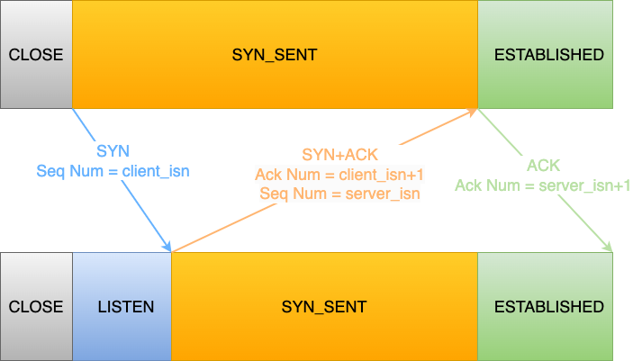

1. 客户端与服务端初始状态都是CLOSE。
2. 服务端主动监听端口，更改状态至LISTEN。
3. 客户端发送SYN状态为1的数据包，表示希望建立连接，客户端状态由CLOSE扭转为SYN\_SENT。与此同时，客户端也会随机初始化序列号置于TCP首部的序列号中，本次发送的报文不含应用层数据。—第一次握手，由客户端发送给服务端
4. 服务端接收到客户端发送到的报文后将SYN和ACK控制位置1代表确认应答，并初始化服务端序列号置于报文序列号，将客户端序列号+1置于确认应答号。服务端状态由LISTEN扭转为SYN\_SENT。—第二次握手，由服务端发送给客户端
5. 客户端接收到服务端报文后还会进行一次应答。将ACK控制位置1代表确认应答，并将服务端序列号+1置于确认应答号。本次报文可携带应用层数据，客户端状态由SYN\_SENT扭转为ESTABLISHED。—第三次握手，由客户端发送给服务端
6. 服务端接收到客户端应答报文后将状态由SYN\_SENT扭转为ESTABLISHED，由此TCP/IP三次握手完成。

#### 三次握手的作用

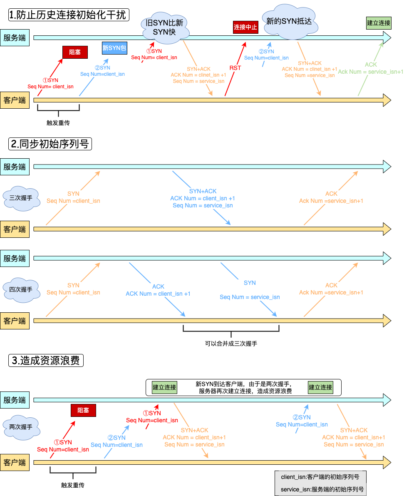

TCP连接需要初始化Socket、序列号和窗口大小。三次握手主要是为了解决历史连接的重复初始化问题、同步双方初始序列号以及减少资源浪费。

- 两次握手：无法防止历史连接的建立，会造成双方资源的浪费，也无法可靠的同步双方序列号；
- 四次握手：三次握手就已经理论上最少可靠连接建立，所以不需要使用更多的通信次数。

#### 握手丢失的情况

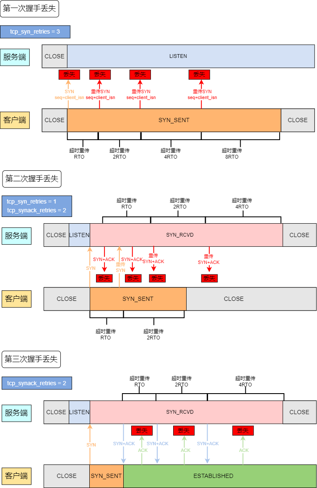

客户端SYN重传的最大次数由参数**tcp\_syn\_retries**决定，服务端SYN重传的最大次数由参数**tcp\_synack\_retries**决定。每次超时的时间为上一次的两倍，**tcp\_syn\_retries+1**/**tcp\_synack\_retries+1**次超时时间到仍未收到下一次握手则关闭。

### **确定可靠连接**-四次挥手

#### **四次挥手流程**

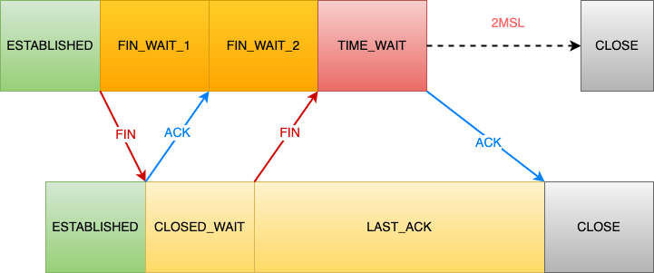

1. 客户端打算断开连接时会发送一个控制位FIN为1的报文表示希望断开连接，状态由ESTABLISHED扭转为FIN\_WAIT\_1。—第一次挥手，客户端向服务端发送FIN报文
2. 服务端接收FIN报文后会返回ACK报文，状态由ESTABLISHED扭转为CLOSED\_WAIT。—第二次挥手，服务端向客户端回复ACK报文
3. 客户端接收到ACK报文后，表明知晓服务端已经开始断连操作，状态由FIN\_WAIT\_1扭转为FIN\_WAIT\_2进入等待服务器处理阶段。
4. 服务器处理完数据后，会主动发送FIN报文，告知客户端数据已处理完成，状态由CLOSED\_WAIT扭转为LAST\_ACK状态。—第三次挥手，服务端向客户端发送FIN报文
5. 客户端接收到FIN报文后回复ACK报文，状态由FIN\_WAIT\_2扭转为TIME\_WAIT状态。—第四次挥手，客户端向服务端回复ACK报文
6. 服务端接收到ACK报文后，进入CLOSE状态，至此服务端已完成连接的关闭。
7. 客户端在发送完FIN报文2MSL后，自动进入CLOSE状态，至此客户端已完成连接的关闭。

#### 四次挥手的作用

- 关闭连接时，客户端向服务端发送 FIN 时，仅仅表示客户端不再发送数据了但是还能接收数据。
- 服务端收到客户端的 FIN 报文时，先回一个 ACK 应答报文，而服务端可能还有数据需要处理和发送，等服务端不再发送数据时，才发送 FIN报文给客户端来表示同意现在关闭连接。

从上面过程可知，服务端通常需要等待完成数据的发送和处理，所以服务端的 ACK 和 FIN 一般都会分开发送，因此是需要四次挥手。

#### 挥手丢失的情况

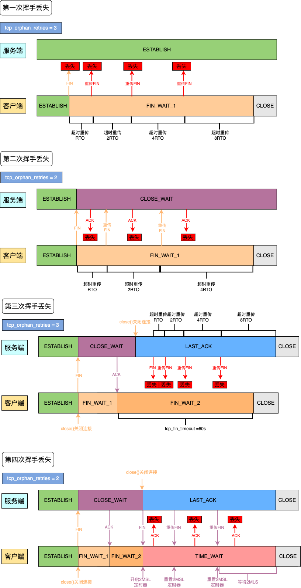

客户端和服务端重传FIN 报文的最大次数由参数**tcp\_orphan\_retries**决定，每次超时的时间为上一次的两倍，**tcp\_orphan\_retries+1**次超时时间仍未收到下一次挥手则关闭。关闭方可以选择调用close函数关闭连接或者shutdown函数关闭连接。对于 close 函数关闭的连接，由于无法再发送和接收数据，所以FIN\_WAIT2 状态不可以持续太久，而 tcp\_fin\_timeout 控制了这个状态下连接的持续时长，默认值是 60 秒。值得注意的是，如果主动关闭方使用\*\* shutdown 函数\*\*关闭连接，指定了只关闭发送方向，而接收方向并没有关闭，那么意味着主动关闭方还是可以接收数据的。tcp\_fin\_timeout 无法控制 shutdown 关闭的连接。

### TIME\_WAIT状态与ClOSE\_WAIT状态

#### **TIME\_WAIT状态等待时间为什么是2MSL**

报文最大生存时间(Maximum Segment Lifetime,MSL)，是报文在网络上存在的最长时间，超过这个时间报文就会被丢弃。TIME\_WAIT 等待 2 倍的 MSL，比较合理的解释是： 网络中可能存在来自发送方的数据包，当这些发送方的数据包被接收方处理后又会向对方发送响应，所以**一来一回需要等待 2 倍的时间**。

#### **为什么需要TIME\_WAIT状态**

- 防止历史连接中的数据，被后面相同四元组的连接错误的接收；
  - 上一个四元组建立的连接中传递的数据因网络延时问题导致延误。由于没有TIME\_WAIT状态不会等待报文消亡，若下一个相同四元组迅速建立连接，并且接受到序列号在接收窗口内的报文，导致数据错乱。
- 保证被动关闭方能被正确的关闭；
  - 如果TIME\_WAIT时间过短或没有，就没有办法进行第四次挥手。被动关闭方的FIN报文如果不按时到达主动关闭方，主动关闭方就不能发送ACK报文进行第四次挥手。所以要等待足够长的时间确保能接受到被动关闭方的FIN报文。

#### 为什么需要CLOSE\_WAIT状态

服务器可能有数据未发送完毕，这段时间是继续发送数据的。如果建立连接之后出现故障：TCP有个保活计时器，通常设置为2小时，两小时内没有收到客户端发送的数据，服务器发送探测报文，每75s发送一次，10次之后探测报文没有反应，认为出现故障，关闭连接。

### 解决丢包问题-重传机制

#### 超时重传

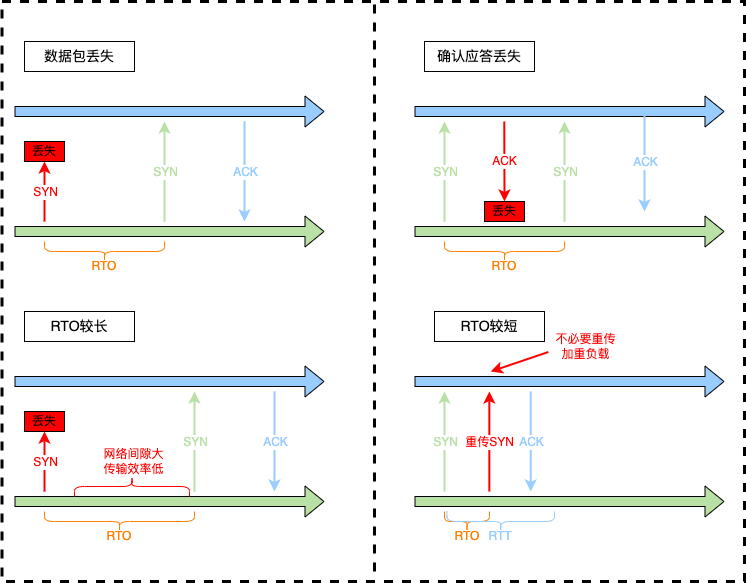

如果出现数据报丢失或确认应答丢失就可以触发TCP超时重传，超时重传时间（Retransmission Timeout , RTO ）过长或者过短都会造成负面影响。

#### **快速重传机制**

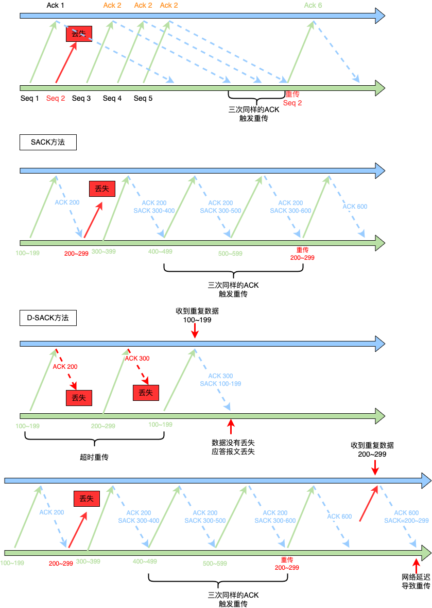

未弥补超时重传机制的问题，快速重传机制以数据为驱动的模式来代替以时间驱动的模式。

快速重传的工作方式是当收到三个相同的 ACK 报文时，会在定时器过期之前，重传丢失的报文段。

快速重传机制只解决了一个问题，就是超时时间的问题，但是它依然面临着另外一个问题。就是**重传的时候，是重传一个，还是重传所有的问题。**

**选择性确认**方法(Selective Acknowledgment, SACK)在 TCP 头部「选项」字段里加一个 `SACK` 的东西，它**可以将已收到的数据的信息发送给「发送方」**，这样发送方就可以知道哪些数据收到了，哪些数据没收到，知道了这些信息，就可以**只重传丢失的数据**。SACK用来告知发送方已发送的数据，Duplicate SACK使用 SACK字段 来告诉发送方有哪些数据被重复接收了。同样是SACK字段，两者的区别在于SACK字段范围在ACK范围内则表示重复的字段，如果在范围外则表示接收到的数据范围。

### 滑动窗口

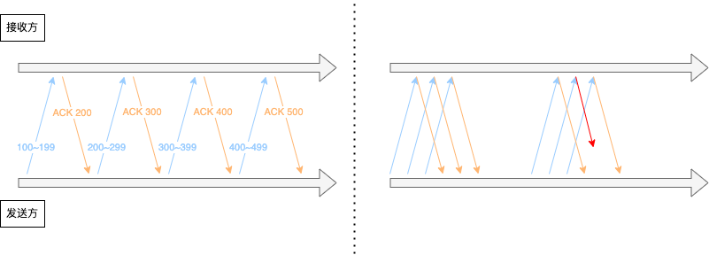

如果对每个数据包都进行确认应答的话，包的往返时间越长，网络的吞吐量就越低。为提高传输效率，TCP 引入了窗口这个概念，即使在往返时间较长的情况下，它也不会降低网络通信的效率。TCP头部中有一个window字段，窗口大小通常是由接收方的窗口大小来决定的，用来告诉发送端接收端还有多少缓存区域可以接收数据，避免接收端数据处理不过来的情况。

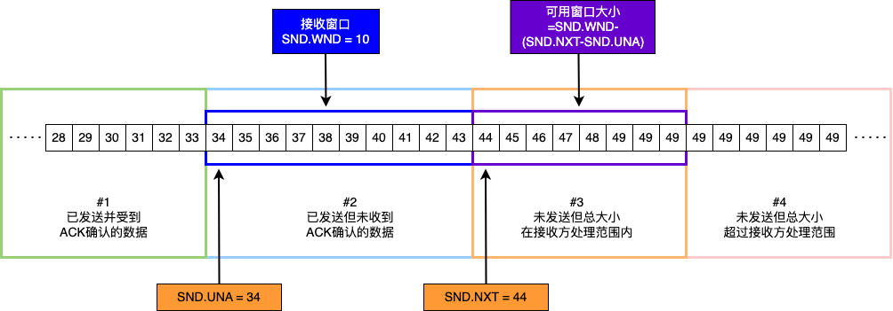

发送方滑动窗口如上图所示，主要分为四个区域，分别为#1已发送并收到ACK确认的数据；#2已发送但未收到ACK确认的数据；#3未发送但总大小在接收方处理范围内(接收方还有空间)；#4未发送但总大小超过接受方处理范围(接收方没有空间)。

发送方滑动窗口使用三个指针来跟踪在四个传输类别中的每一个类别中的字节：`SND.WND`标识发送窗口的大小；`SND.UNA`指向已发送但未收到确认的第一个字节的序列号，即#2的第一个字节；`SND.NXT`指向未发送但可发送范围的第一个字节的序列号，即#3的第一个字节。值得注意的是，通过`SND.WND`和`SND.UNA`就可以计算出指向#4第一个字节的相对指针。

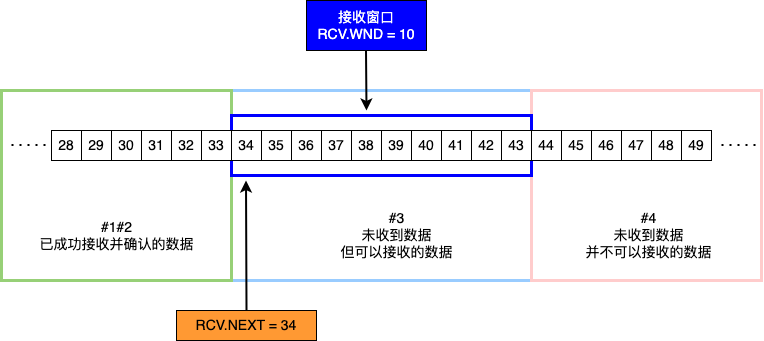

接收方滑动窗口如上图所示，主要分为三个区域：#1 + #2 是已成功接收并确认的数据(等待应用进程读取)；#3 是未收到数据但可以接收的数据；#4 未收到数据并不可以接收的数据。

接收方滑动窗口使用两个指针来跟踪三个接受区域：`RCV.WND`标识接收窗口的大小，用于告知发送方；`RCV.NXT`指向期望从发送方发送来的下一个数据字节的序列号，即#3第一个字节；`RCV.NXT`加上`RCV.WND`的偏移量可以计算出指向#4第一个字节的相对指针。

### 流量控制

#### 流量控制流程

在数据交互的过程中，发送方需要根据接收方的实际接受能力控制发送的数据量，避免发送过多数据。接收方无法及时处理而触发重传机制导致网络资源浪费。发送窗口和接收窗口中所存放的字节数，都是放在操作系统内存缓冲区中的，而操作系统的缓冲区，会**被操作系统调整**。

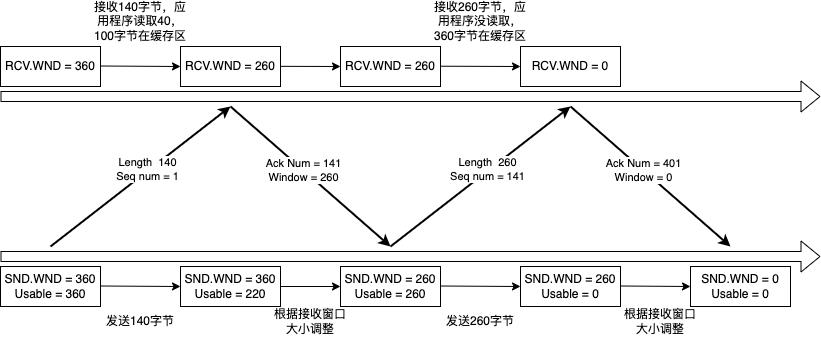

流量控制的具体过程如上图所示：1.客户端发送 140 字节数据后，可用窗口变为 220 (360 - 140)；2.服务端收到 140 字节数据，**但应用程序只读取了40字节**，还有100字节占用缓存区，接收窗口收缩到260(360-100)，发送确认信息，将窗口大小通告给客户端；3.客户端收到窗口通告报文后，同步发送窗口大小至260；4.客户端发送260字节数据，可用窗口耗尽；5.服务端收到260字节数据，**但应用程序没有读取任何数据**，260字节留在缓冲区域，接收窗口收缩至0，发送确认信息将窗口大小同步给客户端；6.客户端收到窗口通告报文后，发送窗口减少至0。**值得注意的是**，窗口收缩至0，即窗口关闭后，发送方会定时发送窗口探测报文，以便知道接收窗口的变化。

#### 窗口关闭问题

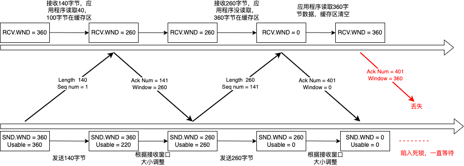

如果窗口大小为 0 时，就会阻止发送方给接收方传递数据，直到窗口变为非 0 为止，这就是窗口关闭。窗口关闭具有潜在风险，如上图所示，如果接收方窗口变化，但窗口通知报文丢失，发送方无法同步接收方窗口信息，将会陷入死锁，一直等待。因此，TCP为每个连接设有一个持续定时器，TCP只要收到零窗口通知就启动定时器，定时器超时便发送**窗口探测 ( Window probe ) 报文**来获取目前接收窗口大小，具体流程如下图所示：

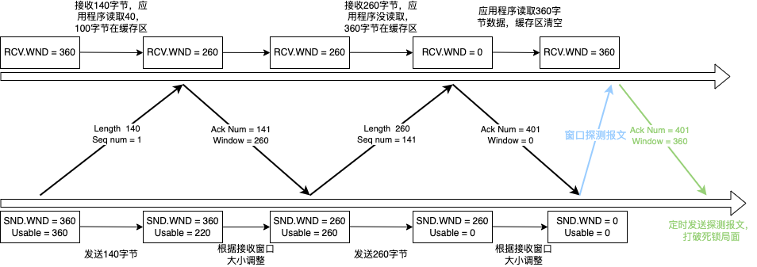

#### 窗口糊涂症

如果接收方太忙了，来不及取走接收窗口里的数据，那么就会导致发送方的发送窗口越来越小。到最后，如果接收方腾出几个字节并告诉发送方现在有几个字节的窗口，而发送方会义无反顾地发送这几个字节，这就是糊涂窗口综合症。TCP+IP头就有四十个字节，为了几个字节去传输，显然得不偿失。解决糊涂窗口综合征主要分为两种1.让接收方不通告小窗口给发送方；2.让发送方避免发送小数据。对于接收方，通常采用阈值限定，当MSS或者缓冲空间的二分之一时，就发送窗口大小0组织发送方发送数据；对于发送方通常采用Nagle算法。

### 拥塞控制

计算机网络是一个共享环境，因此可能因为其他主机间的通信拥堵导致本机发包的数据延时、丢包等问题。如果TCP进入重传，又会增加网络负担进一步导致更大的延迟和丢包，进入恶性循环。所以TCP设置了拥塞控制流程来根据网络情况动态调整发包量，通过拥塞窗口cwnd来监听拥塞程度。简单来说，只要没有规定时间内收到ACK应答报文，触发超时重传就被认为发生拥塞，而拥塞窗口的动态调整算法主要有：慢启动、拥塞避免、拥塞发生、快速恢复。

通常拥塞控制的生命周期根据重传机制不同分为超时重传拥塞控制和快速重传拥塞控制两类，主要流程如下图所示：

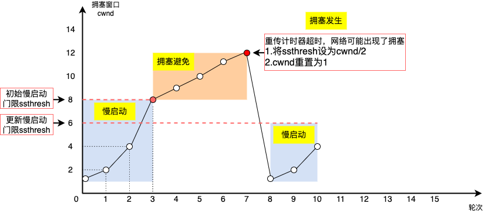

上图为超时重传拥塞控制算法，主要分为四个部分：首先启用慢启动逐步提速，每收到一个ACK，cwnd就增加1；cwnd大于慢启动门限**ssthresh**时，启用拥塞避免算法，每接收一个ACK，cwnd增加1/ssthresh；当发生超时重传时则默认为发生拥塞发生，触发拥塞发生算法，ssthresh设为cwnd/2，cwnd重置为1；继续启用慢启动算法逐步提速，形成闭环。

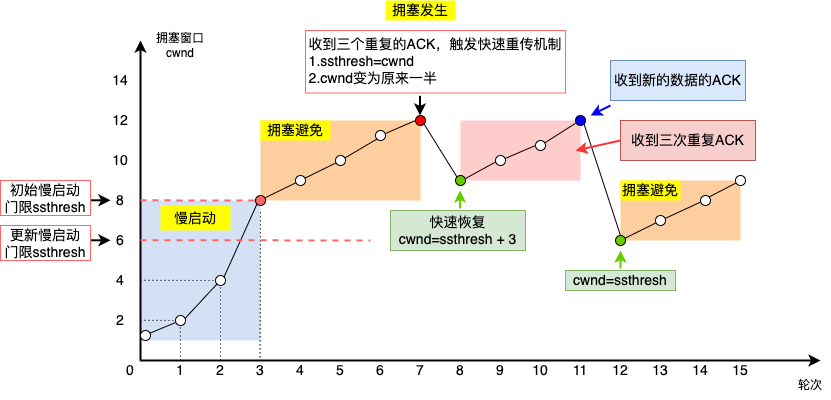

上图为快速重传拥塞控制算法，主要也分为四部分：慢启动与拥塞避免算法与超时重传拥塞控制算法相同；当收到三个重复的ACK时，触发快速重传机制启用拥塞发生算法，ssthresh = cwnd、cwnd变为原来一半；启用快速恢复算法。

快速回复算法步骤如下：

- 拥塞窗口 **cwnd = ssthresh + 3** ( 3 的意思是确认有 3 个数据包被收到了)；
- 重传丢失的数据包；
- 如果再收到重复的 ACK，那么 cwnd 增加 1；
- 如果收到新数据的 ACK 后，把 cwnd 设置为第一步中的 ssthresh 的值，原因是该 ACK 确认了新的数据，说明从 duplicated ACK 时的数据都已收到，该恢复过程已经结束，可以回到恢复之前的状态了，也即再次进入拥塞避免状态；

快速恢复是拥塞发生后慢启动的优化，其首要目的仍然是降低 cwnd 来减缓拥塞，所以必然会出现 cwnd 从大到小的改变。其次，cwnd逐渐加1这一过程的存在是为了尽快将丢失的数据包发给目标，从而解决拥塞的根本问题（三次相同的 ACK 导致的快速重传），所以这一过程中 cwnd 反而是逐渐增大的。

## 总结

计算机网络的第二篇写了一下功能强大的TCP，时至今日TCP依然是网络世界的基石，其强大的功能可以用来应对复杂的网络环境。不过由于头部阻塞和黏包两大痛点，计算机学者设计了HTTP3，使用UDP来全面代替TCP，后续会继续朝着这个方向梳理一下HTTP的基础。

## 参考资料

> 小林coding的图解网络

> 趣谈网络协议
