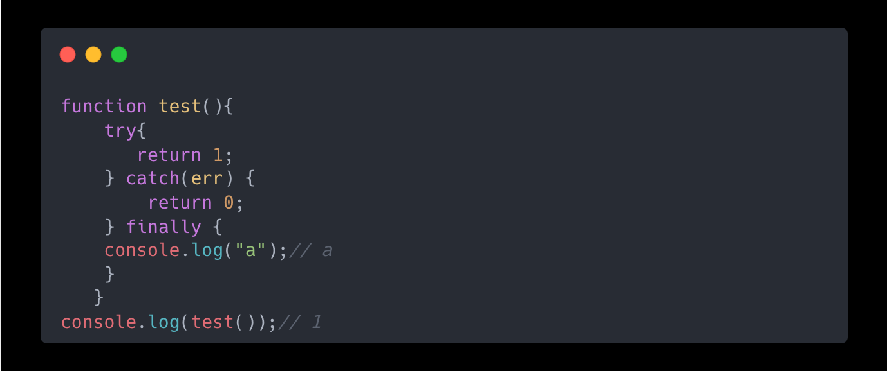
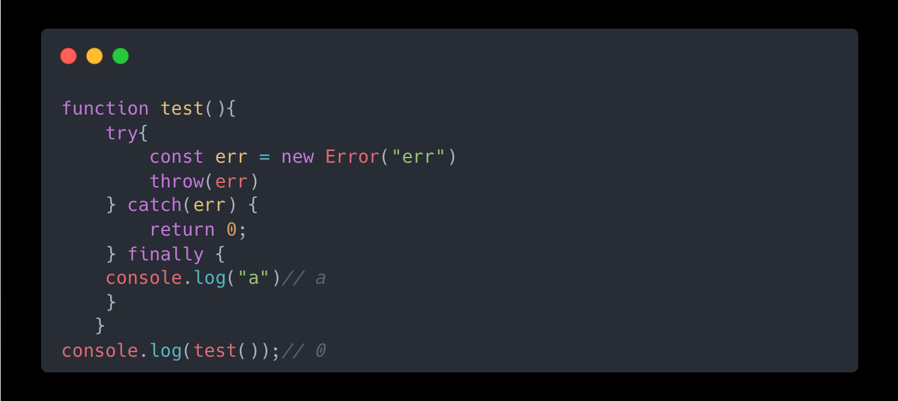
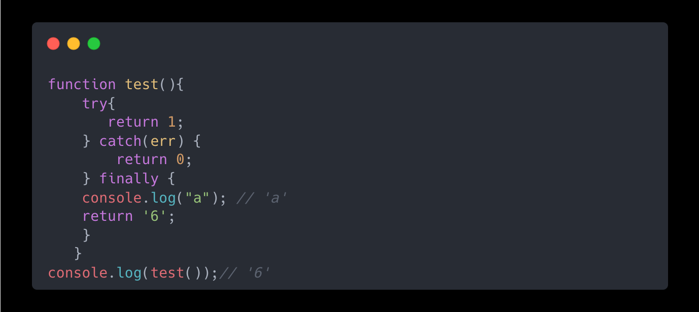
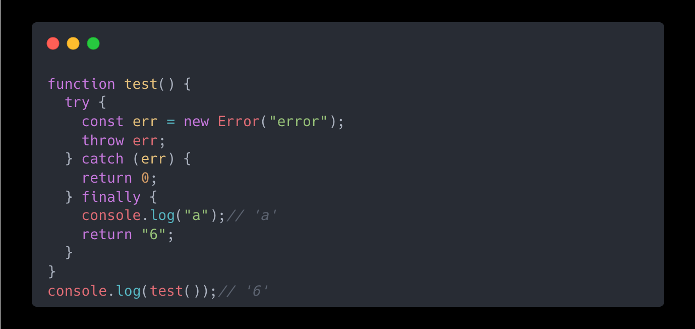
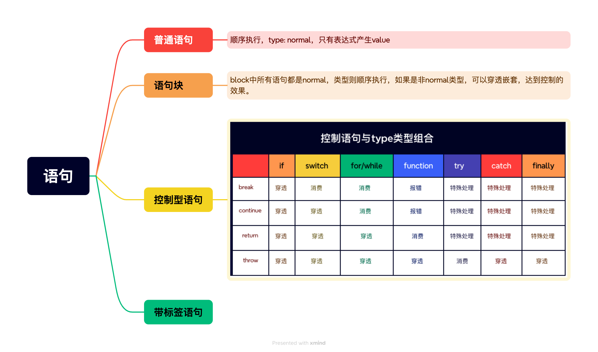
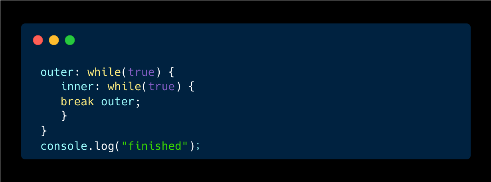

# try-catch-finally机制中return的执行时机

## 前言

前端处理同步异常最常用的方法就是try-catch-finally进行异常捕获，但是在了解异常捕获的时候遗漏了异常捕获中retrun的“返直觉行为”。本文主要讲述这类“反直觉行为”背后的运行机制，如果对异常处理机制感兴趣的同学可以看[前端编程中的异常处理机制](https://juejin.cn/post/7327725037678952474 "前端编程中的异常处理机制")。

## try-catch-finally机制中return行为

问题1：try-catch-finally中在try或者catch中执行了return语句，finally依然会执行嘛？

答案：try()、catch()函数中有return动作，finally语句依然会执行。

问题2：如果在finally中也有返回值嘛？

答案：finally语句中的return动作会覆盖try()、catch()函数中的return动作。

## 为什么会有这种“反直觉”行为

出现这类“反直觉”行为并非独立的行为，而是由JavaScript 语句执行的完成状态这一机制决定的。ECMAScript中两种类型，语言类型与规范类型。其中语言类型就是基础数据类型与引用类型之流，详见文章：[前端开发者应懂的n个概念-数据类型与类型转换](https://juejin.cn/post/7318446209064009755 "前端开发者应懂的n个概念-数据类型与类型转换")。规范类型包括：Reference, List, Completion, Property Descriptor, Property Identifier, Lexical Environment, 和 Environment Record。其中Completion Record 用于描述异常、跳出等语句执行过程，表示一个语句执行完成之后的结果。Completion Record 有三个字段：**type**表示完成类型，常见break、continue、return、throw及normal；**value**表示语句的返回值，如果没有则为empty；**target**表示语句的目标，通常为一个JavaScript标签。JavaScript正式依靠语句的Completion Record的类型，才实现语句的复杂嵌套与控制。常见的控制类型如下图所示：

try-catch-finally代码块中不能使用break、continue来跳出循环或switch语句。如果想要停止try-catch语句块，可以使用return或者throw。由此可见，在try-catch-finally机制中finally中的内容是必须保证执行的。当try-catch模块中执行了return语句产生了非normal记录，且在finally模块中也产生了非normal记录时，会将finally中产生的记录作为整个结构的结果。

最后，对于target字段，唯一作用就是配合标签语句配合跳出多层循环。标签语句是JavaScript中的一种特性，任务语句前均可加上冒号，类似于注释、标记作用。

## 参考

> 前端编程中的异常处理机制[https://juejin.cn/post/7327725037678952474](https://juejin.cn/post/7327725037678952474 "https://juejin.cn/post/7327725037678952474")

> winter老师的重学前端

> 前端开发者应懂的n个概念-数据类型与类型转换[https://juejin.cn/post/7318446209064009755](https://juejin.cn/post/7318446209064009755 "https://juejin.cn/post/7318446209064009755")
