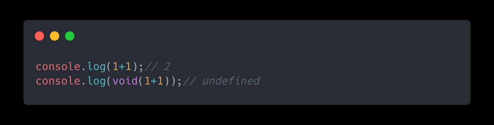
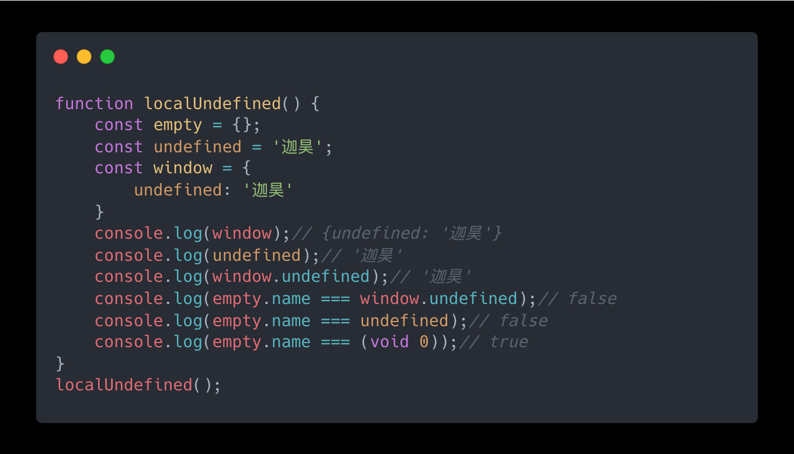
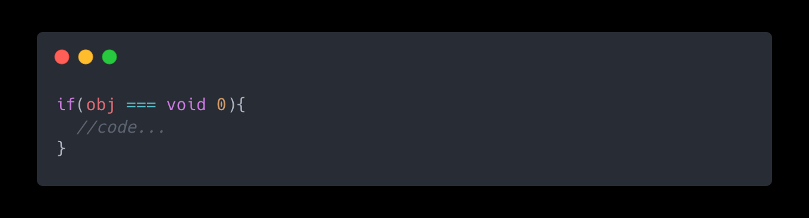

# JavaScript 中 void 0 是什么

**void 是什么？**

MDN 中给 void 的定义是：**void 运算符**对给定的表达式进行求值，然后返回 **undefined**。简单来说就是你给出一个计算表达式通过 void 运算符进行求值，无论表达式值是什么返回都是 undefined。

**那么 undefined 又是什么？**

MDN 中的定义是：全局属性 **undefined** 表示原始值 \[undefined]。它是一个 JavaScript 的 原始数据类型 。

但是它有可能在**非全局作用域**中被当作**标识符**（变量名）来使用（因为 undefined 不是保留字），这样做是一个非常坏的主意，因为这样会使你的代码难以去维护和排错。

通过上面代码可以看出，window、undefined 在局部作用域中是允许被重写的，因此有时通过 undefined 来进行判断就存在风险。这时候 void 运算符的作用就体现出来了，void 无论计算什么属性都返回 undefined，没有额外风险。

## 参考资料

> MDN void 运算符 [https://developer.mozilla.org/zh-CN/docs/Web/JavaScript/Reference/Operators/void](https://developer.mozilla.org/zh-CN/docs/Web/JavaScript/Reference/Operators/void "https://developer.mozilla.org/zh-CN/docs/Web/JavaScript/Reference/Operators/void")

> MDN undefined [https://developer.mozilla.org/zh-CN/docs/Web/JavaScript/Reference/Global_Objects/undefined](https://developer.mozilla.org/zh-CN/docs/Web/JavaScript/Reference/Global_Objects/undefined "https://developer.mozilla.org/zh-CN/docs/Web/JavaScript/Reference/Global_Objects/undefined")
