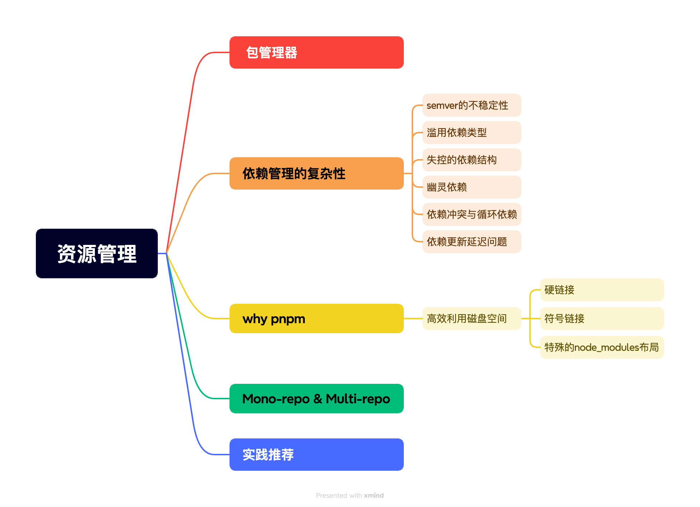
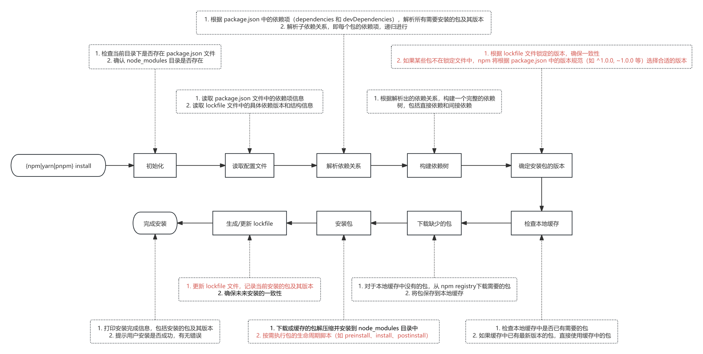
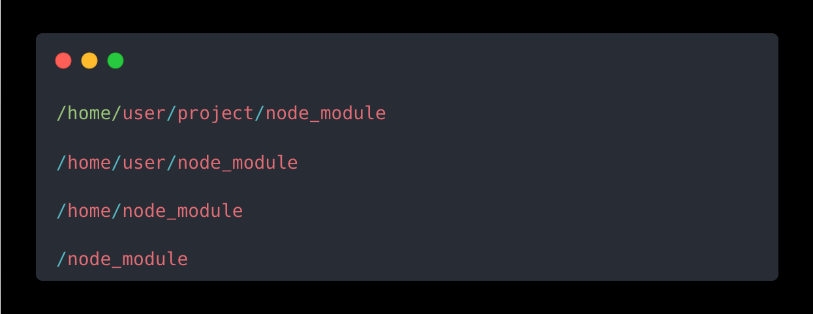
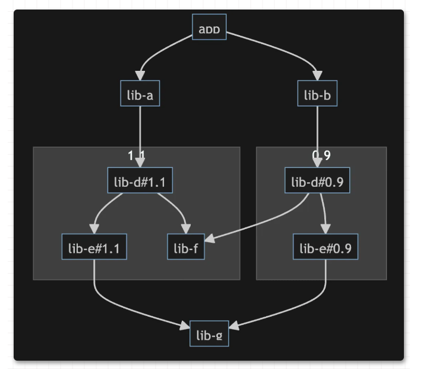
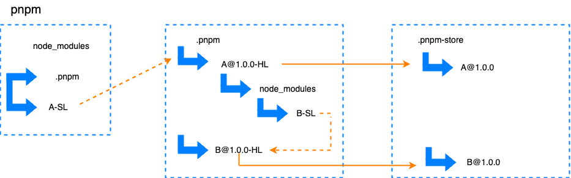
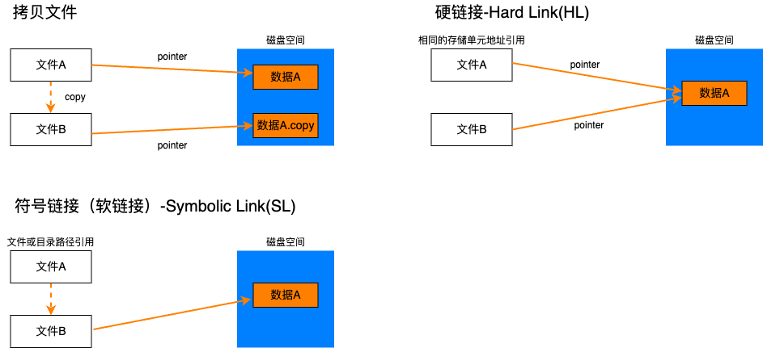
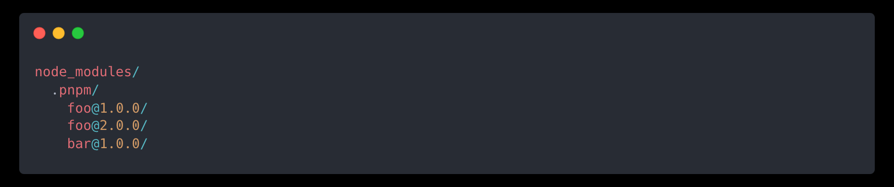
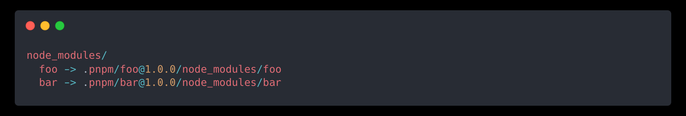
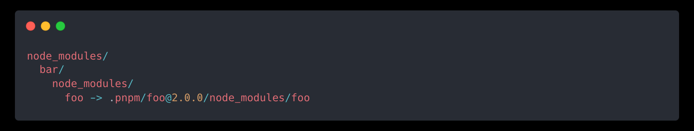
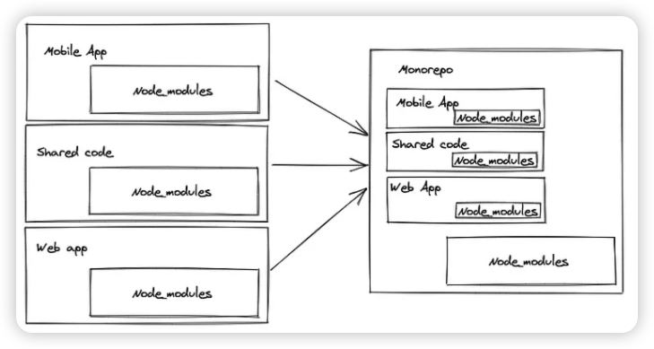

# 前端开发者应懂的n个概念-依赖管理

## 前言

“软件开发最大的敌人是不确定性”—Martin Fowler

"node\_modules是宇宙中最重的物质"—网友

"我们要维护好包管理，不能因为这个导致错误"—某公司

## 目录

## 包管理器

依赖包管理是工程化的一个重要话题，任何软件工程一旦叠加了“规模”和“时间”这两个变量之后，依赖网络都会变得复杂混乱，如果不及时管理，很容易引发稳定、性能、安全等诸多方面的问题。目前主流的包管理器分别是npm、yarn和pnpm，对于依赖包的安装工程大致可以如下图所示：

对于npm、package.json、lock文件作用等基础知识，已在上文[前端依赖管理-npm依赖管理机制](https://juejin.cn/post/7337517508150706211 "前端依赖管理-npm依赖管理机制")中有所讲解，本文就不再赘述。相较于官方提供的npm，yarn在诞生之初就是为了解决历史上npm的某些不足。比如缺乏对于依赖完整性和一致性的保障、安装速度过慢等问题。

## 依赖管理的复杂性

伴随着工程结构复杂度的提升，依赖的复杂度也急剧增长。虽然使用了包管理器用于依赖包的管理，但是依赖问题往往就像一片汪洋，如果不在源头掐住，定位问题就和大海捞针一样困难。依赖管理的潜在问题通常可以划分为下述几类。

#### semver的不稳定性

在package.json的dependencies中，version是最为重要的几个关键属性之一。大多数框架都会遵循semver版本号规则来管理版本迭代。**minor**代表主版本号，不可向前兼容的更改，比如系统重构、API重构等。**minor**为次版本号，代表功能模块变更这类可兼容的更改，一般为API新增等操作。**patch**为补丁版本，一般用于bug fix或安全问题。看似完美的规范，并不是所有开发者都严格遵守的。无法完美符合用户预期，无法保证边界情况的合理兼容，问题也就随之产生了。在[前端依赖管理-npm依赖管理机制](https://juejin.cn/post/7337517508150706211 "前端依赖管理-npm依赖管理机制")中其实提到过，**只要去掉package.json版本号前的标志就可以“绝对锁定”依赖版本号，去除依赖版本差异带来的bug。** 但是，从长期维护的角度来说，只要项目存活时间足够长，总有一天需要升级以来。如果仅仅使用锁版本的方式来等待不得不更新的时刻到阿里。新功能带来的巨变就可能带来庞大的回归成本。(例如，React17—>React18)

因此，良好的依赖管理策略应该在保证稳定的前提下，定期跟进依赖包的更新。将升级风险逐步分摊到每一个小版本中。较好的实践方式是在开发环境中使用适当的范围版本，在测试&生产环境中使用固定的版本。

#### 滥用依赖类型

按照package.json的规则，依赖类型可以分为{dependencies：生产依赖}、{devDependencies:开发依赖}、{peerDependencies: 对等依赖}、{optionalDependencies:可选依赖}、{bundledDependencies：捆绑依赖}。其中，dependencies与devDependencies是日常开发中最常使用的两种类型。当编写的代码会做为Package供他人消费时，不区分dependencies与devDependencies会导致占用**更多的安装时间**，且容易导致造成**菱形依赖**。因此，除非强烈诉求，否则优先使用devDependencies。

实际生产中也会遇到一些必要、又不适合注册到dependencies的依赖。例如webpack插件，强依赖于webpack但不适合注入dependencies，否则会导致用户安装多个插件副本。针对这Case，我们可以使用peerDependencies来实现，既要确保Package包能正常运行，又要避免给用户带来额外的依赖负担。对于peerDependencies，校验规则主要是：

1. 若宿主提供了对等依赖声明(无论是dependencies还是devDependencies)，则优先使用宿主版本，若版本冲突则警告。
2. 若宿主未提供对等依赖，则尝试自动安装对应依赖版本(NPM 7.0 之后支持)。

值得注意的是，对于peerDependencies，npm、yarn与pnpm的处理方式存在略微差异：

1. 对于宿主环境未提供对等依赖的情况，npm3之前支持自动安装，npm3\~npm7由于这一特性带来了许许多多的问题，便取消了自动安装，交由消费者自行维护。npm7只有使用了更高效的依赖推算算法后，重新启用了这个特性。对于yarn与pnpm对于这类情况则是选择交由消费者自行维护。
2. 对于peerDependencies发生版本冲突的情况，npm、yarn与pnpm相同，仅会发出警告，但不会阻止安装运行。**这可能会导致项目出现问题。**
3. 由于yarn与pnpm选择把依赖缺失和依赖冲突都交由消费者维护，所以它们还提供了额外的命令来帮助管理依赖，如`pnpm why`、`yarn why`。

在开发 NPM Package，特别是一些“框架”插件、组件时可以多加使用，实践中通常还会：

1. 使用 `peerDependencies` 声明 Wepack 为对等依赖，要求宿主环境安装对应依赖副本；
2. 同时使用 `devDependencies` 声明 Wepack 为开发依赖，确保开发过程中能正确安装必要依赖项；

值得注意的是，对于像webpack的应用将依赖包和代码全部打包到一起的应用，两者的区分就不再明显。Webpack 会从入口点（通常是你配置的 `entry` 文件）开始，递归地解析所有导入的模块和依赖。并会将所有解析到的依赖和代码打包到一个或多个 bundle 文件中。这意味着无论是开发依赖还是生产依赖，只要在项目中被导入或引用，都会被包含在最终的 bundle 中。

#### 失控的依赖结构

"node\_modules是宇宙中最重的物质"，在安装某个依赖的时候都需要安装一坨子孙依赖。这种现象绝非个例，绝大多数的知名开源项目都有这个问题。造成这一现象的原因其实也不难理解，多数开发者为了提升开发效率，自然会倾向于使用开源代码片段。这本是一种良好实践，但是也不可避免的带来了副作用，依赖颗粒度太细，网络结构复杂庞大，容易触发负面现象。庞大的依赖网会导致初始化与更新性能的下降，版本冲突会导致网络结构异常脆弱。在深链路中的微小变化都有可能引起雪崩效应。

对于这类问题并没有一劳永逸完美方案，只能尽力降低问题出现的范围和影响。我们也不能因为这类问题而忽视依赖外置对于项目维护的帮助。没有工具解决，只能依靠规范准则来缓解问题：

1.设定更严格的开源包审核规则：代码结构是否合理、是否有单测、单测覆盖率多少、issue持续时间。

2.尽可能减少不必要的依赖：审查第三方库功能，引入进需要的部分功能。

3.分层依赖：分层管理依赖结构，减少变动对上游的影响。

4.避免循环依赖

#### 幽灵依赖-Phantom Dependences

**幽灵依赖**指在package.json中没有显式声明注册的依赖包，但却能在代码中引用消费。造成这个问题的主要原因：

1. NodeJs的模块寻找逻辑；
2. yarn和npm依赖扁平化管理；

NodeJs对于外部依赖会进行逐级向上的递归查找，直到系统根目录。如在文件/home/user/project/foo.js中查找模块时，可能会依次在以下目录中寻找依赖：

这样的寻址规则也意味着如果某些依赖安装在project的上层，也会被寻址逻辑命中，导致代码的**错误引用**。其次，yarn和NPM\@3之后都采用了[扁平化依赖结构](https://juejin.cn/post/7337517508150706211 "扁平化依赖结构")的优化策略来解决**依赖嵌套问题**。但是根据NodeJs的寻址逻辑也意味着我们可以引用到任意子孙依赖。

**失控的依赖结构+引用任意子孙依赖=不一致+不可预测+难以维护**

#### 依赖冲突与循环依赖

由于失控的依赖结构，我们通常无法细颗粒度的控制好底层依赖。这就很容易导致依赖冲突与循环依赖。依赖冲突常见于菱形依赖结构中共享依赖包的版本不一致，这种现象轻则导致依赖包的重复安装，重则可能构建失败。

循环依赖是指在依赖链路上形成一个环状的结构关系，从有向无环发展到有向有环结构，会增加依赖网络的解析成本和开发者的理解成本。

#### 依赖更新延迟问题

依赖链条A => B => C => D，若最底层D发布新版本，链条上的B和C也会随之更新,最后A才得以更新。这意味着中间节点越多，顶层包的延迟问题就越严重。因为往往中间节点会有更新活跃度不高的时候，这些风险最终都会嫁接到顶层依赖上。

## why pnpm

pnpm被称为高性能的npm，以安装快速、空间管理合理而被人们熟知。诞生之初，pnpm旨在解决npm和和 Yarn 等传统包管理器中存在的一些限制和低效率问题。

### 高效利用磁盘空间

相较于其他包管理器，对磁盘空间的高效利用是PNPM的一个显著优势。硬连接重复利用资源、软连接确保目录灵活，再配合上特殊的node\_modules目录结构，这一特有的内容寻址存储策略 (Content-Addressable Storage, CAS)，可以避免依赖冲突、幽灵依赖、加快安装速度及节约磁盘空间。

#### **硬链接**

**硬链接**是是文件系统中的一种引用机制，它允许多个文件名指向同一个文件的实际数据块。

**硬链接**的本质是让多个目录项（文件名）共享同一文件的数据内容和元数据（如 inode）。无论创建多少个硬链接，它们都指向相同的 inode 和数据块。因此，**通过任何一个硬链接对文件进行修改，所有硬链接的文件内容都会被更新**。文件的 inode 包含一个**引用计数器**，它记录有多少个文件名指向这个 inode。每当创建一个新的硬链接时，这个计数器就会增加；当删除一个硬链接时，计数器减少。当引用计数为 0 时，表示没有文件名指向这个 inode，系统就会释放文件占用的存储空间。

pnpm 将项目依赖安装在全局的 **store** 中，然后使用硬链接将这些共享依赖引入到项目中。因为硬链接共享同一个 inode 和数据块，即使多个项目都依赖同一个包，磁盘上只存储了一份实际数据，极大地减少了冗余的拷贝。硬链接只需要创建额外的文件名引用，效率比拷贝整个文件高得多。安装依赖时无需重新下载或复制文件，大幅加快了安装速度。

#### **符号链接**

**符号链接**（Symbolic Link），也叫软链接，是一种文件指向机制，它指向的是另一个文件或目录的路径，而不是文件的实际数据。符号链接可以指向文件或目录，即使位于不同的文件系统上，也可以跨越文件系统边界。

通过**符号链接**，**pnpm** 可以保持依赖存储的清晰层次，而不会产生依赖的“平铺”问题，避免 **npm** 或 **yarn** 中 **node\_modules** 层次混乱的问题。符号链接使 **pnpm** 可以快速定位依赖，保持符合 Node.js 的模块解析机制的同时，让 **node\_modules** 结构更清晰。

#### 特殊的node\_modules布局

不同于npm与yarn扁平化的依赖树布局，pnpm采用中心化的依赖包管理安装，将每个依赖的安装路径隔离在 `node_modules/.pnpm` 目录中，按照包名和版本号组合进行存储。如：

每个依赖包都会根据其版本存储在一个独立的目录中，避免了版本冲突。

**软连接的应用**

**pnpm** 在项目的 **node\_modules** 中为每个依赖包创建**符号链接**，这些符号链接指向 **.pnpm** 目录中的实际依赖。例如，在项目 **node\_modules** 中，**foo** 和 **bar** 包实际上是符号链接到 **.pnpm/foo\@1.0.0** 和 **.pnpm/bar\@1.0.0** 目录中的。

通过符号链接，**pnpm** 使得依赖包仍然能够被项目正常访问，但实际的依赖管理是隔离且清晰的。

**子依赖管理**

对于依赖的子依赖，**pnpm** 同样通过符号链接来管理。例如，如果 **bar** 依赖 **foo\@2.0.0**，而项目本身依赖 **foo\@1.0.0**，**pnpm** 会将 **bar** 的 **`foo@2.0.0`** 子依赖存储在 **bar** 自己的 **node\_modules** 目录下，通过符号链接确保不会和项目本身的 **foo\@1.0.0** 冲突。

## Mono-repo & Multi-repo

&#x20;**Monorepo** 指的是单体仓库管理这一架构模式，通俗来说就是一个 git 仓库包含项目所有应用的源代码。**Monorepo** 项目通常由多个 app 组成，比如，把网页端、移动端、小程序等等 app 放在一起；或是把复杂产品线里拆分成微服务，但依旧共享同一个代码仓库。

**Multirepo**指的是多仓库管理，根据应用模块分散管理在不同代码仓库中。

**Multirepo**强调灵活性与独立性，适合独立的、小型的、不需要频繁跨项目协作的项目。**Monorepo**强调统一的版本控制与更好的代码分享，适合大型项目、内部工具和库、以及需要频繁跨项目协作的场景。

## 实践推荐

1.npx only-allow pnpm，限制同一个项目只能使用一类依赖管理工具

2.CorePack enable，提供一种更统一和标准化的方式来管理不同的 JavaScript 包管理器，用于包管理器版本控制。packageManager: <pnpm@xx.xxx.xxx>，明确指定项目的默认包管理器及其版本，确保所有开发者使用一致的工具链。

3.切换node环境：fnm管理node版本，切换项目自动切换node环境。&#x20;

4.使用monorepo ：公司多人合作的项目，我推荐monorepo，因为我们总是无法预计项目的未来，在交接时monorepo至少可以保证信息的完整性。

## 总结

前端基建的脆弱总让人叹为观止，我们只能通过不断地进行条件约束来规范操作，降低问题的发生率。

## 参考资料

> 📌NPM依赖管理复杂性
>
> [https://mp.weixin.qq.com/s/UyOX30WSXh-LjvrIM9wa0A](https://mp.weixin.qq.com/s/UyOX30WSXh-LjvrIM9wa0A "https://mp.weixin.qq.com/s/UyOX30WSXh-LjvrIM9wa0A")

> 关于现代包管理器的思考
>
> [https://juejin.cn/post/6932046455733485575](https://juejin.cn/post/6932046455733485575 "https://juejin.cn/post/6932046455733485575")

> pnpm 官方文档: [pnpm.js.org/en/](https://link.juejin.cn/?target=https://pnpm.js.org/en/ "pnpm.js.org/en/")

> React Native — Monorepos & Code Sharing[https://engineering.brigad.co/react-native-monorepos-code-sharing-f6c08172b417](https://engineering.brigad.co/react-native-monorepos-code-sharing-f6c08172b417 "https://engineering.brigad.co/react-native-monorepos-code-sharing-f6c08172b417")
