# JavaScript的继承机制

## 前言

JavaScript继承特性的发展是经历了一个“野蛮生长的”的过程，从JavaScript1.0时代的“类抄写”技术，到JavaScript1.1的原型继承再到ES6开始正式使用class来声明“类”实现类继承。如周爱民老师所说JavaScript是一门有趣的语言，一方面使用了类继承的基础结构和概念，另一方面又要实现原型继承和基于原型链检查的逻辑。因此，为方便理解JavaScript的特性，本文着重梳理了JavaScript中继承这部分概念，讲解从类抄写、原型继承一直到类继承的特性演变。

## 目录

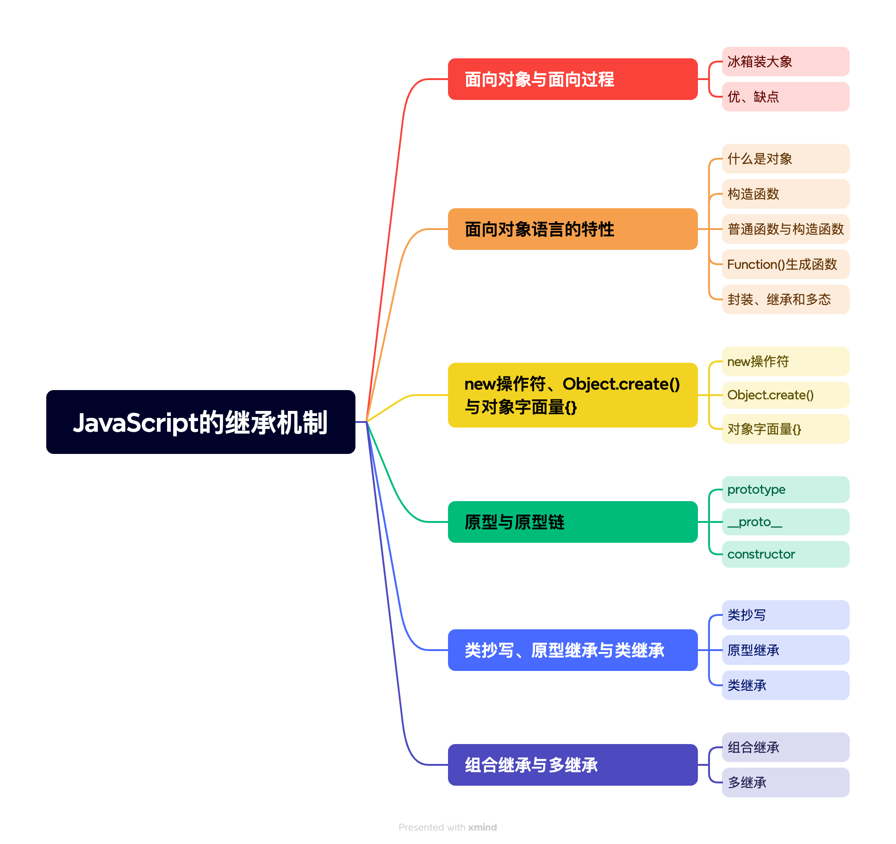

## 面向对象与面向过程

面向对象和面向过程是两种不同的编程思想。两者概念相对抽象，以最经典的“把大象放进冰箱”问题为例子讲述。如何把大象放进冰箱？面向过程的解决方法是：打开冰箱门—>将大象装进冰箱—>关闭冰箱门。而面向对象的解决方法是：冰箱开门—>冰箱装进了大象—>冰箱关门。通过这个例子可以看出，面向对象和面向过程侧重点不同。面向过程以动词为主，完成一个事件就是将不同动作函数按需调用。而面向对象以主谓为主，利用对象的自有属性方法来实现过程。

#### 面向对象与面向过程的优缺点

面向过程-优点：以高开销为代价提高性能，适用于单片机、嵌入式等以性能为重要因素的场景；缺点：不易维护、复用

面向对象-优点：易维护、复用，可以设计出更加灵活且低耦合的系统；缺点：性能比面向过程低

## 面向对象语言的特性

#### **什么是对象？**

周爱民老师在**无类继承**的演讲中曾提过：有一个过程可以持续产生在过程之外持续可用的实例，这个实例就称为对象，而这个过程就称为类。简单来说，类是生成过程，对象是生成产物。我们可以从复杂的事物关系中抽象出一个个的个体，每一个个体都是分工明确的功能中心，可以进行接受信息、处理数据、发送信息等任务。因此只要抽象妥善，对象完全可以进行复用，并使用继承机制进行个性化定制。阮一峰老师认为对象可以从两个层次来解释：

1.对象是单个实物的抽象，实物的关系就是对象的关系，进而可以模拟显示进行编程。

2.对象是一个封装了属性property和方法method的容器，属性可以描述状态，方法可以描述行为。

归根到底，对象就是一种包含**数据**和**行为**的数据结构，而解构就是将对象中属性拿出使用的行为。

#### 构造函数

在JavaScript中函数实际上是一种特殊的JavaScript对象，也有它自身的属性和方法。所谓构造函数，就是提供一个生成对象模版并描述对象基本结构的函数。一个构造函数可以生成多个结构相同的对象。

**普通函数与构造函数区别**：调用方式不同-普通函数直接调用，构造函数用new操作符调用；作用不同-构造函数用来创建实例对象；命名规范不同-普通函数名用小写，构造函数某种意义上是定义类的，应和类名一样以大写字母开头；this指向不同-构造函数this指向创建的实例对象。

但两者的本质区别依然还是在于使用方式上的不同。下面用拿犀牛书上的例子进行说明：

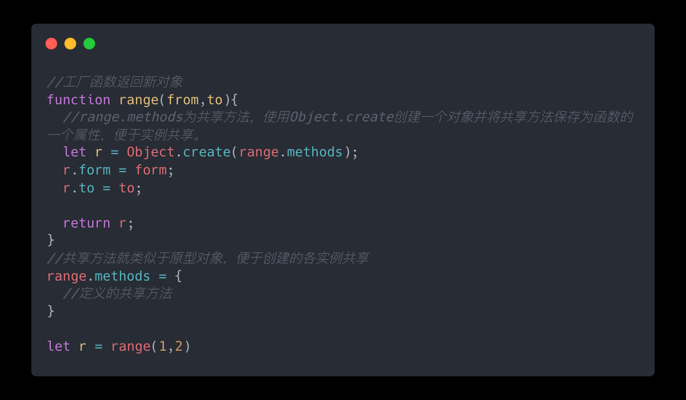

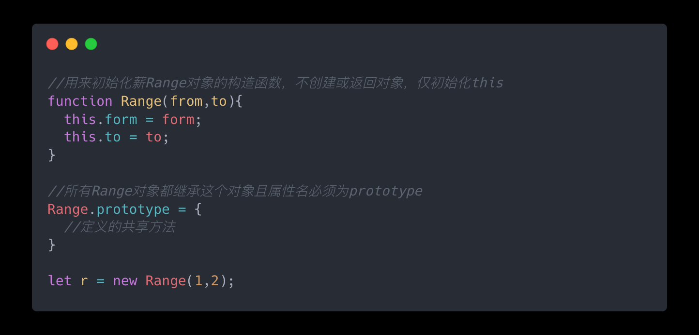

如上图所示，工厂函数就是使用普通函数调用，需要使用现有对象来作为新对象的原型对象并进行创建对象操作。而使用构造函数创建新对象使用new表达式，会自动创建新对象并将构造函数作为该对象方法调用。

#### Function()

虽然几乎没有使用场景，但还可以使用**Function()** 构造函数来创建新函数对象。**Function()** 构造函数可以用来接收任意多个字符串参数，最后一个参数是函数体的文本。这个函数体文本可以是任意多个JavaScript语句，相互以分号分隔。

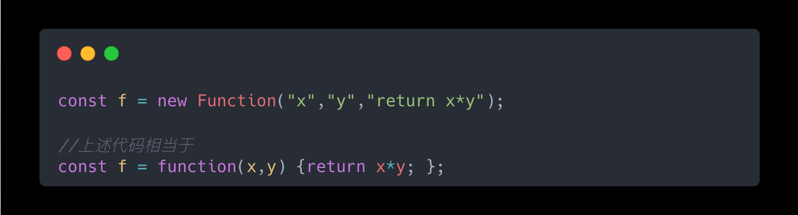

值得注意的是，**Function()** 构造函数不接收任何指定新函数名字的参数。与函数字面量一样，\*\*Function()**构造函数创建的也是匿名函数。并且**Function()\*\*创建的函数不使用词法作用域，而是始终如同顶级函数一样。

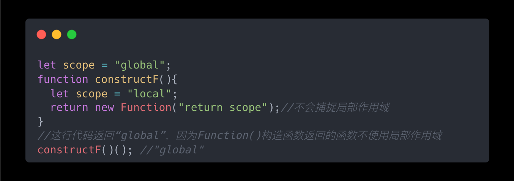

#### 封装、继承和多态

封装：三大特性中封装特性最好理解，封装就是 隐藏对象的属性和实现细节，仅对外公开访问方法，控制在程序中属性的读和写的访问级别。简单来说，调用方无需关注内部如何实现的只需关注如何使用。ES6中引入了class关键字让我们可以模拟类的行为更好地进行封装。

多态：多态性按字面意思就是“多种状态”，在面向对象语言中，接口的多种不同实现方式即为多态。换句话说就是相同的事物，调用其相同的方法，参数也相同时，但表现的行为却不同。但在弱类型语言中多态性的体现并不明显。在JavaScript中，主要体现在在子类和父类上可以有不同实现方法的同名函数，对于同名函数，子类会覆盖父类。JavaScript中不区分参数个数也不区分参数类型只看函数名称，只要函数名称相同就会覆盖。

继承：继承指子类可以使用父类的所有功能并且对这些功能进行扩展。继承的过程是从一般到特殊的过程。JavaScript引入了原型的概念，通过原型链的方式实现了父类、子类之间的共享属性及身份确认机制。但由于ES6之前javascript本身对面向对象编程没有一个语言上的支持标准，所以才有了五花八门、令人眼花缭乱的“类继承”的代码。ES6增加了class、extends、static等关键字用以在语言层面支持面向对象，让继承变得更加规范。下文将着重介绍JavaScript中的继承机制。

## new操作符、Object.create()与对象字面量{}

#### new操作符

new操作符的作用是执行构造函数并返回一个实例对象，实例对象可以继承原型对象的原型链，整个操作符命令可以分为五步：1.创建一个新对象{}；2. 将新对象的\_\_proto\_\_指向构造函数的prototype；3.构造函数中的 this 指向该空对象；4.执行构造函数为这个空对象添加属性；5.判断返回结果类型，如果函数没有返回对象类型Object(包含Functoin， Array，Date， RegExg，Error)，那么new表达式中的函数调用会自动返回这个新的对象。

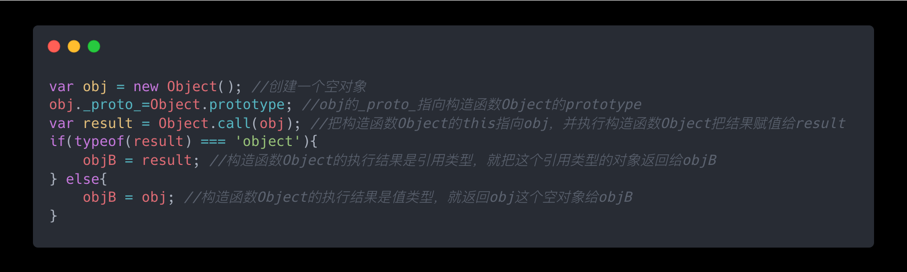

#### Object.create()

**Object.create(proto, propertiesObject) **方法不需要调用构造函数，而是直接为新建对象指定原型对象。**值得注意的是**，使用该方法创建的新对象只能继承指定原型对象上的属性而不能继承原型对象的原型链。其中，**proto**必填参数，是新对象的原型对象。可以继承原型对象得属性和方法并重写。如果参数为null，新对象就是彻底的空对象，且没有继承**Object.prototype**上的任何属性和方法，如**hasOwnProperty()**、\*\*toString()**等。**propertiesObject**是可选参数，指定要添加到新对象上的可枚举的属性（即其自定义的属性和方法，可用**hasOwnProperty()\*\*获取的，而不是原型对象上的）的描述符及相应的属性名称。

#### 对象字面量{}

对象字面量{}创建对象与new关键字创建对象过程类似。由于不需要调用构造函数，所以没有\*\*\_\_proto\_\_**赋值和更改**this\*\*指向的操作，相较于new关键字更加高效，语法更加简洁。

## 原型与原型链

在JavaScript中每个函数在创建的时候都会生成**prototype**属性，这个属性所指向的对象就是这个函数的原型对象。通常**prototype**属性的作用不仅仅是让构造函数指向原型对象，更重要的是让通过该构造函数创建的对象能够共享原型对象上的属性和方法。而原型对象中存在**constructor**和\*\*\_\_proto\_\_**，通过**constructor**属性可以追溯到原型对象的构造函数，通过**\_\_proto\_\_​**属性可以访问对象的原型对象。简单来说，**\_\_proto\_\_​**、 **constructor**属性是对象所独有的而**prototype**属性是函数独有的。由于函数也是对象的一种，因此函数同样也有属性**\_\_proto\_\_​**、 **constructor**属性。通过**prototype**和**constructor\*\*属性的链式交互可以将原型对象串接形成原型链。

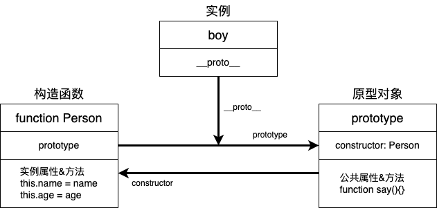

#### prototype属性

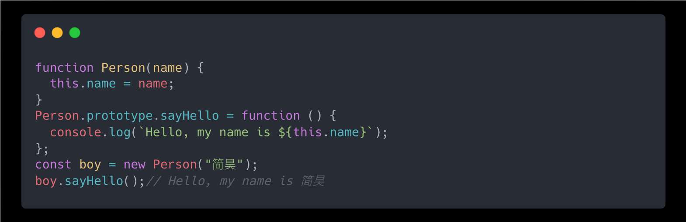

如上图代码所示，构造函数生成对象可以继承构造函数上的原型对象，并对原型对象上方法进行使用。

#### constructor属性

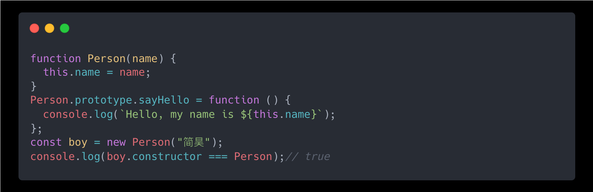

如上图代码所示，实例对象上的**constructor**属性会指向创建该原型对象的构造函数。这个属性通常用于判断对象的构造函数是什么。

#### \_\_proto\_\_属性

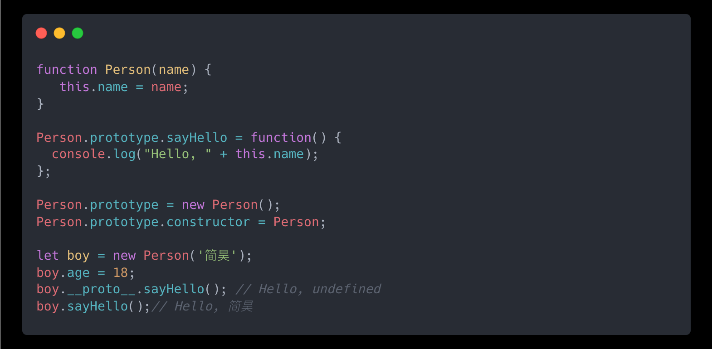

如上图代码所示，boy实例可以通过\*\*\_\_proto\_\_**属性访问构造函数上sayHello方法，但由于上下文没有指向对象所以无法访问到this.name，输出为Hello，undefined。如果直接调用sayHello就可以访问到对象上的name属性，输出为Hello，简昊。需要注意的是，**\_\_proto\_\_​**并不是 ECMAScript 标准的一部分,为了保证代码的可读性、稳定性和安全性，官方更推荐使用**Object.getPrototypeOf() \*\*来访问构造函数并使用 **Object.setPrototypeOf()** 操作构造函数。**Object.getPrototypeOf()** 函数会返回构造函数的原型对象而非构造函数本身。

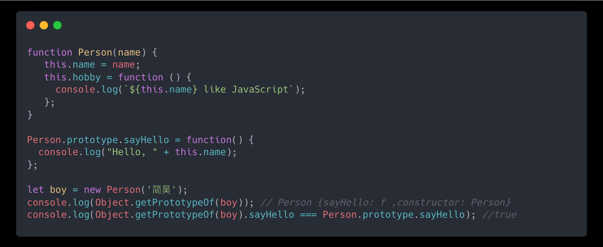

#### 原子对象

原型链既然是链条就会有两头，一端是可以通过\*\*\_\_proto\_\_\*\* 进行追溯原型对象的源头**Object.prototype**即对象的原型对象，是一个空对象，换句话说万物来自于**Object.prototype**，来自于空。另一端可以通过**constructor**进行追溯构造函数的源头是**Function()**，即上文提到的JavaScript中的函数生成语句，一切函数由这个函数产生。有两个天然的原子对象分别是**arguments**和**namespace**。

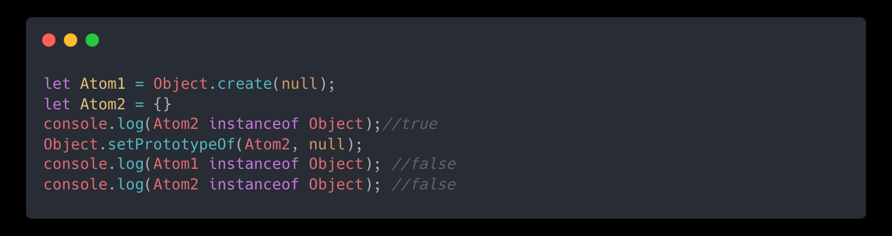

可以通过上图代码生成原子对象，具体原子对象相关知识可以看周爱民老师的项目[metameta](https://github.com/aimingoo/metameta "metameta")。

#### 如何判断属性是否属于某对象

1.\*\*obj.hasOwnProperty(‘属性名’) \*\*用于检查给定的属性是否存在于当前实例对象中（而不是实例原型中）。

2.**in 操作符**用来判断某个属性是否是某个对象上的属性，可以是对象的直接属性，也可以是通过**prototype**继承的原型属性。

两者结合，就可以判断某个属性是否是原型上的属性。

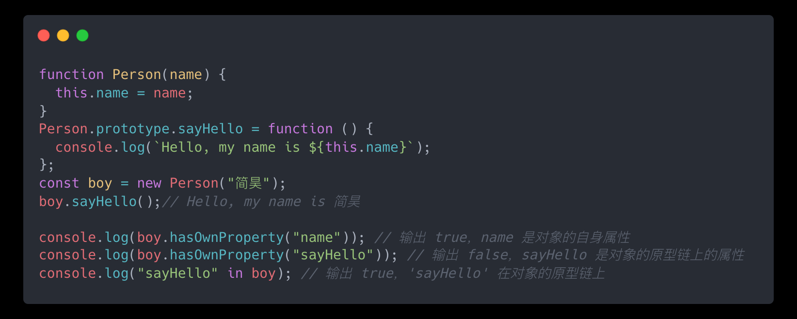

## 类抄写、原型继承与类继承

#### 构造函数实现继承

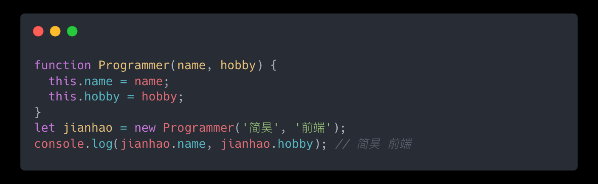

JavaScript 1.0 时代将函数作为构造器，并且在函数中向它的实例（也就是this对象）抄写类声明的那些属性。在早期的面向对象理论里面，将这个函数称为类，而这个被创建出来的实例称为对象。

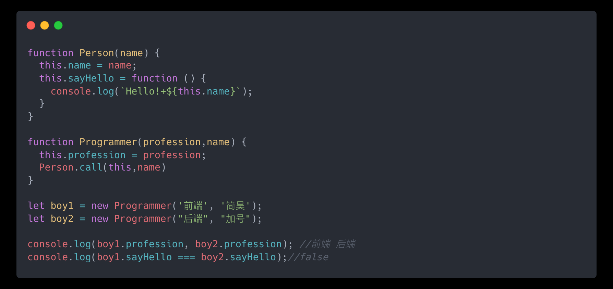

使用构造函数实现继承，虽然所有实例对象都可以继承构造函数中的属性和方法。但是，同一个实例对象之间无法共享属性。上图代码中，通过Person()构造函数创造出的两个实例的hobby方法并不相同。换句话说，每当使用构造函数创建一个实例对象时都会重新创建一个hobby方法。这样的做法通常会带来资源的浪费，因为同样的方法完全可以被实例对象共享。

#### 原型继承

使用\*\*Object.create()**实现继承，可以指定为创造的实例指定一个原型对象，定义在原型对象上的方法被所有实例所共享，不会重复创建，节省了内存空间。但是光使用**Object.create()\*\*来实现继承，并不能满足所有需求。因为创建的对象不会调用构造函数，因此无法进行一些初始化操作，并且只能指定一个原型对象，无法同时继承多个对象的属性和方法。

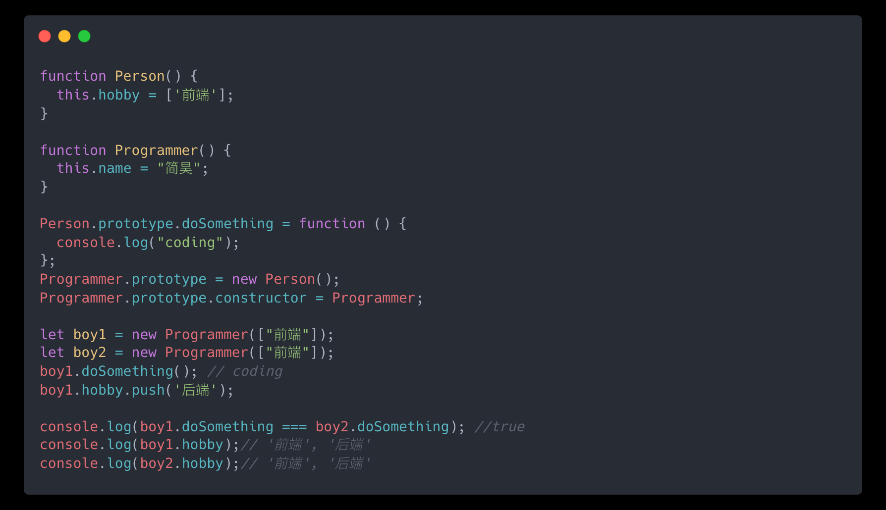

上图为标准的原型继承方法，利用**prototype**配合构造函数实现继承，方法定义在原型对象上，所有实例共享同一个方法。可以通过构造函数进行初始化操作且可同时继承多个对象的属性和方法。至此，JavaScript的继承模式才算完善，即ES6之前所倡导的无类继承模式。无类继承的设计原则是：用原型来实现继承，并在类（也就是构造器）中处理子一级的抽象差异。不过原型继承方式仍有缺点：无法给父类传参；共享父类的引用属性。

#### 类继承

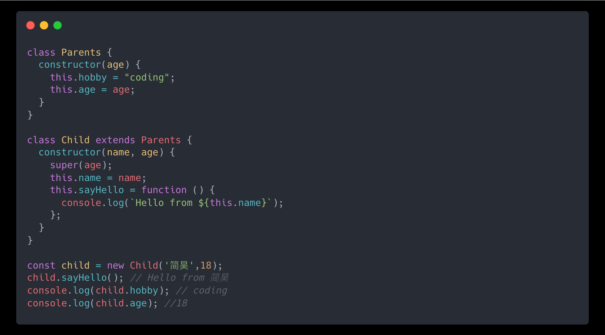

类继承如上图代码所示，其中**extends** 是类继承的核心所在，实际含义是对**child.prototype = new Parent () **的进一步底层封装并加以优化。用**class**定义一个类，对象中会包含一个**constructor**方法，相当于一个构造函数，也称为构造器，在其中子类可以用**super()** 函数调用父类的构造方法 。

#### #私有属性与私有方法

子类无法继承父类的私有属性，换句话说，私有属性只能在定义它的 **class** 里面使用。子类想要使用父类中的私有属性需要通过函数作为媒介。

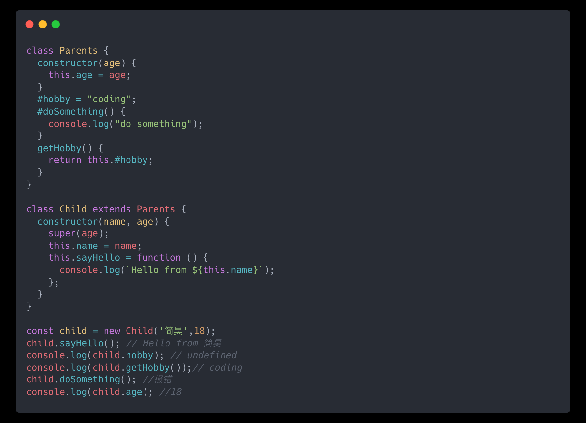

#### static静态属性和静态方法

静态属性和静态方法仅供类自身使用还不给实例对象使用，但静态属性和静态方法可以被子类所继承。值得注意的是，静态属性是通过**浅拷贝**的方式继承的，如果静态属性是引用属性，子类与父类共享同一个内存地址。

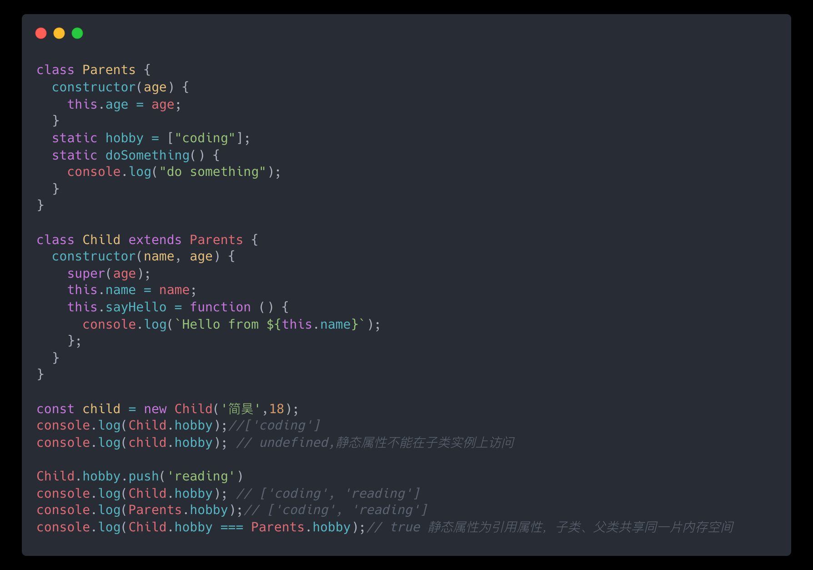

#### super.xxx()

**为什么需要super？**

MDN上解释**super** 关键字是用于访问**对象字面量**或类的原型（\[\[Prototype]]）上的属性，或调用父类的构造函数。**super**的设计主要是为了解决原型链继承只能做到子类继承父类的“全部东西”但子类无法继承父类的“全部能力”的问题。这个问题可以理解为方法覆写带来的副作用，子类方法覆盖，父类方法丢失。详细的说，子类对象如果需要重写原型对象上的方法，同名方法会进行覆盖.这也意味着原型对象上的某方法对于该子类对象已完全失效，子类对象想要安全覆写就需要完全重新实现一遍该方法，这样的做法就失去了继承的价值且给覆写带来了很大风险。值得注意的是，**super**关键字也可以运用于对象字面量上。

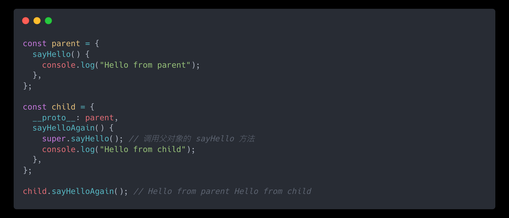

**super的指向问题**

既然要追溯父类，首先就要解决怎么追溯到父类的问题。ES6前没有方法归属于哪个类或者哪个对象的概念，ES6开始为了更加清晰方法的归属问题，在方法中添加了一个\*\*内部槽\[\[HomeObject]] \*\*用来记录方法的归属类。super的指向一般分为三种情况：1.在类声明中，如果是类静态声明，也就是使用 static 声明的方法，主对象就是这个类，例如 AClass；2.在一般声明中，该方法的主对象就是该类所使用的原型，也就是AClass.prototype；3.在对象声明中，方法的主对象就是对象本身。

**super中的this**

ECMAScript 约定，只能在调用了父类构造方法之后，才能使用**super**的方式来引用父类的属性，或者调用父类的方法。这意味着新建子类实例时，父类的构造函数必定会先运行一次，不然可能会导致父类的属性和方法未被正确初始化，从而引发错误。

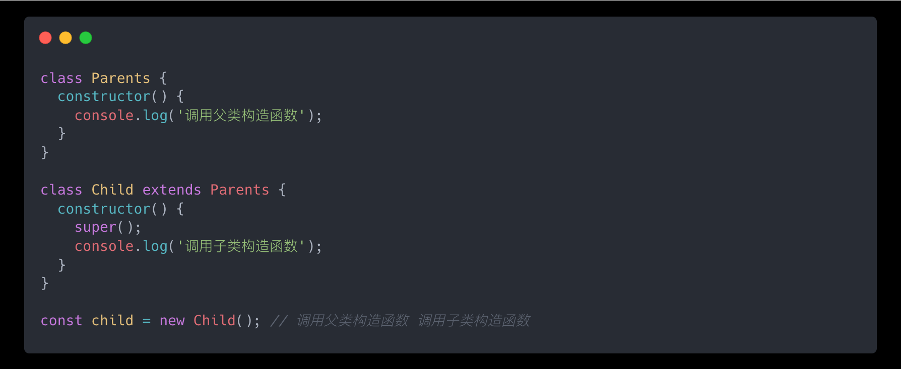

在使用 ES6 类继承时，如果子类中定义了构造函数，那么子类的构造函数必须调用 **super()**，以确保正确初始化父类的属性和方法。主要原因是ES6的继承机制与ES5完全不同，ES5 的继承机制是“实例在前，继承在后”，而ES6的继承机制是先将父类的属性和方法，加到一个空的对象上面，然后再将该对象作为子类的实例即“继承在前，实例在后”。子类构造函数先调用**super**方法会先生成继承父类的继承对象，不然无法继承父类。

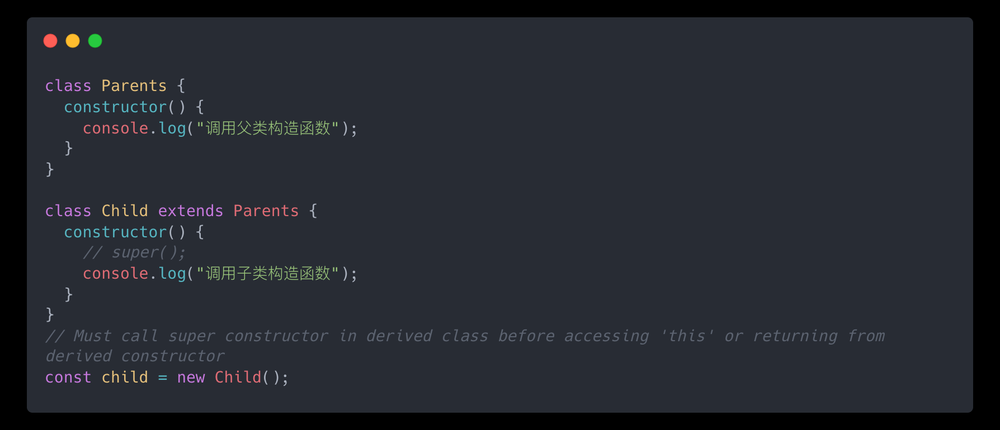

除此之外，在子类的构造函数中，只有调用**super()**之后，才可以使用this关键字，否则会报错。这是因为子类实例的构建，必须先完成父类的继承，只有**super**方法才能让子类实例继承父类。

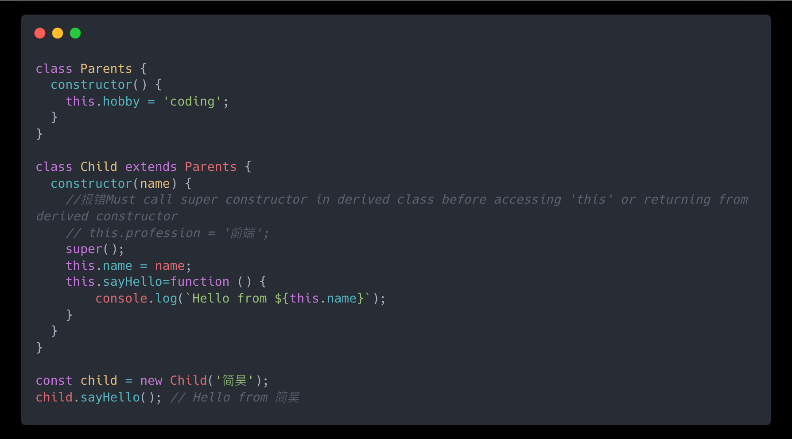

## 组合继承与多继承

#### 构造函数+原型=组合继承

**构造函数与原型链是无类继承的核心**，在JavaScript中的发展过程中，开发者们灵活运用构造函数与原型根据不同使用场景设计了多种继承方式。下文将主要讲述两种常用的组合继承方式与多继承，本部分不需强行记忆，只要理解上文所提构造函数与原型的概念与作用就能理解无类继承的核心。

**组合继承-使用原型链实现对原型属性和方法的继承，借用构造函数实现对实例属性的继承**：创建两次实例

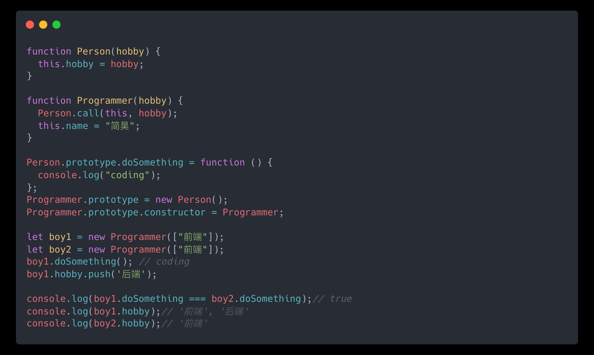

**寄生组合式继承**：性能优异，实现复杂。与组合继承的区别在于子类原型指向上，组合方式继承直接让子类原型指向调用父类构造函数所创建的对象，**寄生组合式继承**让子类原型指向父类的原型对象，避免了父类构造函数的二次调用所造成的资源浪费。

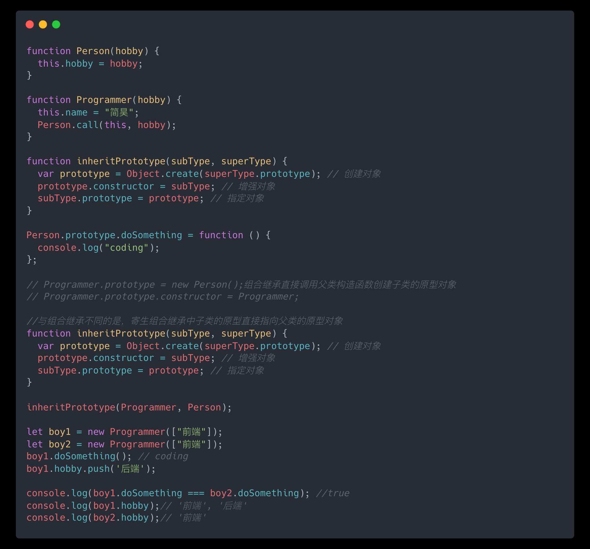

#### 多继承

在es6中已经有语法糖extends去实现类的继承，然而多继承是不被允许也是不被提倡的，因为会导致“**钻石问题**”：比如说b和c都继承自a，d继承自b和c，那么d里面就会有同一个方法来自于两个两个祖先，那么当在d中调用这个方法时就会出现逻辑问题，到底是调用b的呢还是c的呢？

**多继承的核心思想：** 利用借用构造函数中调用多个基类构造函数完成实例属性的多继承，或者通过多个基类原型对象的合并对象来完成方法的多继承。

在js中使用多继承场景较少且本身不被提倡，这里对于“混合模式”等多继承技巧不进行介绍。尽量使用链式继承去满足业务场景，因为多继承需要考虑继承顺序、命名冲突等问题不然易造成“魔法”效果。

## 总结

由于语言设计的负担，JavaScript继承的演变复杂且独特。通过这篇“八股文”让我温习了构造函数继承、原型继承与类继承的各个方面。花了很多时间，了解了很多，但感觉目前能用到的很少。或许写这篇文章就像孔乙己学习茴字的四种写法一样，看着无聊，聊着更无聊。但我依然选择坚信学习具有延后性，或许过段日子开始学习框架源码，今天梳理的知识可以对我有所帮助。

## 参考资料

> js:面向对象编程，带你认识封装、继承和多态[https://juejin.cn/post/6844903480868470798](https://juejin.cn/post/6844903480868470798 "https://juejin.cn/post/6844903480868470798")

> 一图搞懂JS原型&原型链[https://segmentfault.com/a/1190000021232132](https://segmentfault.com/a/1190000021232132 "https://segmentfault.com/a/1190000021232132")

> MDN：对象原型[https://developer.mozilla.org/zh-CN/docs/Learn/JavaScript/Objects/Object\_prototypes](https://developer.mozilla.org/zh-CN/docs/Learn/JavaScript/Objects/Object_prototypes "https://developer.mozilla.org/zh-CN/docs/Learn/JavaScript/Objects/Object_prototypes")

> 构造函数与new命令[https://javascript.ruanyifeng.com/oop/basic.html](https://javascript.ruanyifeng.com/oop/basic.html "https://javascript.ruanyifeng.com/oop/basic.html")

> 周爱民老师的JavaScript核心原理解析

> js多继承[https://juejin.cn/post/6844903842212298766](https://juejin.cn/post/6844903842212298766 "https://juejin.cn/post/6844903842212298766")

> 阮一峰老师的ES6入门教程[https://es6.ruanyifeng.com/#README](https://es6.ruanyifeng.com/#README "https://es6.ruanyifeng.com/#README")
