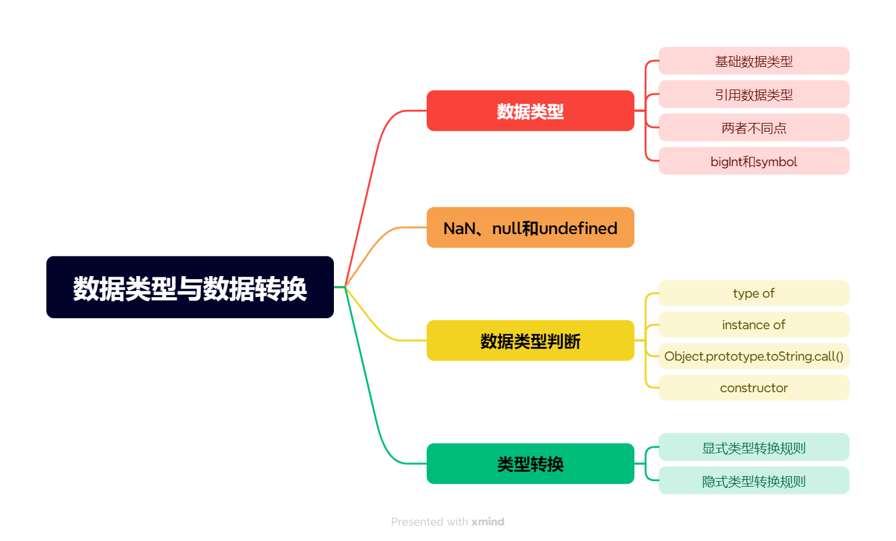
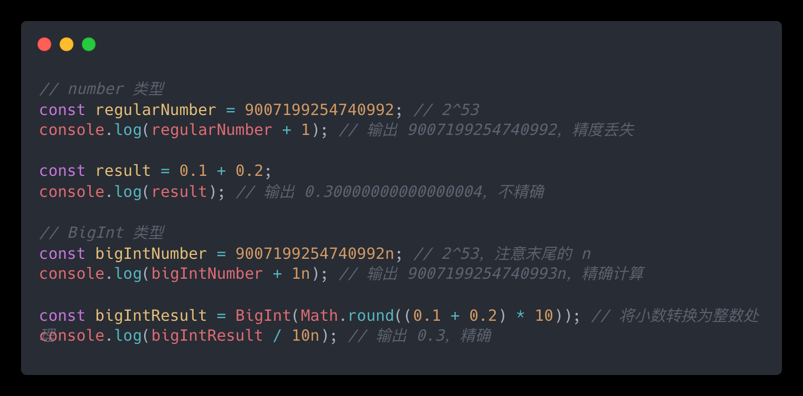
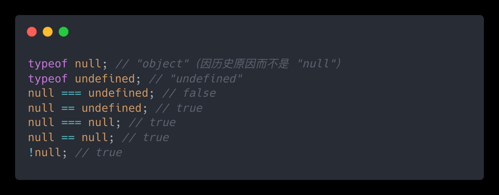
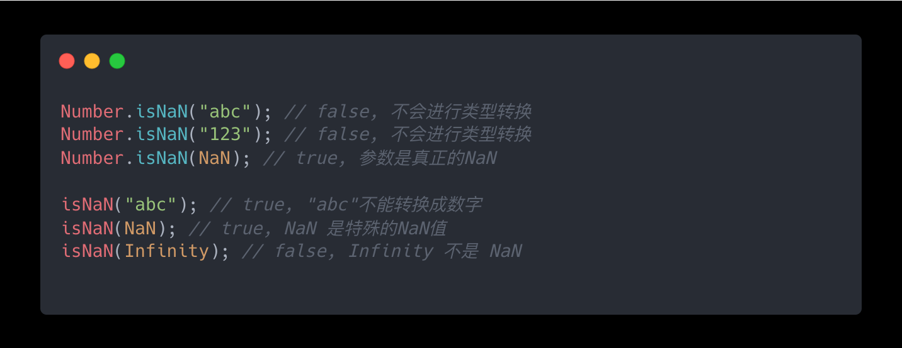

# 数据类型与类型转换

## 前言

> 梳理自JavaScript开发者应懂的33个概念专栏，2024年从回顾基础开始记录自己的编程生活。

## 目录

## 数据类型

**基础数据类型：**

字符串（String）、数字（Number）、布尔（Boolean）、Null、Undefined、Symbol（独一无二的值。）Bigint

**引用数据类型：**

对象(Object)、数组(Array)、函数(Function)、Map、Set

**基础数据类型和引用数据类型的不同点：**

基础数据类型的值存放在放**栈空间**，而引用数据类型的值存放**堆空间**并**只能通过栈空间**中的**引用地址**进行访问。引用类型需要引用访问。

复制时基本数据类型值相同，完全独立，引用类型只复制栈中地址，值为共同体。

**Number和BigInt区别：**

- Number: 表示数字范围有限，且受到 IEEE 754 浮点数规范的限制。JavaScript 中的 Number.MAX\_SAFE\_INTEGER(253 – 1) 和 Number.MIN\_SAFE\_INTEGER( -253 – 1）定义了 Number 类型的安全整数范围。由于 IEEE 754 浮点数的规范，Number在处理大整数或需要高精度计算的场景下可能会出现问题。
- BigInt：表示任意大的整数，不受安全整数范围的限制。其类型是精确表示整数的，不会有浮点数运算中的精度丢失问题。
- BigInt和Number可以比较但不能直接进行运算，进行运算需要通过类型转换。

**symbol作用：** 表示独一无二不可重复的变量，防止全局变量污染，可以用来定义对象的唯一属性名。

## NaN、null和undefined

**undefind** 是全局对象的一个属性，**一个变量没有被赋值、一个函数没有返回值、某个对象不存在某个属性却去访问、函数定义了形参但没有传递实参**，这时候都是undefined。在实际使用过程中，不需要对一个变量显式的赋值 **undefined**，因为当声明变量但未赋值时，默认值即为 **undefined**。

**null**表示缺少的标识，指变量未指向任何对象，相当于一个对象没有设置指针地址。**null**可以用于释放对象，但由于内存管理是由JavaScript中引擎的垃圾收集器负责。因此，虽然手动将对象的引用设置为 **null** 可以帮助加速垃圾收集过程（提前设置该对象不再被当前变量引用，如果为唯一引用则引用计数归零，该对象待回收），但在大多数情况下，用户不需要过于关注手动释放对象。

**NaN**是全局作用域中的一个变量，表示“非数字”值，即此值不是合法数字。NaN !== NaN，该变量不可删除、改写和配置。检测NaN有两种方式：Number.isNaN()、isNaN()。

Number.isNaN()是严格判断，只有在参数是真正的 NaN 时返回 true。

isNaN()会先尝试将参数转换为number再进行判断。如果参数为object，isNaN()会先调用 valueOf 方法，然后再尝试调用 toString 方法进行转换。对于string使用 parseFloat 函数将字符串转换为浮点数。

## 数据类型判断

**typeof**

优点：能够快速区分基本数据类型

缺点：不能将Objdeect、Array和null区分，都返回object（typeof function会返回'function'）

原理：typeof用来判断js在底层存储变量的机器码。000：对象、010：浮点数、100：字符串、110：布尔、1：整数、null：所有机器码均为sh0。因此typeof判断null时会误判为对象。

**instanceof**

优点：能够区分Array、Object和null，弥补typeof的不足

缺点：Number，Boolean，String基本数据类型不能判断，且如果涉及多个窗口（frames）或多个全局执行上下文的情况，可能出现问题。

原理：instanceof通过比较左右对象的原型链来判断对象类型。instanceof在查找的过程中会遍历左边变量的原型链，通过与右边变量的**prototype**进行比较，直到找到右边变量所有的**prototype**，则左边变量为右边变量的实例，否则不是。

**Object.prototype.toString.call()**

原理：Object.prototype.toString方法返回一个表示该对象类型的字符串。

JavaScript 调用 toString 方法将对象转换成原始类型，使用call方法确定检测数据。每种数据类型的构造函数的原型上都有**toString**方法，只有object上的是返回所属类信息，其他都是转字符串。

优点：精准判断数据类型

缺点：写法繁琐不容易记，推荐进行封装后使用

**constructor (用于引用数据类型)**

原理：获取实例的构造函数判断和某个类是否相同，如果相同就说明该数据是符合那个数据类型的，这种方法不会把原型链上的其他类也加入进来，避免了原型链的干扰。

缺点：null、undefined都是无效对象，没有constructor。对于自定义对象可能原有constructor丢失，会默认为Object，导致误判。

## 显式类型转换

**转Number**

Number()、 parseInt()、 parseFloat()

Number() 用于其他任意数据类型，parseInt()、parseFloat() 一般用于纯数字字符串。

特殊情况：Number(undefined)—>NaN 、Number(null)—>0

**转String**

String() 、toString()

toString()方法可将纯数字字符串转为其他进制纯数字字符串。

特殊情况：undefined、null只能用String()

**转Boolean**

Boolean()

在 Javascript 中，只有 **空字符串**、**数字0**、**false**、**null**、**undefined** 和 **NaN** 这 6 个值为假之外，其他所有的值均为真值。

## 隐式类型转换

**隐式类型转换规则**

JavaScript中将运算符分为一元运算符、二元运算符、三元运算符，隐式类型转换一般发生在二元运算符中。二元运算符有：数学运算符、赋值运算符、比较运算符、逻辑运算符。其中，涉及隐式转换最多的两个运算符 + 和 ==。

转换规则：

1. 对象—>字符串—>数字
2. 布尔值—>数字

数学运算符 + - \* / %

**加法 \[需要特别注意]：** 如果等式两边有一个为字符串，那么javaScript会将另一边也转为String类型，然后拼接，最后得到一个拼接后的字符串。其他数学运算符，均是将等式两边先转为Number类型，然后再计算。

比较运算符 > < >= <= != !== == ===

简单数据类型的比较，比较的是变量的大小/值，所以会发生隐式类型转换，转为Number

复杂数据类型的比较，比较的是两个变量保存的地址

**双等号==\[需要特别注意]：**

1. 如果两个值类型相同，再进行三等号的比较流程
2. 如果两个值类型不相同，需根据以下规则进行类型转换
   1. 如果一个是null，一个是undefined，那么相等
   2. 如果比较的两者中有布尔值，会把 **Boolean** 先转换为对应的 **Number**，即 0 和 1，然后进行比较。
   3. 如果比较的双方中有一方为 **Number**，一方为 **String**时，会把 **String** 通过\*\* Number() \*\*方法转换为数字，然后进行比较。
   4. 如果比较的双方中有一方为 **Boolean**，一方为 **String**时，会将双方转换为数字，然后再进行比较。
   5. 如果比较的双方中有一方为 **Number**，一方为**Object**时，则会调用 **valueOf** 方法将**Object**转换为数字，然后进行比较。
   6. 总结：会将双等号两侧数据转换为Number后进行比较

三等号===:

1. 如果类型不同，就一定不相等
2. 如果两个都是数值，并且是同一个值，那么相等；如果其中至少一个是NaN，那么不相等。（判断值是否为NaN只能使用isNaN()来判断）
3. 如果两个都是字符串，每个位置的字符都一样，那么相等，否则不相等
4. 如果两个值都是true，或是false，那么相等
5. 如果两个值都引用同一个对象或是函数，那么相等，否则不相等
6. 如果两个值都是null，或是undefined，那么相等

## 参考文献

> "33 Fundamentals Every JavaScript Developer Should Know" [https://medium.com/@stephenthecurt/33-fundamentals-every-javascript-developer-should-know-13dd720a90d1](https://medium.com/@stephenthecurt/33-fundamentals-every-javascript-developer-should-know-13dd720a90d1 "https://medium.com/@stephenthecurt/33-fundamentals-every-javascript-developer-should-know-13dd720a90d1")

> "33 Concepts Every JavaScript Developer Should Know" [https://github.com/leonardomso/33-js-concepts?tab=readme-ov-file](https://github.com/leonardomso/33-js-concepts?tab=readme-ov-file "https://github.com/leonardomso/33-js-concepts?tab=readme-ov-file")

> "JavaScript开发者应懂的33个概念"[https://github.com/leonardomso/33-js-concepts](https://github.com/leonardomso/33-js-concepts "https://github.com/leonardomso/33-js-concepts")
